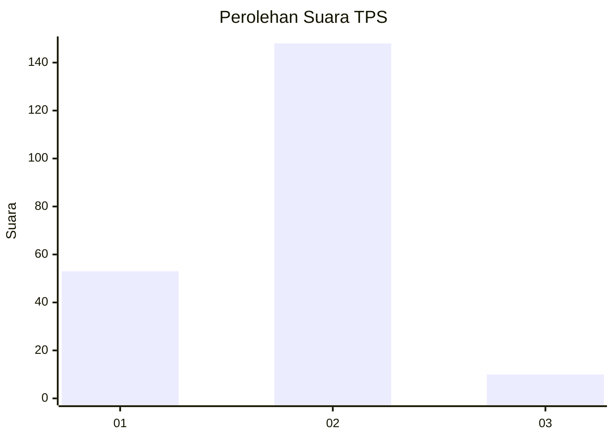
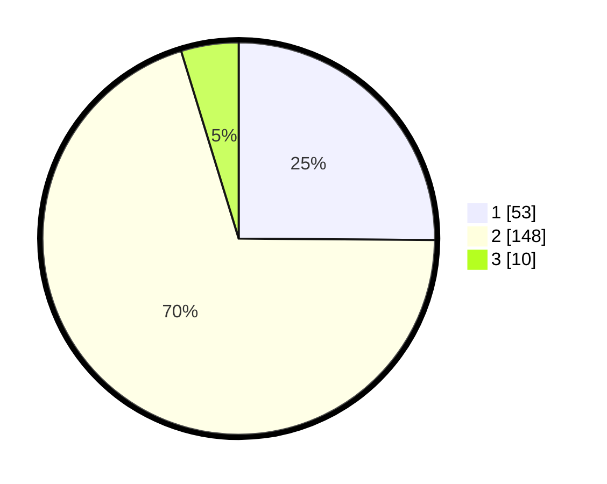

# Hasil

## Grafik

## Tabel

| No. | Nama Paslon    | Suara | Suara (raw) | Persentase |
|:--- |:-------------- | -----:| -----------:| ----------:|
| 1   | ANIES MUHAIMIN | 53    | [53][p-1]   | 25,12      |
| 2   | PRABOWO GIBRAN | 148   | [148][p-2]  | 70,14      |
| 3   | GANJAR MAHFUD  | 10    | [10][p-3]   | 4,74       |

[p-1]: https://github.com/gigit-pemilu/pemilu-2024-32-jawa-barat/blob/main/pilpres/hitung-suara/sub/32-jawa-barat/sub/04-bandung/sub/29-ciparay/sub/2001-ciparay/sub/003-tps/sub/paslon-1.txt
[p-2]: https://github.com/gigit-pemilu/pemilu-2024-32-jawa-barat/blob/main/pilpres/hitung-suara/sub/32-jawa-barat/sub/04-bandung/sub/29-ciparay/sub/2001-ciparay/sub/003-tps/sub/paslon-2.txt
[p-3]: https://github.com/gigit-pemilu/pemilu-2024-32-jawa-barat/blob/main/pilpres/hitung-suara/sub/32-jawa-barat/sub/04-bandung/sub/29-ciparay/sub/2001-ciparay/sub/003-tps/sub/paslon-3.txt

## Foto C Plano

https://sirekap-obj-formc.kpu.go.id/2123/pemilu/ppwp/32/04/29/20/01/3204292001003-20240214-231620--dcb68030-1fcd-47aa-bfe8-2c743e250df1.jpg

https://sirekap-obj-formc.kpu.go.id/2123/pemilu/ppwp/32/04/29/20/01/3204292001003-20240215-014801--9ba816a3-0c0e-4576-8a2c-517501fb3530.jpg

https://sirekap-obj-formc.kpu.go.id/2123/pemilu/ppwp/32/04/29/20/01/3204292001003-20240215-014818--8dcde5bf-56c4-4322-915e-070fd6351138.jpg

## Metadata

| Key        | Value               |
| ---------- | ------------------- |
| Time Stamp | 2024-02-15 18:00:26 |

