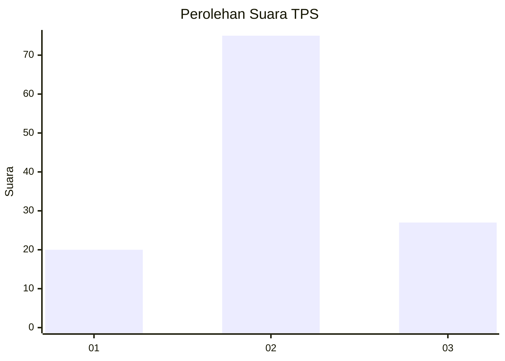
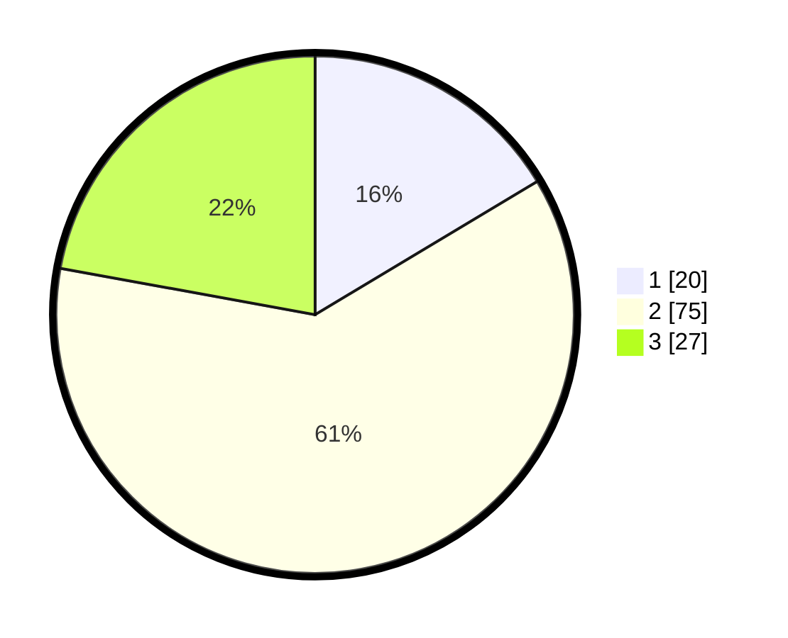

# Hasil

## Grafik

## Tabel

| No. | Nama Paslon    | Suara | Suara (raw) | Persentase |
|:--- |:-------------- | -----:| -----------:| ----------:|
| 1   | ANIES MUHAIMIN | 20    | [20][p-1]   | 16,39      |
| 2   | PRABOWO GIBRAN | 75    | [75][p-2]   | 61,48      |
| 3   | GANJAR MAHFUD  | 27    | [27][p-3]   | 22,13      |

[p-1]: https://github.com/gigit-pemilu/pemilu-2024-32-jawa-barat/blob/main/pilpres/hitung-suara/sub/32-jawa-barat/sub/04-bandung/sub/29-ciparay/sub/2010-sarimahi/sub/018-tps/sub/paslon-1.txt
[p-2]: https://github.com/gigit-pemilu/pemilu-2024-32-jawa-barat/blob/main/pilpres/hitung-suara/sub/32-jawa-barat/sub/04-bandung/sub/29-ciparay/sub/2010-sarimahi/sub/018-tps/sub/paslon-2.txt
[p-3]: https://github.com/gigit-pemilu/pemilu-2024-32-jawa-barat/blob/main/pilpres/hitung-suara/sub/32-jawa-barat/sub/04-bandung/sub/29-ciparay/sub/2010-sarimahi/sub/018-tps/sub/paslon-3.txt

## Foto C Plano

https://sirekap-obj-formc.kpu.go.id/f25d/pemilu/ppwp/32/04/29/20/10/3204292010018-20240221-202823--61f2075d-23e9-49da-9138-5a292366aedb.jpg

https://sirekap-obj-formc.kpu.go.id/f25d/pemilu/ppwp/32/04/29/20/10/3204292010018-20240221-203155--6e885bc5-e6c1-47f7-ac93-d73ceb6d26b7.jpg

https://sirekap-obj-formc.kpu.go.id/f25d/pemilu/ppwp/32/04/29/20/10/3204292010018-20240221-202137--b4cd607d-2651-49ce-8908-e78f3f218587.jpg

## Metadata

| Key        | Value               |
| ---------- | ------------------- |
| Time Stamp | 2024-02-21 21:00:04 |

## DATA PEMILIH TETAP

Jumlah pemilih dalam DPT: **3**.
 * L: **134**.
 * P: **100**.

## DATA PENGGUNA HAK PILIH

Jumlah pengguna hak pilih dalam DPT: **11**.
 * L: **110**.
 * P: **0**.

Jumlah pengguna hak pilih dalam DPTb: **0**.
 * L: **400**.
 * P: **70**.

Jumlah pengguna hak pilih dalam DPK: **20**.
 * L: **0**.
 * P: **72**.

Jumlah pengguna hak pilih: **622**.
 * L: **110**.
 * P: **115**.

## JUMLAH SUARA SAH DAN TIDAK SAH

JUMLAH SELURUH SUARA SAH: **223**.

JUMLAH SUARA TIDAK SAH: **3**.

JUMLAH SELURUH SUARA SAH DAN SUARA TIDAK SAH: **226**.

