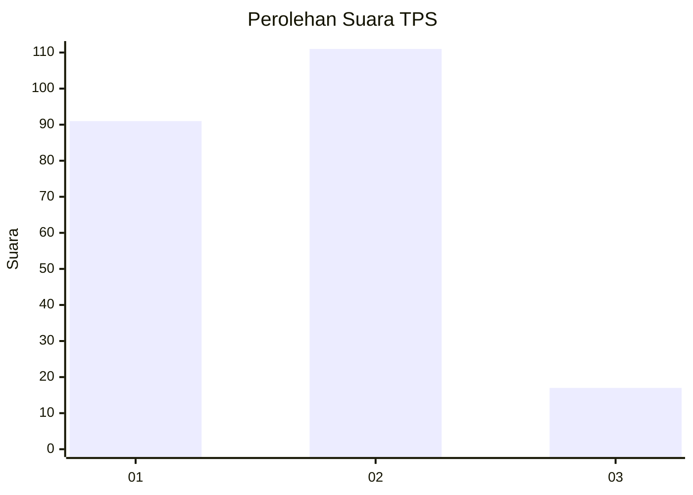
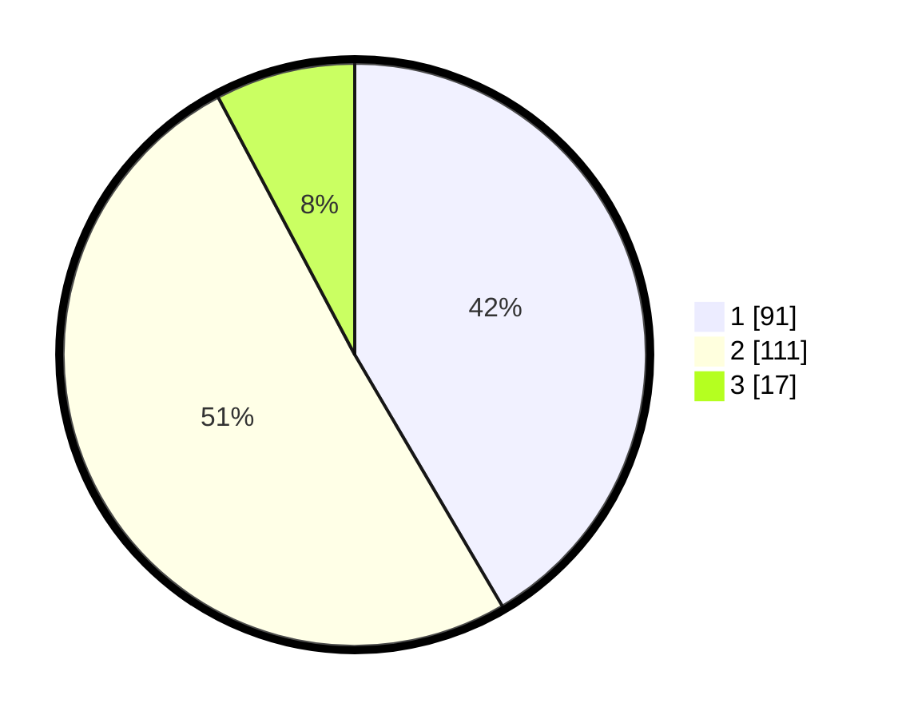

# Hasil

## Grafik

## Tabel

| No. | Nama Paslon    | Suara | Suara (raw) | Persentase |
|:--- |:-------------- | -----:| -----------:| ----------:|
| 1   | ANIES MUHAIMIN | 91    | [91][p-1]   | 41,55      |
| 2   | PRABOWO GIBRAN | 111   | [111][p-2]  | 50,68      |
| 3   | GANJAR MAHFUD  | 17    | [17][p-3]   | 7,76       |

[p-1]: https://github.com/gigit-pemilu/pemilu-2024-32-jawa-barat/blob/main/pilpres/hitung-suara/sub/32-jawa-barat/sub/04-bandung/sub/30-pacet/sub/2001-cipeujeuh/sub/002-tps/sub/paslon-1.txt
[p-2]: https://github.com/gigit-pemilu/pemilu-2024-32-jawa-barat/blob/main/pilpres/hitung-suara/sub/32-jawa-barat/sub/04-bandung/sub/30-pacet/sub/2001-cipeujeuh/sub/002-tps/sub/paslon-2.txt
[p-3]: https://github.com/gigit-pemilu/pemilu-2024-32-jawa-barat/blob/main/pilpres/hitung-suara/sub/32-jawa-barat/sub/04-bandung/sub/30-pacet/sub/2001-cipeujeuh/sub/002-tps/sub/paslon-3.txt

## Foto C Plano

https://sirekap-obj-formc.kpu.go.id/14a7/pemilu/ppwp/32/04/30/20/01/3204302001002-20240219-132316--a1cef798-f2b9-49f3-b277-7d55d647fd6a.jpg

https://sirekap-obj-formc.kpu.go.id/14a7/pemilu/ppwp/32/04/30/20/01/3204302001002-20240219-132459--cb9768ee-c11f-4a22-9036-154d8a48df47.jpg

https://sirekap-obj-formc.kpu.go.id/14a7/pemilu/ppwp/32/04/30/20/01/3204302001002-20240219-132657--642d9ebd-e812-4967-a24e-c113ab552779.jpg

## Metadata

| Key        | Value               |
| ---------- | ------------------- |
| Time Stamp | 2024-02-19 23:00:00 |

