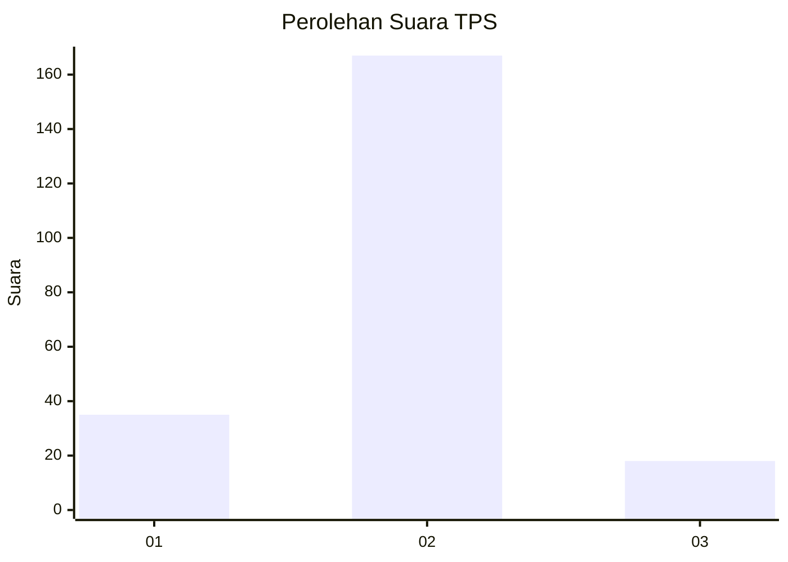
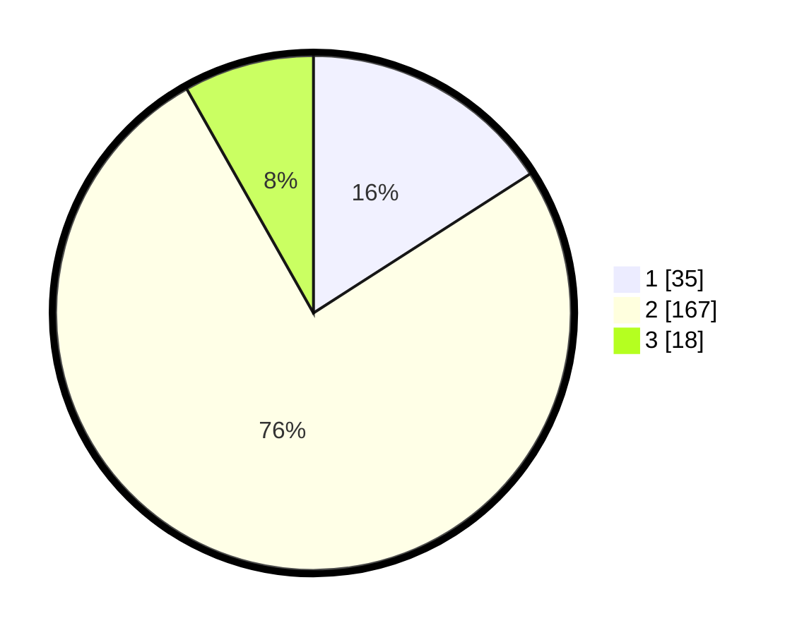

# Hasil

## Grafik

## Tabel

| No. | Nama Paslon    | Suara | Suara (raw) | Persentase |
|:--- |:-------------- | -----:| -----------:| ----------:|
| 1   | ANIES MUHAIMIN | 35    | [35][p-1]   | 15,91      |
| 2   | PRABOWO GIBRAN | 167   | [167][p-2]  | 75,91      |
| 3   | GANJAR MAHFUD  | 18    | [18][p-3]   | 8,18       |

[p-1]: https://github.com/gigit-pemilu/pemilu-2024/blob/main/pilpres/hitung-suara/sub/32-jawa-barat/sub/04-bandung/sub/30-pacet/sub/2006-nagrak/sub/002-tps/sub/paslon-1.txt
[p-2]: https://github.com/gigit-pemilu/pemilu-2024/blob/main/pilpres/hitung-suara/sub/32-jawa-barat/sub/04-bandung/sub/30-pacet/sub/2006-nagrak/sub/002-tps/sub/paslon-2.txt
[p-3]: https://github.com/gigit-pemilu/pemilu-2024/blob/main/pilpres/hitung-suara/sub/32-jawa-barat/sub/04-bandung/sub/30-pacet/sub/2006-nagrak/sub/002-tps/sub/paslon-3.txt

## Foto C Plano

https://sirekap-obj-formc.kpu.go.id/44da/pemilu/ppwp/32/04/30/20/06/3204302006002-20240215-164646--ab150dc6-9b9a-4b25-acac-53879ba8c2a8.jpg

https://sirekap-obj-formc.kpu.go.id/44da/pemilu/ppwp/32/04/30/20/06/3204302006002-20240215-015243--5bd09fea-7e31-4ad1-8d73-8cab6f02b2a3.jpg

https://sirekap-obj-formc.kpu.go.id/44da/pemilu/ppwp/32/04/30/20/06/3204302006002-20240215-015400--c79d839b-0c6b-4530-a8df-24e87ed2913c.jpg

## Metadata

| Key        | Value               |
| ---------- | ------------------- |
| Time Stamp | 2024-02-15 17:00:25 |

