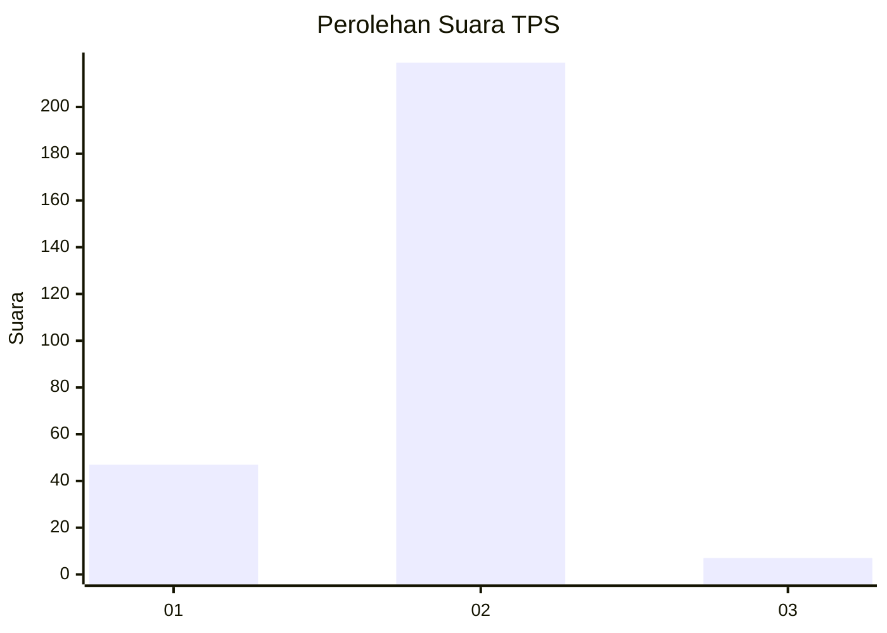
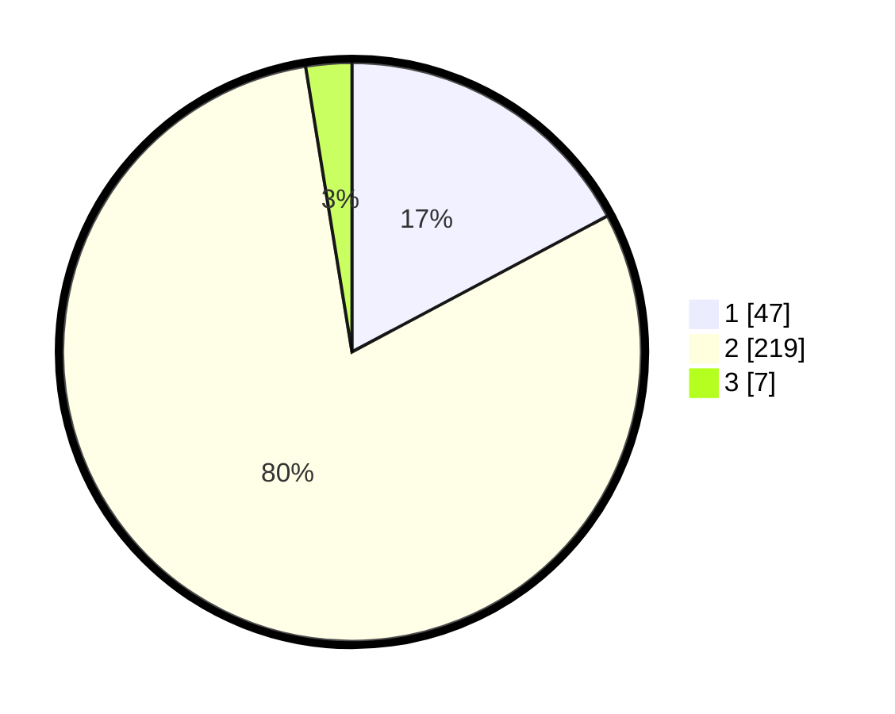

# Hasil

## Grafik

## Tabel

| No. | Nama Paslon    | Suara | Suara (raw) | Persentase |
|:--- |:-------------- | -----:| -----------:| ----------:|
| 1   | ANIES MUHAIMIN | 47    | [47][p-1]   | 17,22      |
| 2   | PRABOWO GIBRAN | 219   | [219][p-2]  | 80,22      |
| 3   | GANJAR MAHFUD  | 7     | [7][p-3]    | 2,56       |

[p-1]: https://github.com/gigit-pemilu/pemilu-2024-32-jawa-barat/blob/main/pilpres/hitung-suara/sub/32-jawa-barat/sub/04-bandung/sub/30-pacet/sub/2011-girimulya/sub/020-tps/sub/paslon-1.txt
[p-2]: https://github.com/gigit-pemilu/pemilu-2024-32-jawa-barat/blob/main/pilpres/hitung-suara/sub/32-jawa-barat/sub/04-bandung/sub/30-pacet/sub/2011-girimulya/sub/020-tps/sub/paslon-2.txt
[p-3]: https://github.com/gigit-pemilu/pemilu-2024-32-jawa-barat/blob/main/pilpres/hitung-suara/sub/32-jawa-barat/sub/04-bandung/sub/30-pacet/sub/2011-girimulya/sub/020-tps/sub/paslon-3.txt

## Foto C Plano

https://sirekap-obj-formc.kpu.go.id/0656/pemilu/ppwp/32/04/30/20/11/3204302011020-20240215-015724--76da0182-767c-4b5d-af62-4a6c0d8d313e.jpg

https://sirekap-obj-formc.kpu.go.id/0656/pemilu/ppwp/32/04/30/20/11/3204302011020-20240215-015846--14ccc32b-ebe1-4a8d-bef4-8ab841b40acd.jpg

https://sirekap-obj-formc.kpu.go.id/0656/pemilu/ppwp/32/04/30/20/11/3204302011020-20240215-020013--53b937ba-4620-43d9-960e-ed024a0258cd.jpg

## Metadata

| Key        | Value               |
| ---------- | ------------------- |
| Time Stamp | 2024-02-15 17:30:25 |

