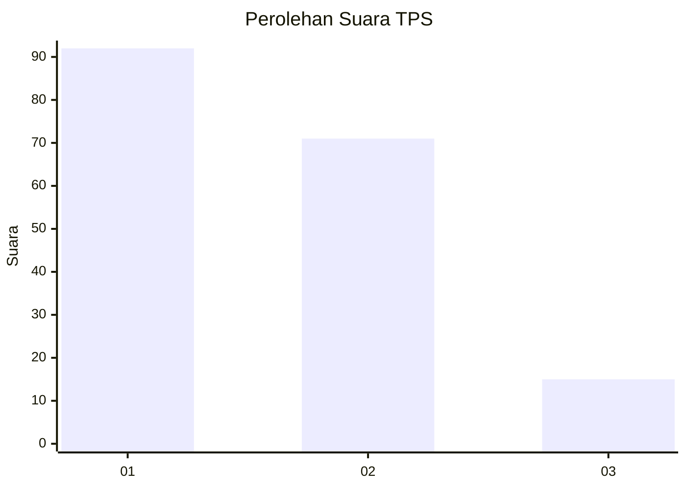
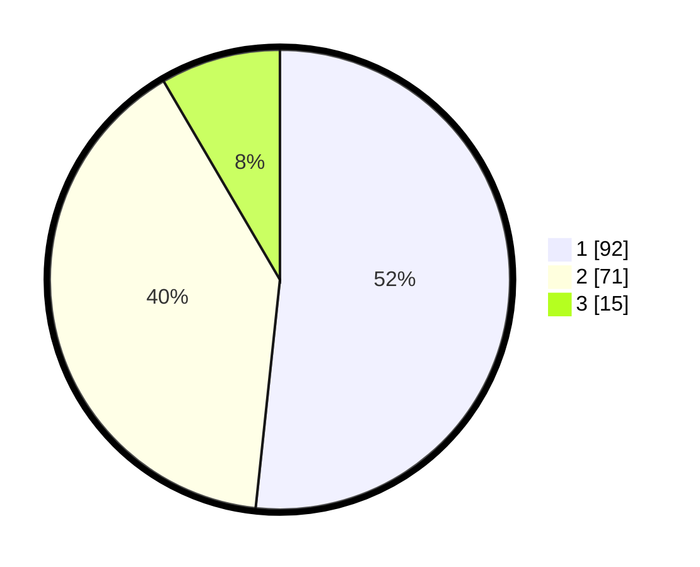

# Hasil

## Grafik

## Tabel

| No. | Nama Paslon    | Suara | Suara (raw) | Persentase |
|:--- |:-------------- | -----:| -----------:| ----------:|
| 1   | ANIES MUHAIMIN | 92    | [92][p-1]   | 51,69      |
| 2   | PRABOWO GIBRAN | 71    | [71][p-2]   | 39,89      |
| 3   | GANJAR MAHFUD  | 15    | [15][p-3]   | 8,43       |

[p-1]: https://github.com/gigit-pemilu/pemilu-2024/blob/main/pilpres/hitung-suara/sub/32-jawa-barat/sub/04-bandung/sub/32-baleendah/sub/1001-baleendah/sub/003-tps/sub/paslon-1.txt
[p-2]: https://github.com/gigit-pemilu/pemilu-2024/blob/main/pilpres/hitung-suara/sub/32-jawa-barat/sub/04-bandung/sub/32-baleendah/sub/1001-baleendah/sub/003-tps/sub/paslon-2.txt
[p-3]: https://github.com/gigit-pemilu/pemilu-2024/blob/main/pilpres/hitung-suara/sub/32-jawa-barat/sub/04-bandung/sub/32-baleendah/sub/1001-baleendah/sub/003-tps/sub/paslon-3.txt

## Foto C Plano

https://sirekap-obj-formc.kpu.go.id/0505/pemilu/ppwp/32/04/32/10/01/3204321001003-20240214-203720--d12e8e73-0ba2-4fda-9aa4-ee1dc4abe009.jpg

https://sirekap-obj-formc.kpu.go.id/0505/pemilu/ppwp/32/04/32/10/01/3204321001003-20240215-014945--a142f426-b596-459d-a5b1-294967c91b3e.jpg

https://sirekap-obj-formc.kpu.go.id/0505/pemilu/ppwp/32/04/32/10/01/3204321001003-20240215-015400--b5a0c713-64b5-4973-b94c-25dbd487f65f.jpg

## Metadata

| Key        | Value               |
| ---------- | ------------------- |
| Time Stamp | 2024-02-15 20:00:44 |

