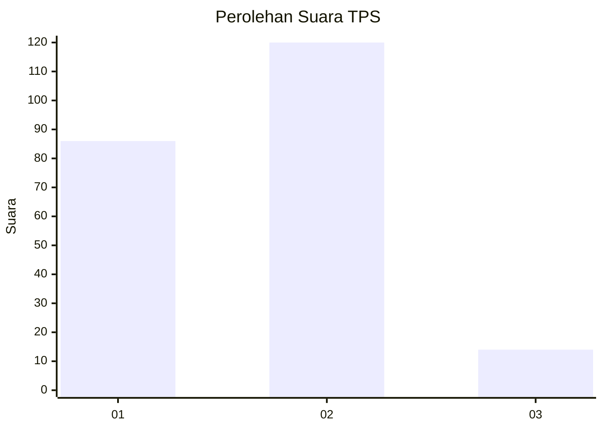

# Hasil

## Grafik

## Tabel

| No. | Nama Paslon    | Suara | Suara (raw) | Persentase |
|:--- |:-------------- | -----:| -----------:| ----------:|
| 1   | ANIES MUHAIMIN | 86    | [86][p-1]   | 39,09      |
| 2   | PRABOWO GIBRAN | 120   | [120][p-2]  | 54,55      |
| 3   | GANJAR MAHFUD  | 14    | [14][p-3]   | 6,36       |

[p-1]: https://github.com/gigit-pemilu/pemilu-2024-32-jawa-barat/blob/main/pilpres/hitung-suara/sub/32-jawa-barat/sub/04-bandung/sub/32-baleendah/sub/1001-baleendah/sub/005-tps/sub/paslon-1.txt
[p-2]: https://github.com/gigit-pemilu/pemilu-2024-32-jawa-barat/blob/main/pilpres/hitung-suara/sub/32-jawa-barat/sub/04-bandung/sub/32-baleendah/sub/1001-baleendah/sub/005-tps/sub/paslon-2.txt
[p-3]: https://github.com/gigit-pemilu/pemilu-2024-32-jawa-barat/blob/main/pilpres/hitung-suara/sub/32-jawa-barat/sub/04-bandung/sub/32-baleendah/sub/1001-baleendah/sub/005-tps/sub/paslon-3.txt

## Foto C Plano

https://sirekap-obj-formc.kpu.go.id/1c3c/pemilu/ppwp/32/04/32/10/01/3204321001005-20240225-144851--80d02bf1-b6c5-4f9c-b1b5-2d9e39780628.jpg

https://sirekap-obj-formc.kpu.go.id/1c3c/pemilu/ppwp/32/04/32/10/01/3204321001005-20240225-145143--9457478a-5feb-4bd0-a0e9-bfc3b9cda30b.jpg

https://sirekap-obj-formc.kpu.go.id/1c3c/pemilu/ppwp/32/04/32/10/01/3204321001005-20240227-110525--bc52ee2f-7cf4-44d3-b624-05d35513a238.jpg

## Metadata

| Key        | Value               |
| ---------- | ------------------- |
| Time Stamp | 2024-02-27 12:00:00 |

