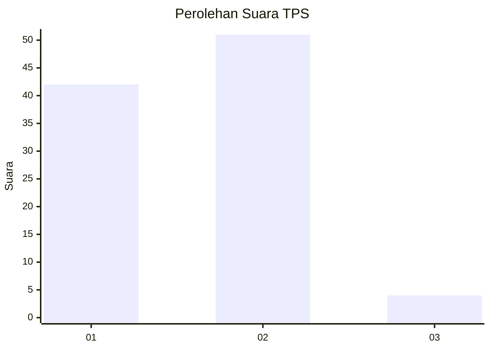
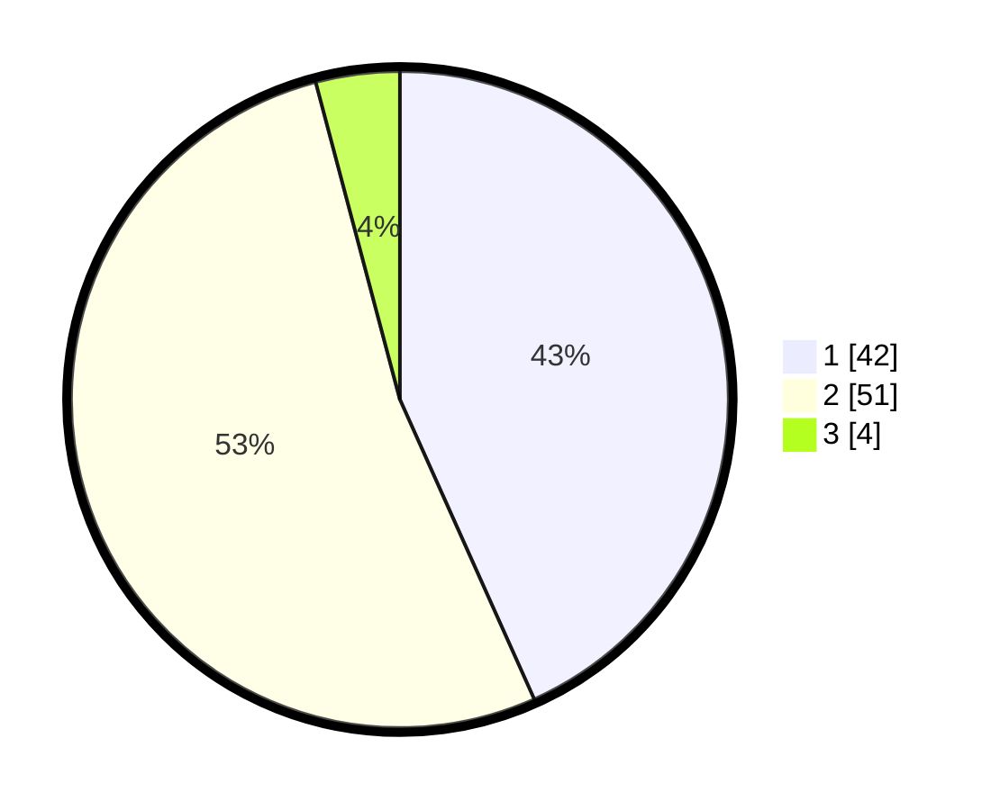

# Hasil

## Grafik

## Tabel

| No. | Nama Paslon    | Suara | Suara (raw) | Persentase |
|:--- |:-------------- | -----:| -----------:| ----------:|
| 1   | ANIES MUHAIMIN | 42    | [42][p-1]   | 43,30      |
| 2   | PRABOWO GIBRAN | 51    | [51][p-2]   | 52,58      |
| 3   | GANJAR MAHFUD  | 4     | [4][p-3]    | 4,12       |

[p-1]: https://github.com/gigit-pemilu/pemilu-2024/blob/main/pilpres/hitung-suara/sub/32-jawa-barat/sub/04-bandung/sub/32-baleendah/sub/1003-manggahang/sub/011-tps/sub/paslon-1.txt
[p-2]: https://github.com/gigit-pemilu/pemilu-2024/blob/main/pilpres/hitung-suara/sub/32-jawa-barat/sub/04-bandung/sub/32-baleendah/sub/1003-manggahang/sub/011-tps/sub/paslon-2.txt
[p-3]: https://github.com/gigit-pemilu/pemilu-2024/blob/main/pilpres/hitung-suara/sub/32-jawa-barat/sub/04-bandung/sub/32-baleendah/sub/1003-manggahang/sub/011-tps/sub/paslon-3.txt

## Foto C Plano

https://sirekap-obj-formc.kpu.go.id/2f8b/pemilu/ppwp/32/04/32/10/03/3204321003011-20240215-232458--039509d7-92e9-4bc9-8c49-5a91e7bc4d87.jpg

https://sirekap-obj-formc.kpu.go.id/2f8b/pemilu/ppwp/32/04/32/10/03/3204321003011-20240215-211912--ad600fa3-b5f7-4efa-8bd3-d9769adce79b.jpg

https://sirekap-obj-formc.kpu.go.id/2f8b/pemilu/ppwp/32/04/32/10/03/3204321003011-20240215-232536--53a0d6b0-8d58-4bdf-92ba-5e9e545a2759.jpg

## Metadata

| Key        | Value               |
| ---------- | ------------------- |
| Time Stamp | 2024-02-16 10:00:28 |

