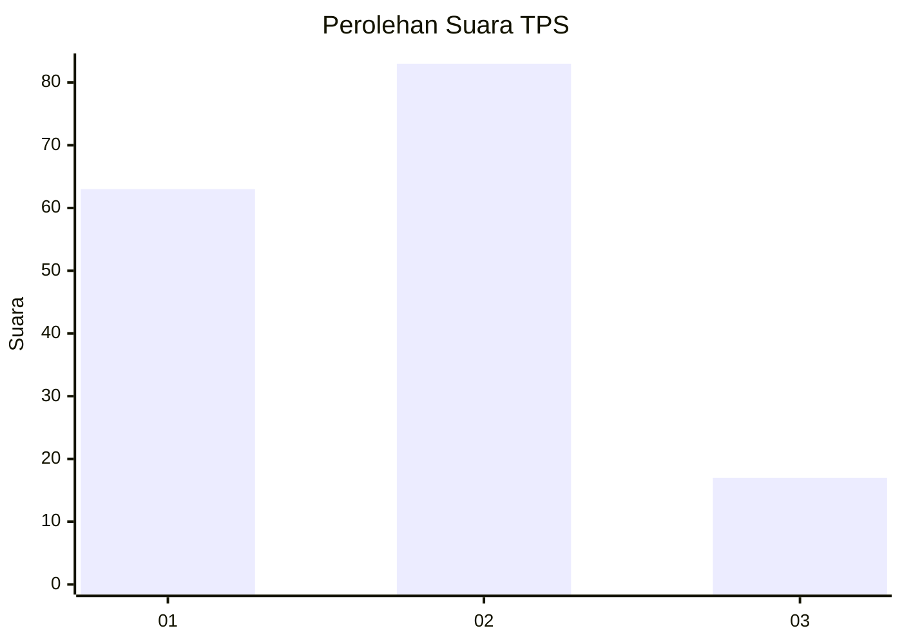
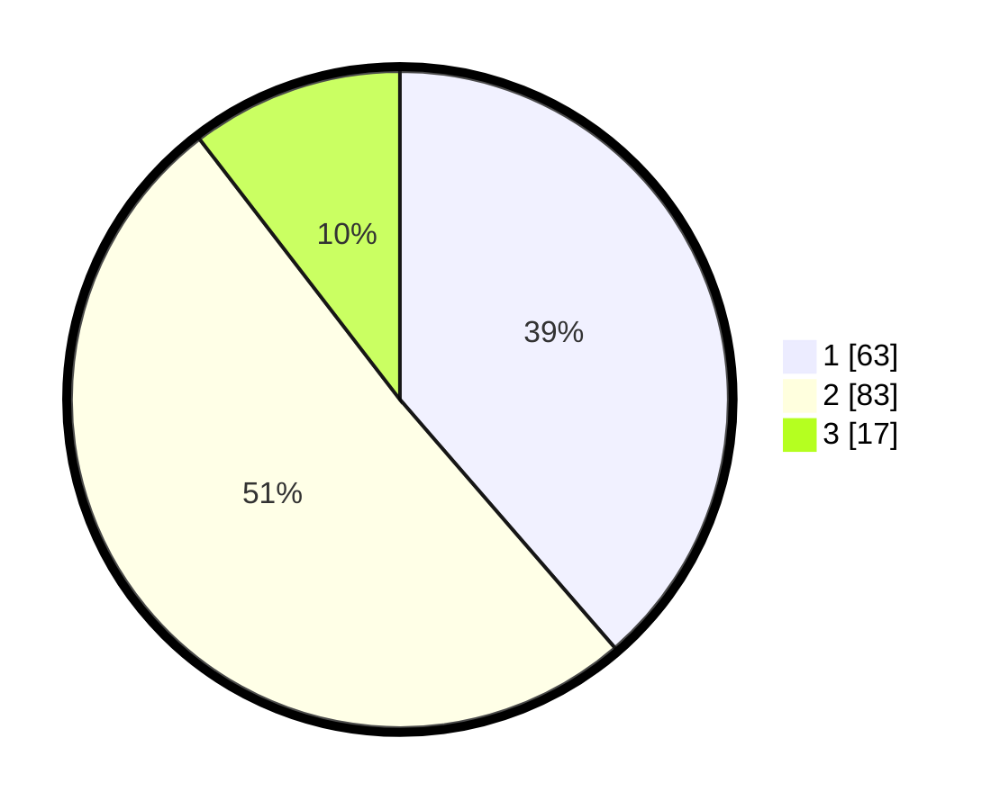

# Hasil

## Grafik

## Tabel

| No. | Nama Paslon    | Suara | Suara (raw) | Persentase |
|:--- |:-------------- | -----:| -----------:| ----------:|
| 1   | ANIES MUHAIMIN | 63    | [63][p-1]   | 38,65      |
| 2   | PRABOWO GIBRAN | 83    | [83][p-2]   | 50,92      |
| 3   | GANJAR MAHFUD  | 17    | [17][p-3]   | 10,43      |

[p-1]: https://github.com/gigit-pemilu/pemilu-2024-32-jawa-barat/blob/main/pilpres/hitung-suara/sub/32-jawa-barat/sub/04-bandung/sub/33-majalaya/sub/2001-majalaya/sub/001-tps/sub/paslon-1.txt
[p-2]: https://github.com/gigit-pemilu/pemilu-2024-32-jawa-barat/blob/main/pilpres/hitung-suara/sub/32-jawa-barat/sub/04-bandung/sub/33-majalaya/sub/2001-majalaya/sub/001-tps/sub/paslon-2.txt
[p-3]: https://github.com/gigit-pemilu/pemilu-2024-32-jawa-barat/blob/main/pilpres/hitung-suara/sub/32-jawa-barat/sub/04-bandung/sub/33-majalaya/sub/2001-majalaya/sub/001-tps/sub/paslon-3.txt

## Foto C Plano

https://sirekap-obj-formc.kpu.go.id/eed1/pemilu/ppwp/32/04/33/20/01/3204332001001-20240227-085811--2a639275-cf75-4337-8c62-e21d4d426220.jpg

https://sirekap-obj-formc.kpu.go.id/eed1/pemilu/ppwp/32/04/33/20/01/3204332001001-20240222-101342--d311e449-730b-4d50-a9db-c336eb287eb6.jpg

https://sirekap-obj-formc.kpu.go.id/eed1/pemilu/ppwp/32/04/33/20/01/3204332001001-20240222-101508--0869ca19-b050-4670-9ec9-18513b55da83.jpg

## Metadata

| Key        | Value               |
| ---------- | ------------------- |
| Time Stamp | 2024-02-27 09:00:00 |

