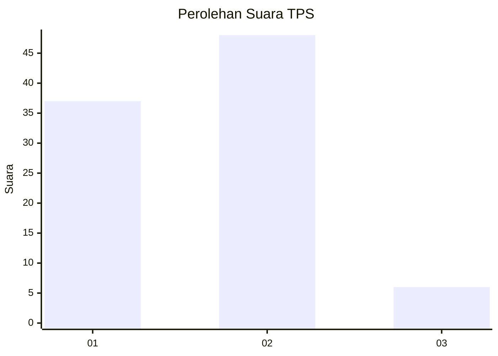
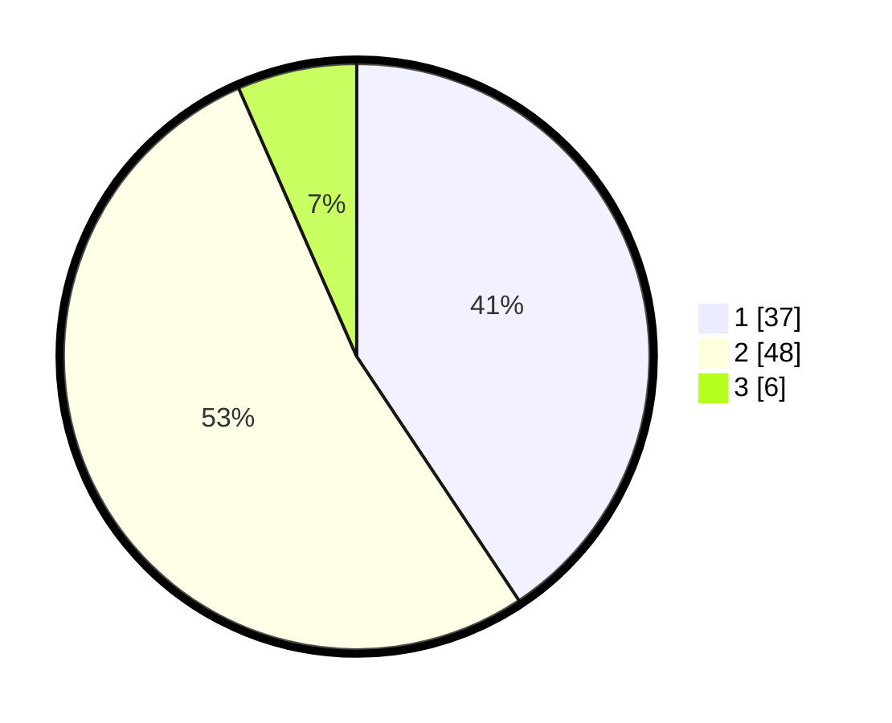

# Hasil

## Grafik

## Tabel

| No. | Nama Paslon    | Suara | Suara (raw) | Persentase |
|:--- |:-------------- | -----:| -----------:| ----------:|
| 1   | ANIES MUHAIMIN | 37    | [37][p-1]   | 40,66      |
| 2   | PRABOWO GIBRAN | 48    | [48][p-2]   | 52,75      |
| 3   | GANJAR MAHFUD  | 6     | [6][p-3]    | 6,59       |

[p-1]: https://github.com/gigit-pemilu/pemilu-2024/blob/main/pilpres/hitung-suara/sub/32-jawa-barat/sub/04-bandung/sub/33-majalaya/sub/2006-majasetra/sub/004-tps/sub/paslon-1.txt
[p-2]: https://github.com/gigit-pemilu/pemilu-2024/blob/main/pilpres/hitung-suara/sub/32-jawa-barat/sub/04-bandung/sub/33-majalaya/sub/2006-majasetra/sub/004-tps/sub/paslon-2.txt
[p-3]: https://github.com/gigit-pemilu/pemilu-2024/blob/main/pilpres/hitung-suara/sub/32-jawa-barat/sub/04-bandung/sub/33-majalaya/sub/2006-majasetra/sub/004-tps/sub/paslon-3.txt

## Foto C Plano

https://sirekap-obj-formc.kpu.go.id/58ab/pemilu/ppwp/32/04/33/20/06/3204332006004-20240222-132836--df757c28-b23f-44b9-800b-f197421f612c.jpg

https://sirekap-obj-formc.kpu.go.id/58ab/pemilu/ppwp/32/04/33/20/06/3204332006004-20240222-133424--644236df-a522-4b2d-9504-768cc648635a.jpg

https://sirekap-obj-formc.kpu.go.id/58ab/pemilu/ppwp/32/04/33/20/06/3204332006004-20240222-133637--ff951c17-f789-4c0e-a8fe-e9c8b89cba63.jpg

## Metadata

| Key        | Value               |
| ---------- | ------------------- |
| Time Stamp | 2024-02-22 14:00:00 |

## DATA PEMILIH TETAP

Jumlah pemilih dalam DPT: **200**.
 * L: **501**.
 * P: **99**.

## DATA PENGGUNA HAK PILIH

Jumlah pengguna hak pilih dalam DPT: **485**.
 * L: **92**.
 * P: **193**.

Jumlah pengguna hak pilih dalam DPTb: **214**.
 * L: **22**.
 * P: **322**.

Jumlah pengguna hak pilih dalam DPK: **134**.
 * L: **2**.
 * P: **202**.

Jumlah pengguna hak pilih: **429**.
 * L: **694**.
 * P: **695**.

## JUMLAH SUARA SAH DAN TIDAK SAH

JUMLAH SELURUH SUARA SAH: **185**.

JUMLAH SUARA TIDAK SAH: **4**.

JUMLAH SELURUH SUARA SAH DAN SUARA TIDAK SAH: **189**.

