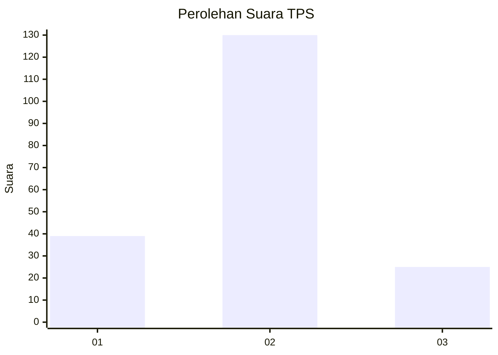
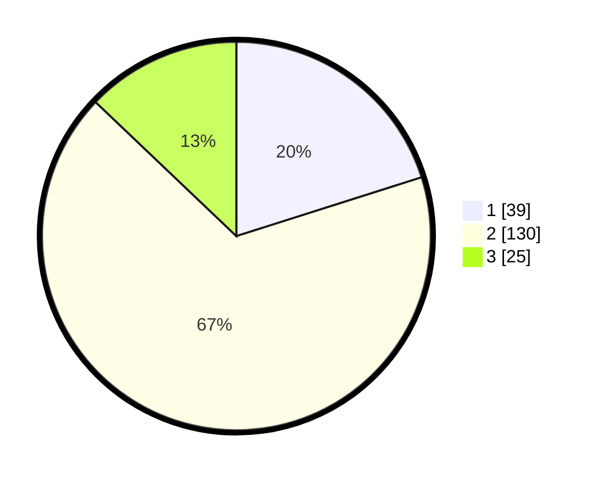

# Hasil

## Grafik

## Tabel

| No. | Nama Paslon    | Suara | Suara (raw) | Persentase |
|:--- |:-------------- | -----:| -----------:| ----------:|
| 1   | ANIES MUHAIMIN | 39    | [39][p-1]   | 20,10      |
| 2   | PRABOWO GIBRAN | 130   | [130][p-2]  | 67,01      |
| 3   | GANJAR MAHFUD  | 25    | [25][p-3]   | 12,89      |

[p-1]: https://github.com/gigit-pemilu/pemilu-2024/blob/main/pilpres/hitung-suara/sub/32-jawa-barat/sub/04-bandung/sub/34-solokanjeruk/sub/2001-rancakasumba/sub/004-tps/sub/paslon-1.txt
[p-2]: https://github.com/gigit-pemilu/pemilu-2024/blob/main/pilpres/hitung-suara/sub/32-jawa-barat/sub/04-bandung/sub/34-solokanjeruk/sub/2001-rancakasumba/sub/004-tps/sub/paslon-2.txt
[p-3]: https://github.com/gigit-pemilu/pemilu-2024/blob/main/pilpres/hitung-suara/sub/32-jawa-barat/sub/04-bandung/sub/34-solokanjeruk/sub/2001-rancakasumba/sub/004-tps/sub/paslon-3.txt

## Foto C Plano

https://sirekap-obj-formc.kpu.go.id/02d0/pemilu/ppwp/32/04/34/20/01/3204342001004-20240220-105615--d955ce5d-b2f6-406a-be41-4bc29894f53a.jpg

https://sirekap-obj-formc.kpu.go.id/02d0/pemilu/ppwp/32/04/34/20/01/3204342001004-20240220-100606--3b278c80-3e5f-4574-b3ba-53e585658bbf.jpg

https://sirekap-obj-formc.kpu.go.id/02d0/pemilu/ppwp/32/04/34/20/01/3204342001004-20240220-101121--3b4ca16e-7b95-48fc-af0d-f45f42c2c8f7.jpg

## Metadata

| Key        | Value               |
| ---------- | ------------------- |
| Time Stamp | 2024-02-20 11:00:00 |

