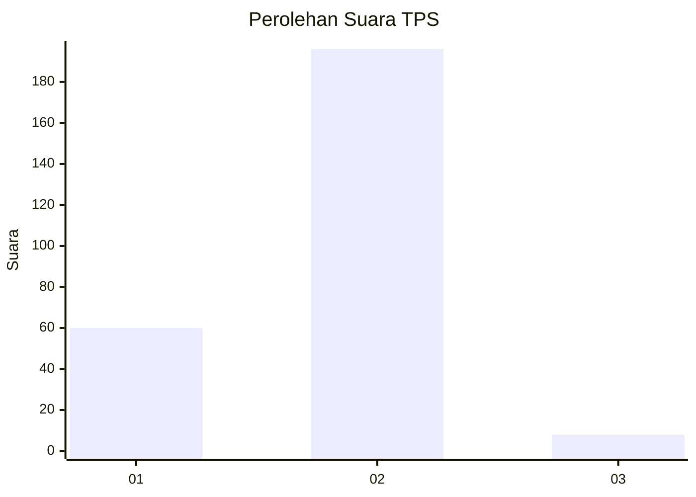

# Hasil

## Grafik

## Tabel

| No. | Nama Paslon    | Suara | Suara (raw) | Persentase |
|:--- |:-------------- | -----:| -----------:| ----------:|
| 1   | ANIES MUHAIMIN | 60    | [60][p-1]   | 22,73      |
| 2   | PRABOWO GIBRAN | 196   | [196][p-2]  | 74,24      |
| 3   | GANJAR MAHFUD  | 8     | [8][p-3]    | 3,03       |

[p-1]: https://github.com/gigit-pemilu/pemilu-2024/blob/main/pilpres/hitung-suara/sub/32-jawa-barat/sub/04-bandung/sub/34-solokanjeruk/sub/2004-panyadap/sub/025-tps/sub/paslon-1.txt
[p-2]: https://github.com/gigit-pemilu/pemilu-2024/blob/main/pilpres/hitung-suara/sub/32-jawa-barat/sub/04-bandung/sub/34-solokanjeruk/sub/2004-panyadap/sub/025-tps/sub/paslon-2.txt
[p-3]: https://github.com/gigit-pemilu/pemilu-2024/blob/main/pilpres/hitung-suara/sub/32-jawa-barat/sub/04-bandung/sub/34-solokanjeruk/sub/2004-panyadap/sub/025-tps/sub/paslon-3.txt

## Foto C Plano

https://sirekap-obj-formc.kpu.go.id/81eb/pemilu/ppwp/32/04/34/20/04/3204342004025-20240215-000806--74556456-9723-4a27-80ed-3469351bb3a1.jpg

https://sirekap-obj-formc.kpu.go.id/81eb/pemilu/ppwp/32/04/34/20/04/3204342004025-20240215-000907--5638d9ab-6dcb-4f34-a296-dd913d755100.jpg

https://sirekap-obj-formc.kpu.go.id/81eb/pemilu/ppwp/32/04/34/20/04/3204342004025-20240215-000956--fc72ec53-9f81-42cc-a1d4-c1e3ec71a565.jpg

## Metadata

| Key        | Value               |
| ---------- | ------------------- |
| Time Stamp | 2024-02-16 12:51:22 |

