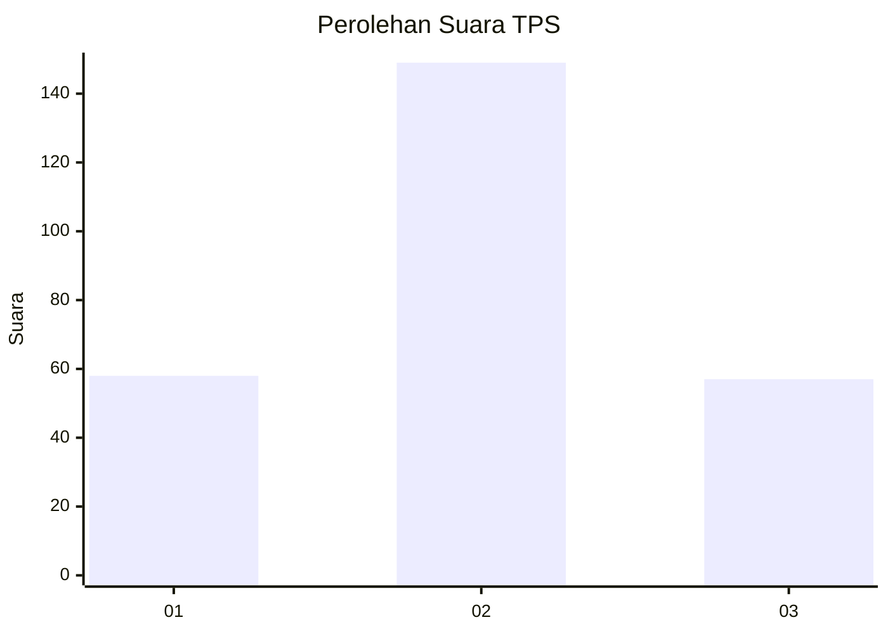
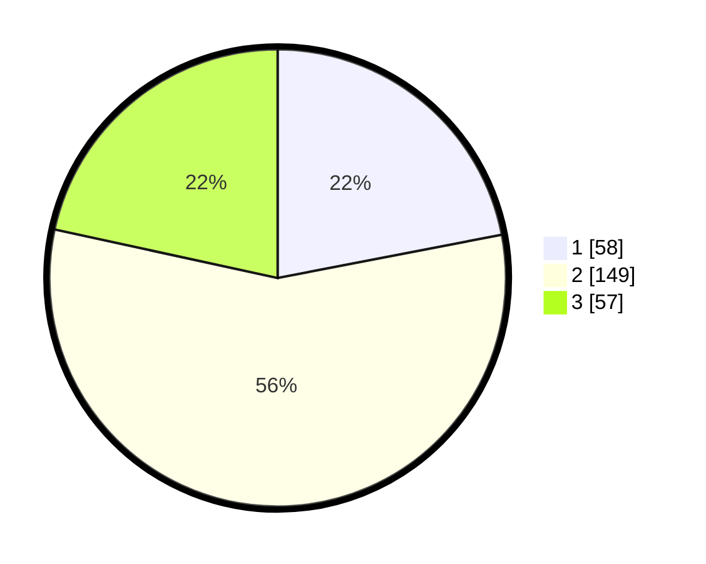

# Hasil

## Grafik

## Tabel

| No. | Nama Paslon    | Suara | Suara (raw) | Persentase |
|:--- |:-------------- | -----:| -----------:| ----------:|
| 1   | ANIES MUHAIMIN | 58    | [58][p-1]   | 21,97      |
| 2   | PRABOWO GIBRAN | 149   | [149][p-2]  | 56,44      |
| 3   | GANJAR MAHFUD  | 57    | [57][p-3]   | 21,59      |

[p-1]: https://github.com/gigit-pemilu/pemilu-2024/blob/main/pilpres/hitung-suara/sub/32-jawa-barat/sub/04-bandung/sub/34-solokanjeruk/sub/2005-bojongemas/sub/022-tps/sub/paslon-1.txt
[p-2]: https://github.com/gigit-pemilu/pemilu-2024/blob/main/pilpres/hitung-suara/sub/32-jawa-barat/sub/04-bandung/sub/34-solokanjeruk/sub/2005-bojongemas/sub/022-tps/sub/paslon-2.txt
[p-3]: https://github.com/gigit-pemilu/pemilu-2024/blob/main/pilpres/hitung-suara/sub/32-jawa-barat/sub/04-bandung/sub/34-solokanjeruk/sub/2005-bojongemas/sub/022-tps/sub/paslon-3.txt

## Foto C Plano

https://sirekap-obj-formc.kpu.go.id/2f60/pemilu/ppwp/32/04/34/20/05/3204342005022-20240221-205219--c5ddece2-aec8-44fd-8abc-30b6de56b7b6.jpg

https://sirekap-obj-formc.kpu.go.id/2f60/pemilu/ppwp/32/04/34/20/05/3204342005022-20240221-205303--ccafc63a-905d-4a3c-8f2b-6934356ec682.jpg

https://sirekap-obj-formc.kpu.go.id/2f60/pemilu/ppwp/32/04/34/20/05/3204342005022-20240225-235546--76e68a80-d2cf-456c-884f-3e294a0046c0.jpg

## Metadata

| Key        | Value               |
| ---------- | ------------------- |
| Time Stamp | 2024-02-26 00:00:00 |

