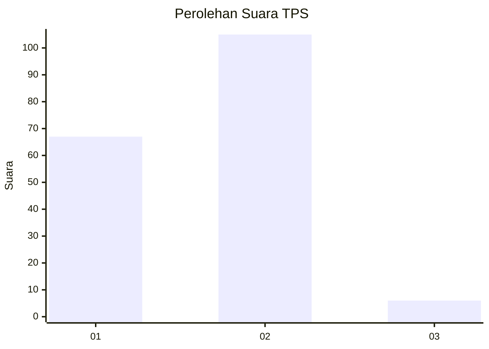
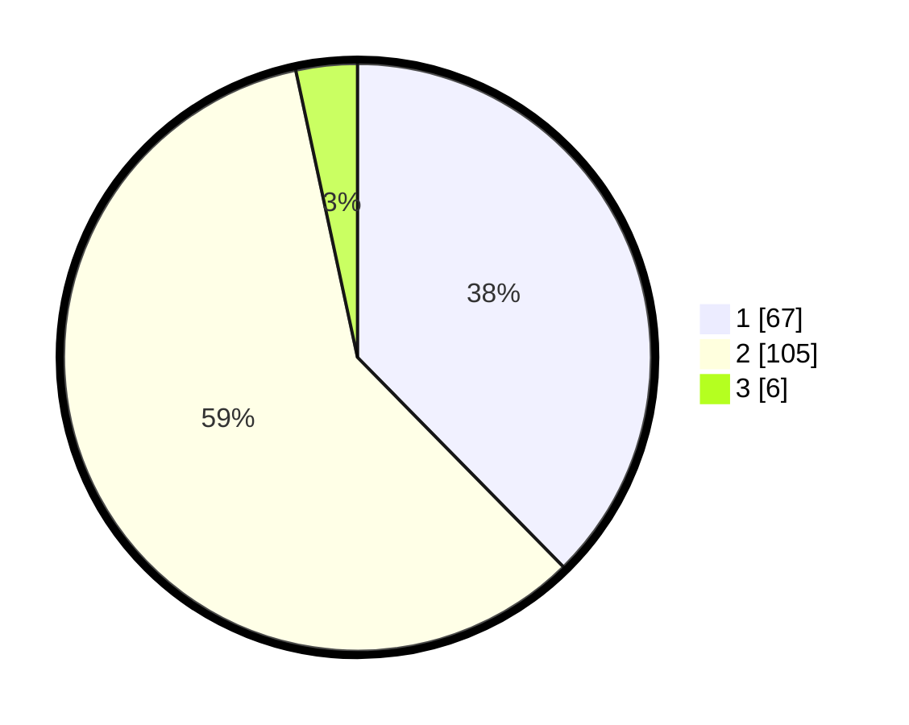

# Hasil

## Grafik

## Tabel

| No. | Nama Paslon    | Suara | Suara (raw) | Persentase |
|:--- |:-------------- | -----:| -----------:| ----------:|
| 1   | ANIES MUHAIMIN | 67    | [67][p-1]   | 37,64      |
| 2   | PRABOWO GIBRAN | 105   | [105][p-2]  | 58,99      |
| 3   | GANJAR MAHFUD  | 6     | [6][p-3]    | 3,37       |

[p-1]: https://github.com/gigit-pemilu/pemilu-2024-32-jawa-barat/blob/main/pilpres/hitung-suara/sub/32-jawa-barat/sub/04-bandung/sub/37-soreang/sub/2004-panyirapan/sub/002-tps/sub/paslon-1.txt
[p-2]: https://github.com/gigit-pemilu/pemilu-2024-32-jawa-barat/blob/main/pilpres/hitung-suara/sub/32-jawa-barat/sub/04-bandung/sub/37-soreang/sub/2004-panyirapan/sub/002-tps/sub/paslon-2.txt
[p-3]: https://github.com/gigit-pemilu/pemilu-2024-32-jawa-barat/blob/main/pilpres/hitung-suara/sub/32-jawa-barat/sub/04-bandung/sub/37-soreang/sub/2004-panyirapan/sub/002-tps/sub/paslon-3.txt

## Foto C Plano

https://sirekap-obj-formc.kpu.go.id/e7c8/pemilu/ppwp/32/04/37/20/04/3204372004002-20240222-134821--56c3c6ff-5583-43eb-b3bc-8a60477267ac.jpg

https://sirekap-obj-formc.kpu.go.id/e7c8/pemilu/ppwp/32/04/37/20/04/3204372004002-20240222-134924--56a25b52-613c-49da-a208-42bc5e7206bc.jpg

https://sirekap-obj-formc.kpu.go.id/e7c8/pemilu/ppwp/32/04/37/20/04/3204372004002-20240222-135039--d104eaf7-61c1-441e-b15e-6dc8517a3fa5.jpg

## Metadata

| Key        | Value               |
| ---------- | ------------------- |
| Time Stamp | 2024-02-22 15:00:00 |

## DATA PEMILIH TETAP

Jumlah pemilih dalam DPT: **209**.
 * L: **501**.
 * P: **608**.

## DATA PENGGUNA HAK PILIH

Jumlah pengguna hak pilih dalam DPT: **477**.
 * L: **555**.
 * P: **492**.

Jumlah pengguna hak pilih dalam DPTb: **0**.
 * L: **555**.
 * P: **578**.

Jumlah pengguna hak pilih dalam DPK: **1**.
 * L: **4**.
 * P: **8**.

Jumlah pengguna hak pilih: **178**.
 * L: **85**.
 * P: **83**.

## JUMLAH SUARA SAH DAN TIDAK SAH

JUMLAH SELURUH SUARA SAH: **178**.

JUMLAH SUARA TIDAK SAH: **0**.

JUMLAH SELURUH SUARA SAH DAN SUARA TIDAK SAH: **178**.

