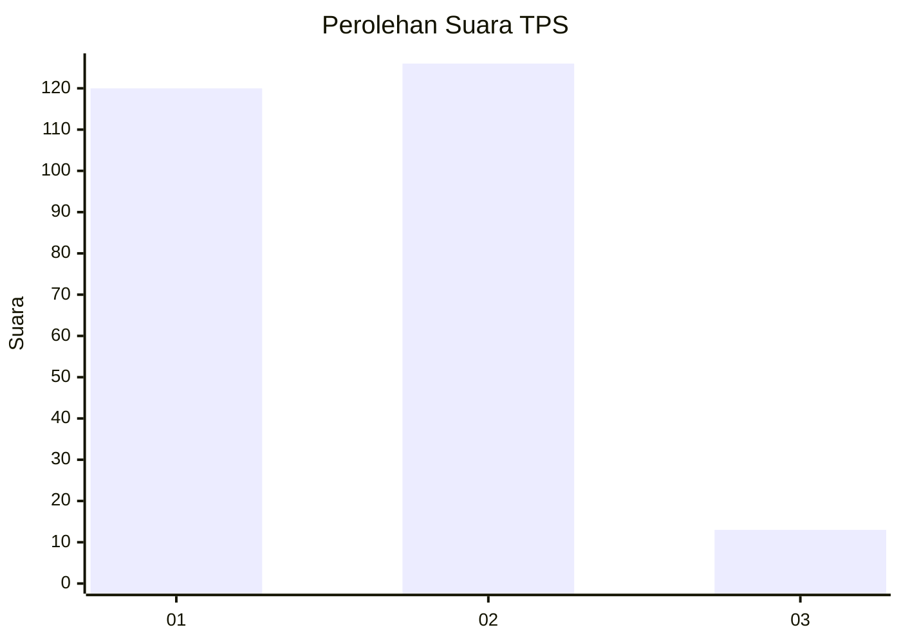
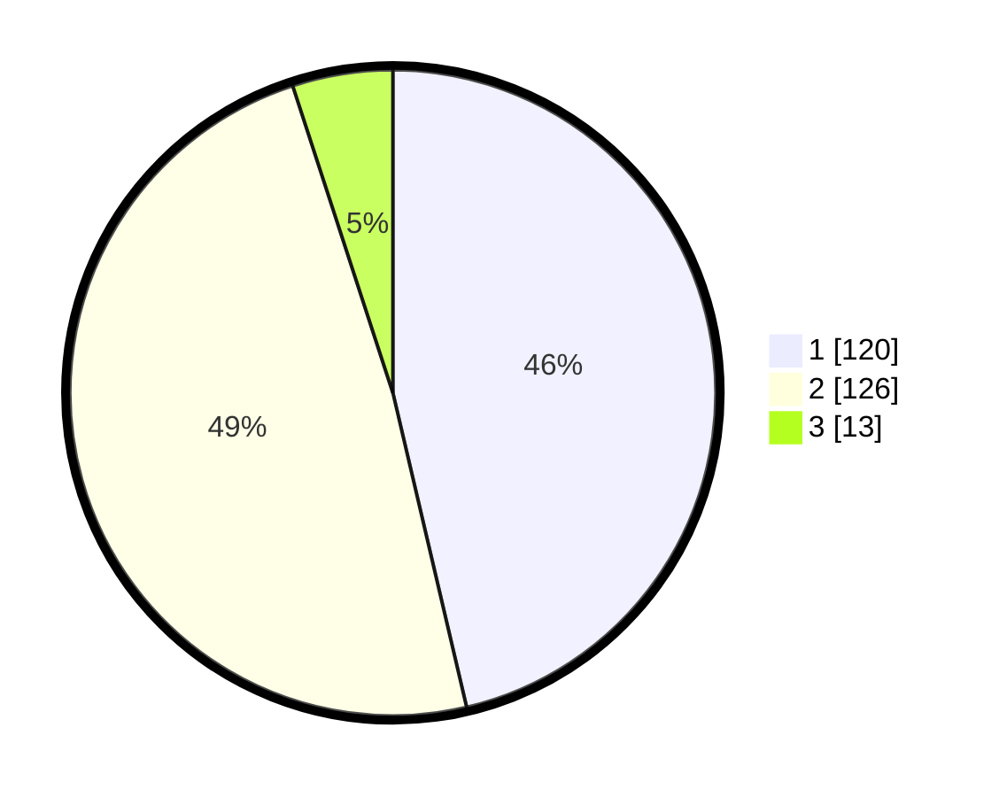

# Hasil

## Grafik

## Tabel

| No. | Nama Paslon    | Suara | Suara (raw) | Persentase |
|:--- |:-------------- | -----:| -----------:| ----------:|
| 1   | ANIES MUHAIMIN | 120   | [120][p-1]  | 46,33      |
| 2   | PRABOWO GIBRAN | 126   | [126][p-2]  | 48,65      |
| 3   | GANJAR MAHFUD  | 13    | [13][p-3]   | 5,02       |

[p-1]: https://github.com/gigit-pemilu/pemilu-2024/blob/main/pilpres/hitung-suara/sub/32-jawa-barat/sub/04-bandung/sub/37-soreang/sub/2011-pamekaran/sub/010-tps/sub/paslon-1.txt
[p-2]: https://github.com/gigit-pemilu/pemilu-2024/blob/main/pilpres/hitung-suara/sub/32-jawa-barat/sub/04-bandung/sub/37-soreang/sub/2011-pamekaran/sub/010-tps/sub/paslon-2.txt
[p-3]: https://github.com/gigit-pemilu/pemilu-2024/blob/main/pilpres/hitung-suara/sub/32-jawa-barat/sub/04-bandung/sub/37-soreang/sub/2011-pamekaran/sub/010-tps/sub/paslon-3.txt

## Foto C Plano

https://sirekap-obj-formc.kpu.go.id/1fa0/pemilu/ppwp/32/04/37/20/11/3204372011010-20240224-002852--be5a7a6f-d1e2-4380-8cc5-1cd9cc24b2db.jpg

https://sirekap-obj-formc.kpu.go.id/1fa0/pemilu/ppwp/32/04/37/20/11/3204372011010-20240223-211129--100eacdc-e8ac-4619-8fe6-de34b4807480.jpg

https://sirekap-obj-formc.kpu.go.id/1fa0/pemilu/ppwp/32/04/37/20/11/3204372011010-20240223-211326--76d28199-3cdb-47de-b5de-e702735439d0.jpg

## Metadata

| Key        | Value               |
| ---------- | ------------------- |
| Time Stamp | 2024-02-24 22:31:28 |

