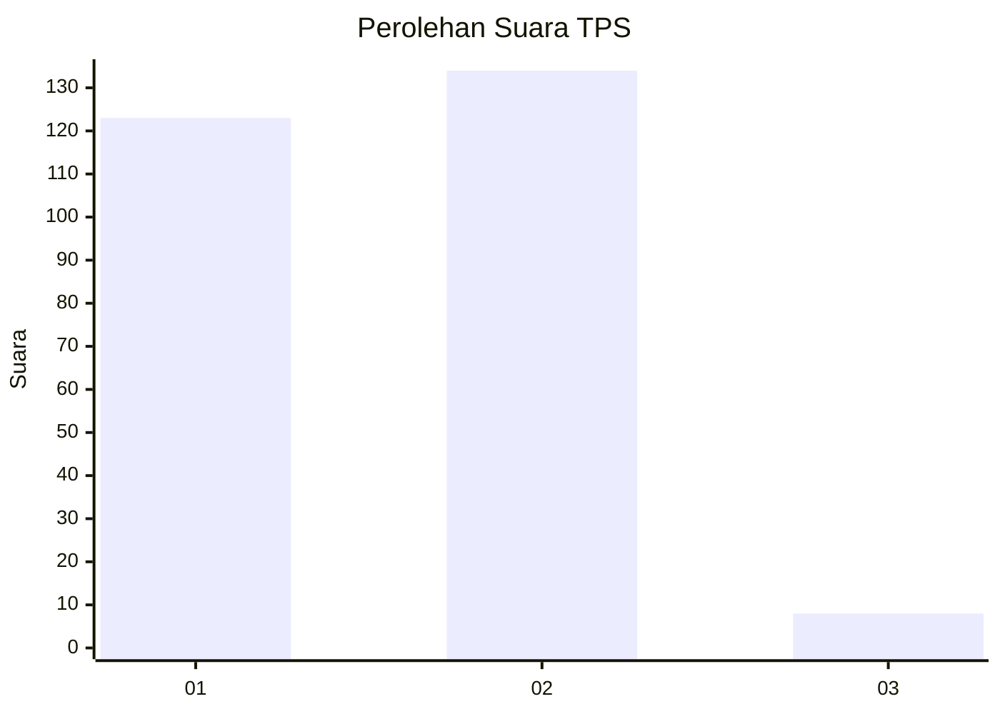
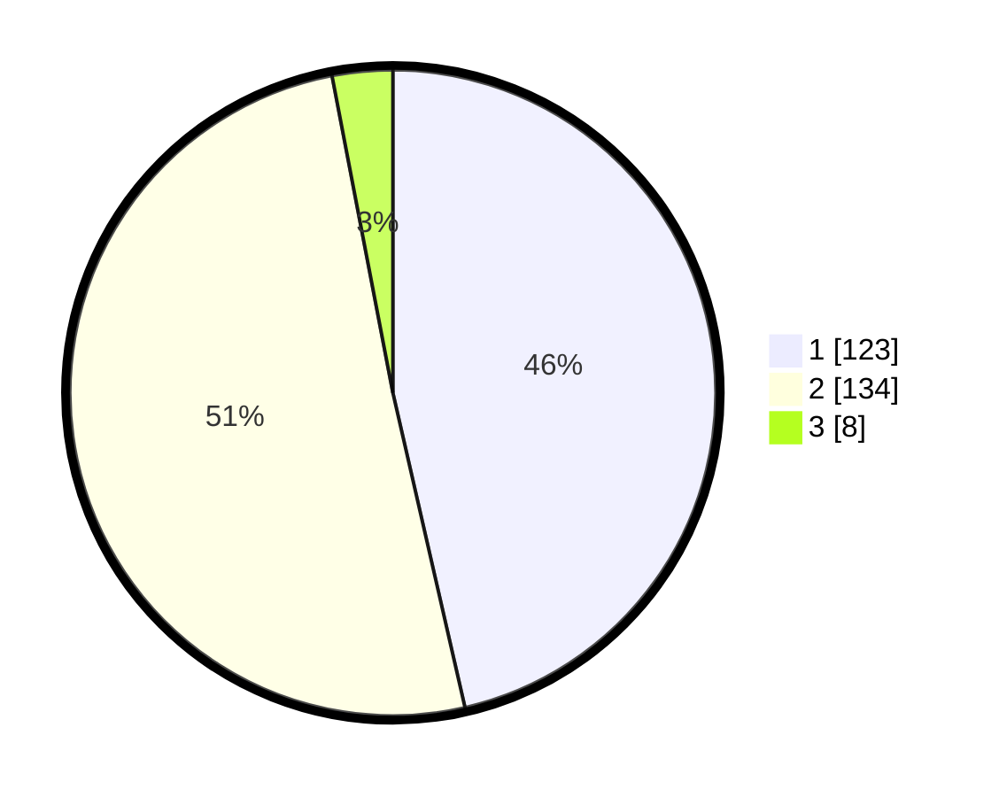

# Hasil

## Grafik

## Tabel

| No. | Nama Paslon    | Suara | Suara (raw) | Persentase |
|:--- |:-------------- | -----:| -----------:| ----------:|
| 1   | ANIES MUHAIMIN | 123   | [123][p-1]  | 46,42      |
| 2   | PRABOWO GIBRAN | 134   | [134][p-2]  | 50,57      |
| 3   | GANJAR MAHFUD  | 8     | [8][p-3]    | 3,02       |

[p-1]: https://github.com/gigit-pemilu/pemilu-2024/blob/main/pilpres/hitung-suara/sub/32-jawa-barat/sub/04-bandung/sub/37-soreang/sub/2018-sukanagara/sub/005-tps/sub/paslon-1.txt
[p-2]: https://github.com/gigit-pemilu/pemilu-2024/blob/main/pilpres/hitung-suara/sub/32-jawa-barat/sub/04-bandung/sub/37-soreang/sub/2018-sukanagara/sub/005-tps/sub/paslon-2.txt
[p-3]: https://github.com/gigit-pemilu/pemilu-2024/blob/main/pilpres/hitung-suara/sub/32-jawa-barat/sub/04-bandung/sub/37-soreang/sub/2018-sukanagara/sub/005-tps/sub/paslon-3.txt

## Foto C Plano

https://sirekap-obj-formc.kpu.go.id/5b72/pemilu/ppwp/32/04/37/20/18/3204372018005-20240215-061529--35b2e811-4106-4615-ace5-35b3b36bb879.jpg

https://sirekap-obj-formc.kpu.go.id/5b72/pemilu/ppwp/32/04/37/20/18/3204372018005-20240215-061746--ae95bcc6-d349-4432-a5f1-8932d4071e28.jpg

https://sirekap-obj-formc.kpu.go.id/5b72/pemilu/ppwp/32/04/37/20/18/3204372018005-20240215-061916--655302fd-5477-4ea7-a1bb-566d8010245f.jpg

## Metadata

| Key        | Value               |
| ---------- | ------------------- |
| Time Stamp | 2024-02-15 22:00:27 |

