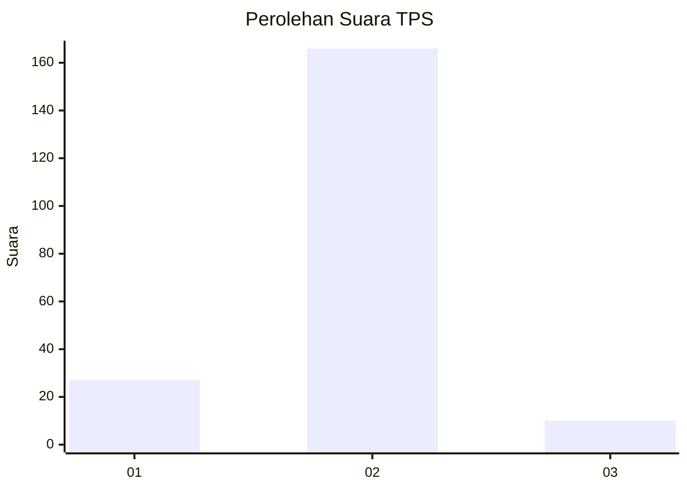
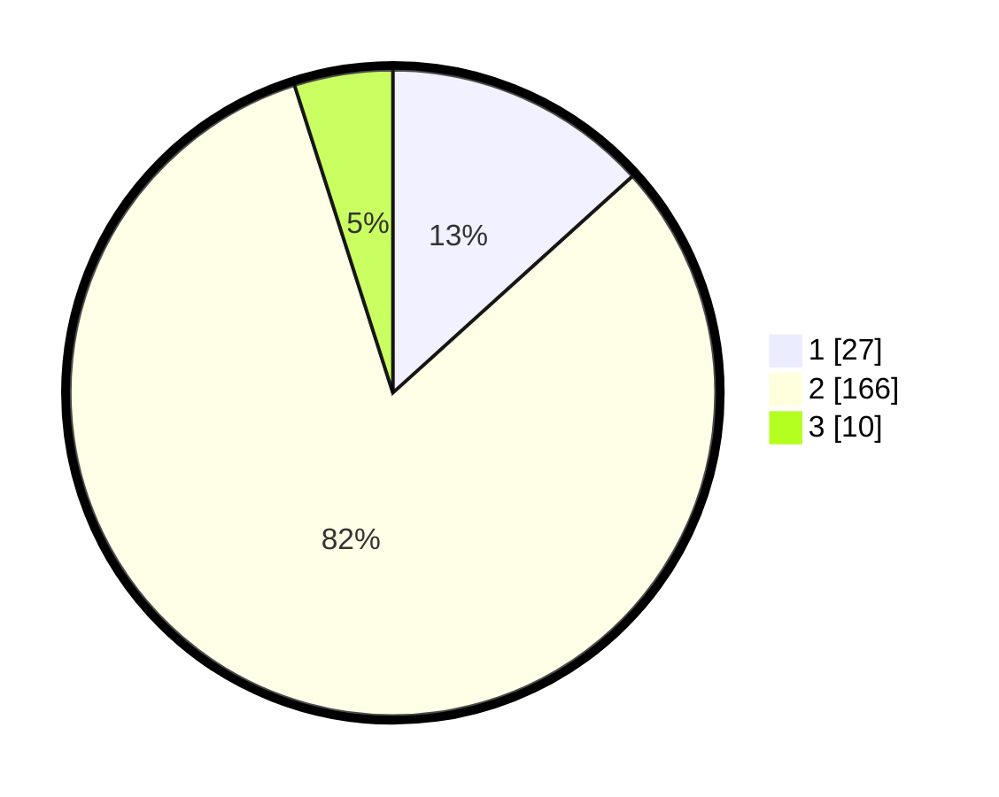

# Hasil

## Grafik

## Tabel

| No. | Nama Paslon    | Suara | Suara (raw) | Persentase |
|:--- |:-------------- | -----:| -----------:| ----------:|
| 1   | ANIES MUHAIMIN | 27    | [27][p-1]   | 13,30      |
| 2   | PRABOWO GIBRAN | 166   | [166][p-2]  | 81,77      |
| 3   | GANJAR MAHFUD  | 10    | [10][p-3]   | 4,93       |

[p-1]: https://github.com/gigit-pemilu/pemilu-2024-32-jawa-barat/blob/main/pilpres/hitung-suara/sub/32-jawa-barat/sub/04-bandung/sub/38-pasirjambu/sub/2001-pasirjambu/sub/001-tps/sub/paslon-1.txt
[p-2]: https://github.com/gigit-pemilu/pemilu-2024-32-jawa-barat/blob/main/pilpres/hitung-suara/sub/32-jawa-barat/sub/04-bandung/sub/38-pasirjambu/sub/2001-pasirjambu/sub/001-tps/sub/paslon-2.txt
[p-3]: https://github.com/gigit-pemilu/pemilu-2024-32-jawa-barat/blob/main/pilpres/hitung-suara/sub/32-jawa-barat/sub/04-bandung/sub/38-pasirjambu/sub/2001-pasirjambu/sub/001-tps/sub/paslon-3.txt

## Foto C Plano

https://sirekap-obj-formc.kpu.go.id/af38/pemilu/ppwp/32/04/38/20/01/3204382001001-20240223-200147--d9551d84-092e-40ac-835b-22719373e30d.jpg

https://sirekap-obj-formc.kpu.go.id/af38/pemilu/ppwp/32/04/38/20/01/3204382001001-20240223-200253--94180a80-9c03-4f94-9844-c16d055a6b63.jpg

https://sirekap-obj-formc.kpu.go.id/af38/pemilu/ppwp/32/04/38/20/01/3204382001001-20240223-200411--bb5215d7-cc19-4807-bce6-fa57e14f55c8.jpg

## Metadata

| Key        | Value               |
| ---------- | ------------------- |
| Time Stamp | 2024-02-24 22:31:28 |

