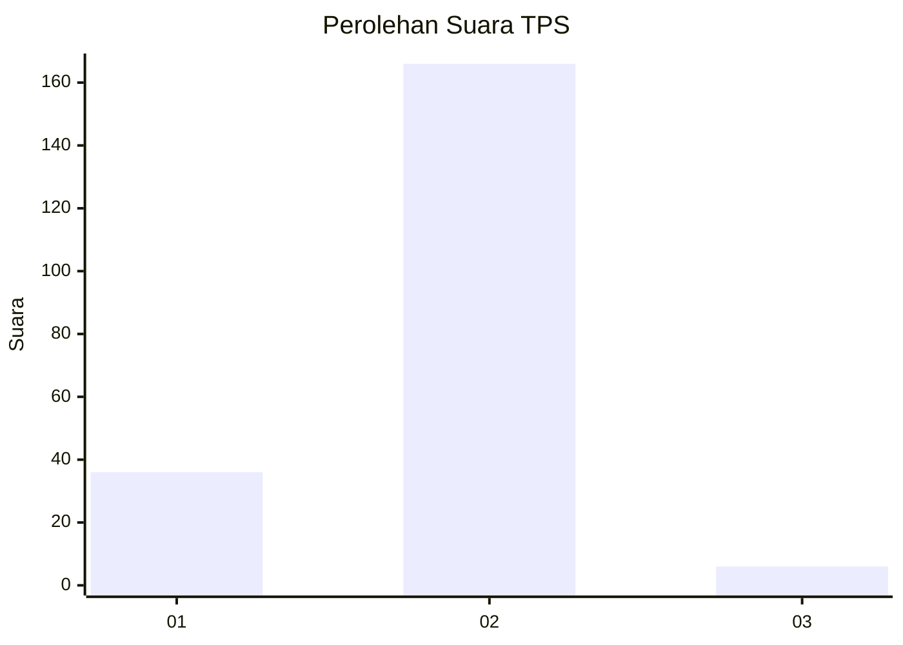
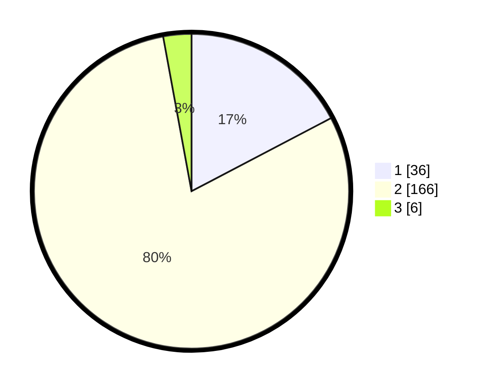

# Hasil

## Grafik

## Tabel

| No. | Nama Paslon    | Suara | Suara (raw) | Persentase |
|:--- |:-------------- | -----:| -----------:| ----------:|
| 1   | ANIES MUHAIMIN | 36    | [36][p-1]   | 17,31      |
| 2   | PRABOWO GIBRAN | 166   | [166][p-2]  | 79,81      |
| 3   | GANJAR MAHFUD  | 6     | [6][p-3]    | 2,88       |

[p-1]: https://github.com/gigit-pemilu/pemilu-2024/blob/main/pilpres/hitung-suara/sub/32-jawa-barat/sub/04-bandung/sub/38-pasirjambu/sub/2001-pasirjambu/sub/004-tps/sub/paslon-1.txt
[p-2]: https://github.com/gigit-pemilu/pemilu-2024/blob/main/pilpres/hitung-suara/sub/32-jawa-barat/sub/04-bandung/sub/38-pasirjambu/sub/2001-pasirjambu/sub/004-tps/sub/paslon-2.txt
[p-3]: https://github.com/gigit-pemilu/pemilu-2024/blob/main/pilpres/hitung-suara/sub/32-jawa-barat/sub/04-bandung/sub/38-pasirjambu/sub/2001-pasirjambu/sub/004-tps/sub/paslon-3.txt

## Foto C Plano

https://sirekap-obj-formc.kpu.go.id/264d/pemilu/ppwp/32/04/38/20/01/3204382001004-20240223-200344--2beb2546-316e-4fd4-915b-4bbdad7236ba.jpg

https://sirekap-obj-formc.kpu.go.id/264d/pemilu/ppwp/32/04/38/20/01/3204382001004-20240223-200438--e9345a35-7336-47c6-be68-ffacf78807e5.jpg

https://sirekap-obj-formc.kpu.go.id/264d/pemilu/ppwp/32/04/38/20/01/3204382001004-20240223-200555--762f52b8-a7d7-496e-94e5-edce23596269.jpg

## Metadata

| Key        | Value               |
| ---------- | ------------------- |
| Time Stamp | 2024-02-25 16:00:00 |

