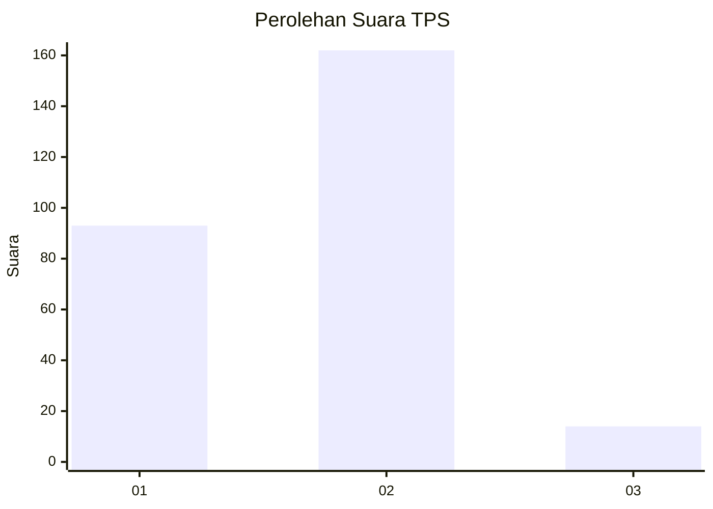
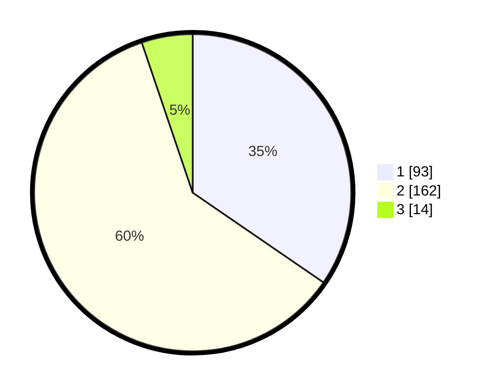

# Hasil

## Grafik

## Tabel

| No. | Nama Paslon    | Suara | Suara (raw) | Persentase |
|:--- |:-------------- | -----:| -----------:| ----------:|
| 1   | ANIES MUHAIMIN | 93    | [93][p-1]   | 34,57      |
| 2   | PRABOWO GIBRAN | 162   | [162][p-2]  | 60,22      |
| 3   | GANJAR MAHFUD  | 14    | [14][p-3]   | 5,20       |

[p-1]: https://github.com/gigit-pemilu/pemilu-2024/blob/main/pilpres/hitung-suara/sub/32-jawa-barat/sub/04-bandung/sub/38-pasirjambu/sub/2003-cikoneng/sub/010-tps/sub/paslon-1.txt
[p-2]: https://github.com/gigit-pemilu/pemilu-2024/blob/main/pilpres/hitung-suara/sub/32-jawa-barat/sub/04-bandung/sub/38-pasirjambu/sub/2003-cikoneng/sub/010-tps/sub/paslon-2.txt
[p-3]: https://github.com/gigit-pemilu/pemilu-2024/blob/main/pilpres/hitung-suara/sub/32-jawa-barat/sub/04-bandung/sub/38-pasirjambu/sub/2003-cikoneng/sub/010-tps/sub/paslon-3.txt

## Foto C Plano

https://sirekap-obj-formc.kpu.go.id/bf25/pemilu/ppwp/32/04/38/20/03/3204382003010-20240222-141628--fcc559f6-17f3-4468-b9c6-059bd1c3d05b.jpg

https://sirekap-obj-formc.kpu.go.id/bf25/pemilu/ppwp/32/04/38/20/03/3204382003010-20240222-141745--17767eaf-6db0-419b-b344-f68cdd0c6ad0.jpg

https://sirekap-obj-formc.kpu.go.id/bf25/pemilu/ppwp/32/04/38/20/03/3204382003010-20240222-142044--28a978c5-4003-464e-8235-504dd52bca07.jpg

## Metadata

| Key        | Value               |
| ---------- | ------------------- |
| Time Stamp | 2024-02-22 17:00:00 |

