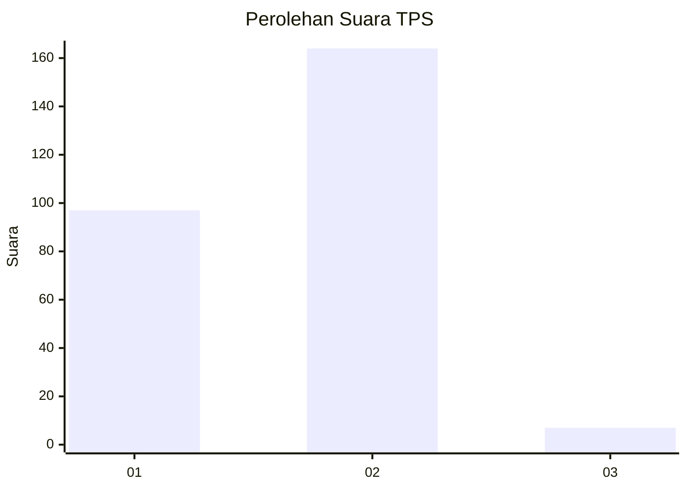
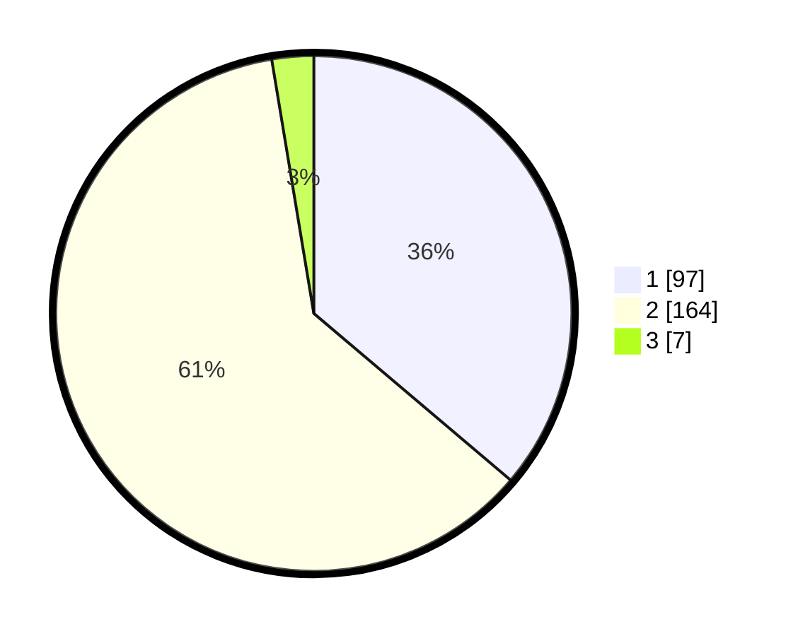

# Hasil

## Grafik

## Tabel

| No. | Nama Paslon    | Suara | Suara (raw) | Persentase |
|:--- |:-------------- | -----:| -----------:| ----------:|
| 1   | ANIES MUHAIMIN | 97    | [97][p-1]   | 36,19      |
| 2   | PRABOWO GIBRAN | 164   | [164][p-2]  | 61,19      |
| 3   | GANJAR MAHFUD  | 7     | [7][p-3]    | 2,61       |

[p-1]: https://github.com/gigit-pemilu/pemilu-2024/blob/main/pilpres/hitung-suara/sub/32-jawa-barat/sub/04-bandung/sub/38-pasirjambu/sub/2003-cikoneng/sub/011-tps/sub/paslon-1.txt
[p-2]: https://github.com/gigit-pemilu/pemilu-2024/blob/main/pilpres/hitung-suara/sub/32-jawa-barat/sub/04-bandung/sub/38-pasirjambu/sub/2003-cikoneng/sub/011-tps/sub/paslon-2.txt
[p-3]: https://github.com/gigit-pemilu/pemilu-2024/blob/main/pilpres/hitung-suara/sub/32-jawa-barat/sub/04-bandung/sub/38-pasirjambu/sub/2003-cikoneng/sub/011-tps/sub/paslon-3.txt

## Foto C Plano

https://sirekap-obj-formc.kpu.go.id/992a/pemilu/ppwp/32/04/38/20/03/3204382003011-20240221-170525--bcc8d76d-2b83-48ed-81b3-60ba38fe8151.jpg

https://sirekap-obj-formc.kpu.go.id/992a/pemilu/ppwp/32/04/38/20/03/3204382003011-20240221-170629--1508f081-55c7-4c61-85f5-0c84fd831920.jpg

https://sirekap-obj-formc.kpu.go.id/992a/pemilu/ppwp/32/04/38/20/03/3204382003011-20240221-170700--777495e7-2051-4c16-b2a6-5f8711097f00.jpg

## Metadata

| Key        | Value               |
| ---------- | ------------------- |
| Time Stamp | 2024-02-21 20:00:00 |

