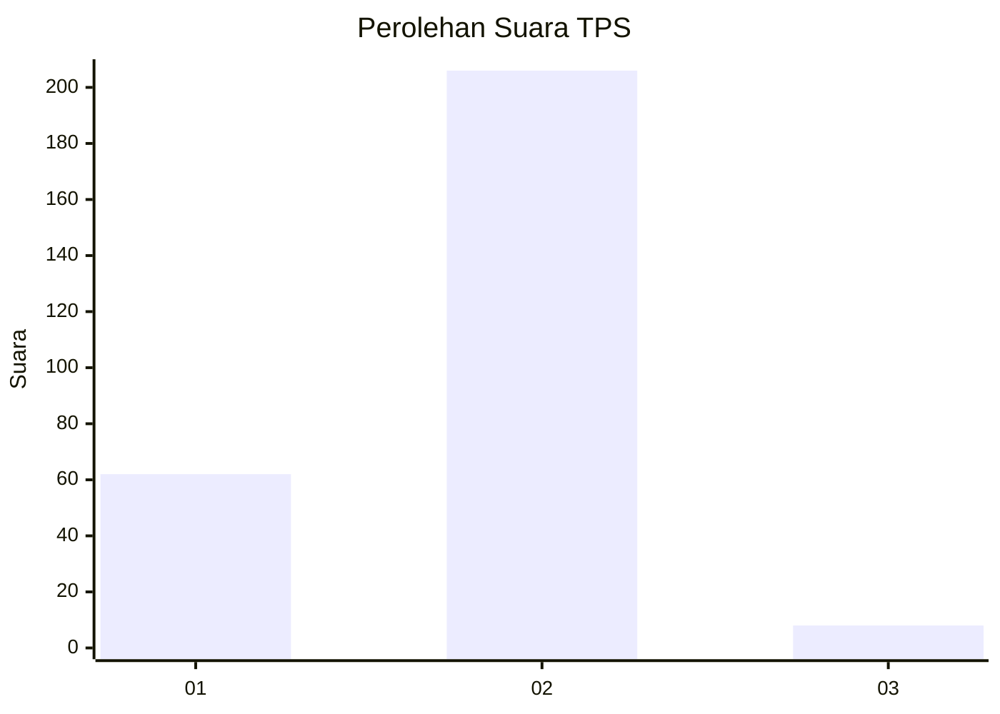

# Hasil

## Grafik

## Tabel

| No. | Nama Paslon    | Suara | Suara (raw) | Persentase |
|:--- |:-------------- | -----:| -----------:| ----------:|
| 1   | ANIES MUHAIMIN | 62    | [62][p-1]   | 22,46      |
| 2   | PRABOWO GIBRAN | 206   | [206][p-2]  | 74,64      |
| 3   | GANJAR MAHFUD  | 8     | [8][p-3]    | 2,90       |

[p-1]: https://github.com/gigit-pemilu/pemilu-2024/blob/main/pilpres/hitung-suara/sub/32-jawa-barat/sub/04-bandung/sub/38-pasirjambu/sub/2003-cikoneng/sub/012-tps/sub/paslon-1.txt
[p-2]: https://github.com/gigit-pemilu/pemilu-2024/blob/main/pilpres/hitung-suara/sub/32-jawa-barat/sub/04-bandung/sub/38-pasirjambu/sub/2003-cikoneng/sub/012-tps/sub/paslon-2.txt
[p-3]: https://github.com/gigit-pemilu/pemilu-2024/blob/main/pilpres/hitung-suara/sub/32-jawa-barat/sub/04-bandung/sub/38-pasirjambu/sub/2003-cikoneng/sub/012-tps/sub/paslon-3.txt

## Foto C Plano

https://sirekap-obj-formc.kpu.go.id/7b2b/pemilu/ppwp/32/04/38/20/03/3204382003012-20240221-152111--5123bf70-acd8-4a1b-b93f-43bea97face5.jpg

https://sirekap-obj-formc.kpu.go.id/7b2b/pemilu/ppwp/32/04/38/20/03/3204382003012-20240221-152150--01675b3c-d8b4-4cee-9e53-efaa6543da98.jpg

https://sirekap-obj-formc.kpu.go.id/7b2b/pemilu/ppwp/32/04/38/20/03/3204382003012-20240221-152226--ec3b2e9a-7a3a-4465-825c-4c68a8c7a049.jpg

## Metadata

| Key        | Value               |
| ---------- | ------------------- |
| Time Stamp | 2024-02-21 20:00:00 |

