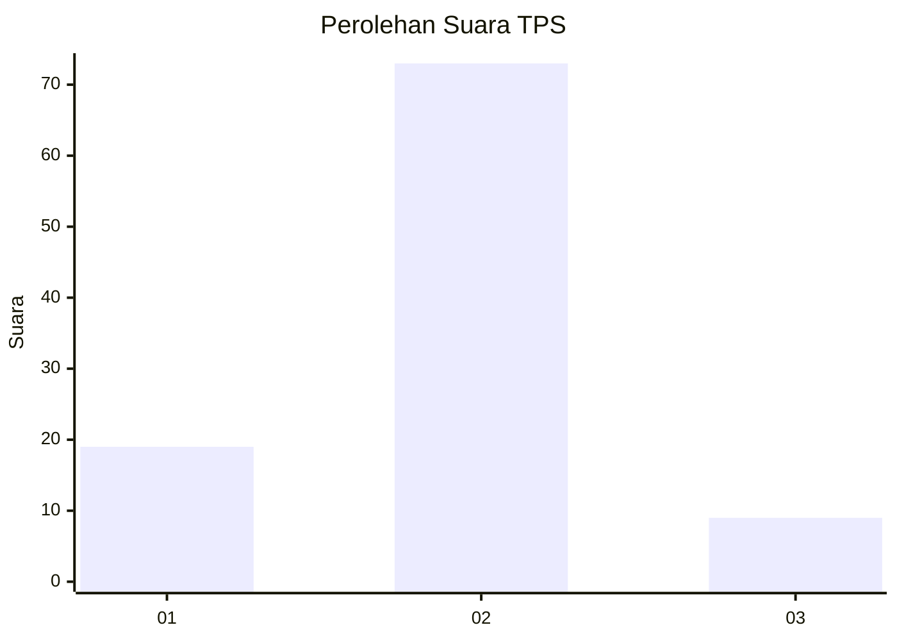
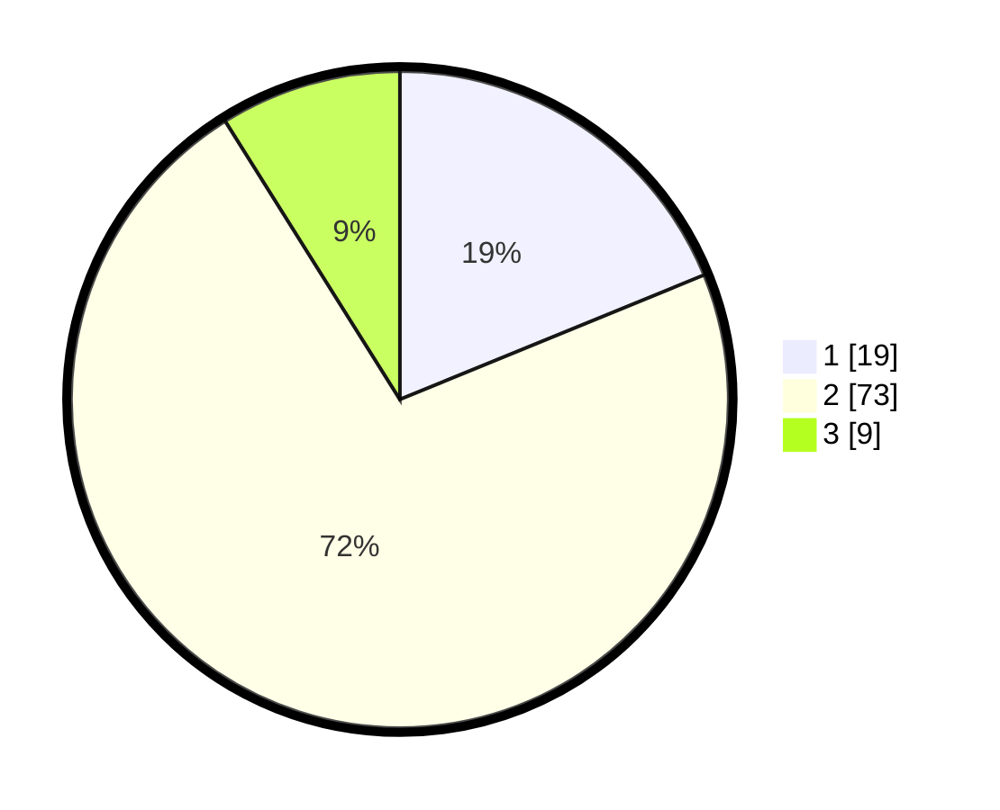

# Hasil

## Grafik

## Tabel

| No. | Nama Paslon    | Suara | Suara (raw) | Persentase |
|:--- |:-------------- | -----:| -----------:| ----------:|
| 1   | ANIES MUHAIMIN | 19    | [19][p-1]   | 18,81      |
| 2   | PRABOWO GIBRAN | 73    | [73][p-2]   | 72,28      |
| 3   | GANJAR MAHFUD  | 9     | [9][p-3]    | 8,91       |

[p-1]: https://github.com/gigit-pemilu/pemilu-2024/blob/main/pilpres/hitung-suara/sub/32-jawa-barat/sub/04-bandung/sub/38-pasirjambu/sub/2005-cisondari/sub/016-tps/sub/paslon-1.txt
[p-2]: https://github.com/gigit-pemilu/pemilu-2024/blob/main/pilpres/hitung-suara/sub/32-jawa-barat/sub/04-bandung/sub/38-pasirjambu/sub/2005-cisondari/sub/016-tps/sub/paslon-2.txt
[p-3]: https://github.com/gigit-pemilu/pemilu-2024/blob/main/pilpres/hitung-suara/sub/32-jawa-barat/sub/04-bandung/sub/38-pasirjambu/sub/2005-cisondari/sub/016-tps/sub/paslon-3.txt

## Foto C Plano

https://sirekap-obj-formc.kpu.go.id/e60e/pemilu/ppwp/32/04/38/20/05/3204382005016-20240223-191804--63690d3f-133c-4937-a586-3a43172c19a3.jpg

https://sirekap-obj-formc.kpu.go.id/e60e/pemilu/ppwp/32/04/38/20/05/3204382005016-20240223-191828--85d2ab7c-bb55-445f-b68e-cb70356b9627.jpg

https://sirekap-obj-formc.kpu.go.id/e60e/pemilu/ppwp/32/04/38/20/05/3204382005016-20240223-191919--e5db036d-a68f-42c9-a45a-134a38e681a7.jpg

## Metadata

| Key        | Value               |
| ---------- | ------------------- |
| Time Stamp | 2024-02-24 22:31:28 |

