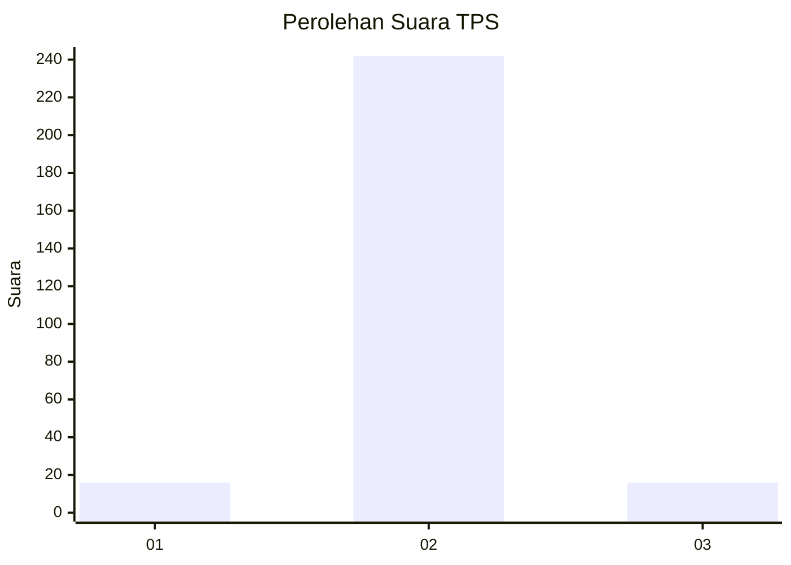
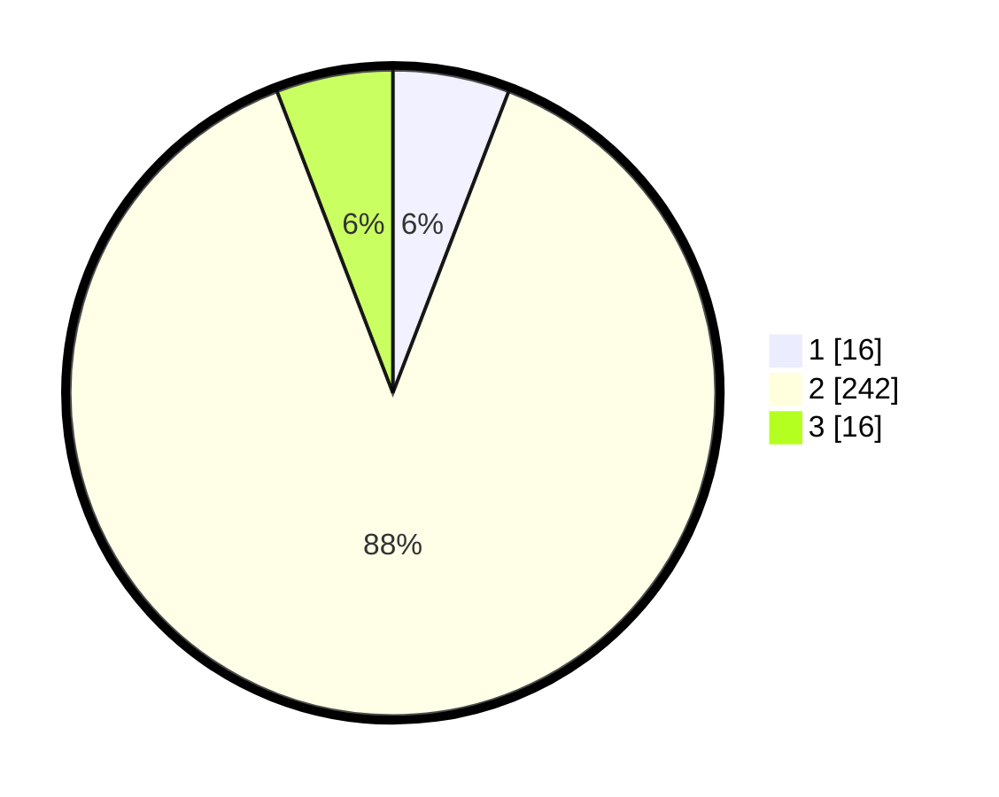

# Hasil

## Grafik

## Tabel

| No. | Nama Paslon    | Suara | Suara (raw) | Persentase |
|:--- |:-------------- | -----:| -----------:| ----------:|
| 1   | ANIES MUHAIMIN | 16    | [16][p-1]   | 5,84       |
| 2   | PRABOWO GIBRAN | 242   | [242][p-2]  | 88,32      |
| 3   | GANJAR MAHFUD  | 16    | [16][p-3]   | 5,84       |

[p-1]: https://github.com/gigit-pemilu/pemilu-2024/blob/main/pilpres/hitung-suara/sub/32-jawa-barat/sub/04-bandung/sub/38-pasirjambu/sub/2005-cisondari/sub/025-tps/sub/paslon-1.txt
[p-2]: https://github.com/gigit-pemilu/pemilu-2024/blob/main/pilpres/hitung-suara/sub/32-jawa-barat/sub/04-bandung/sub/38-pasirjambu/sub/2005-cisondari/sub/025-tps/sub/paslon-2.txt
[p-3]: https://github.com/gigit-pemilu/pemilu-2024/blob/main/pilpres/hitung-suara/sub/32-jawa-barat/sub/04-bandung/sub/38-pasirjambu/sub/2005-cisondari/sub/025-tps/sub/paslon-3.txt

## Foto C Plano

https://sirekap-obj-formc.kpu.go.id/9f82/pemilu/ppwp/32/04/38/20/05/3204382005025-20240223-180725--1eda4aa5-47c3-4c9e-b1cc-d857b7a45e33.jpg

https://sirekap-obj-formc.kpu.go.id/9f82/pemilu/ppwp/32/04/38/20/05/3204382005025-20240223-180801--c3b6a297-804d-4929-9eab-62647ab88237.jpg

https://sirekap-obj-formc.kpu.go.id/9f82/pemilu/ppwp/32/04/38/20/05/3204382005025-20240223-180849--6e4ed4ca-87a1-4d21-9640-75011b8aca15.jpg

## Metadata

| Key        | Value               |
| ---------- | ------------------- |
| Time Stamp | 2024-02-24 22:31:28 |

