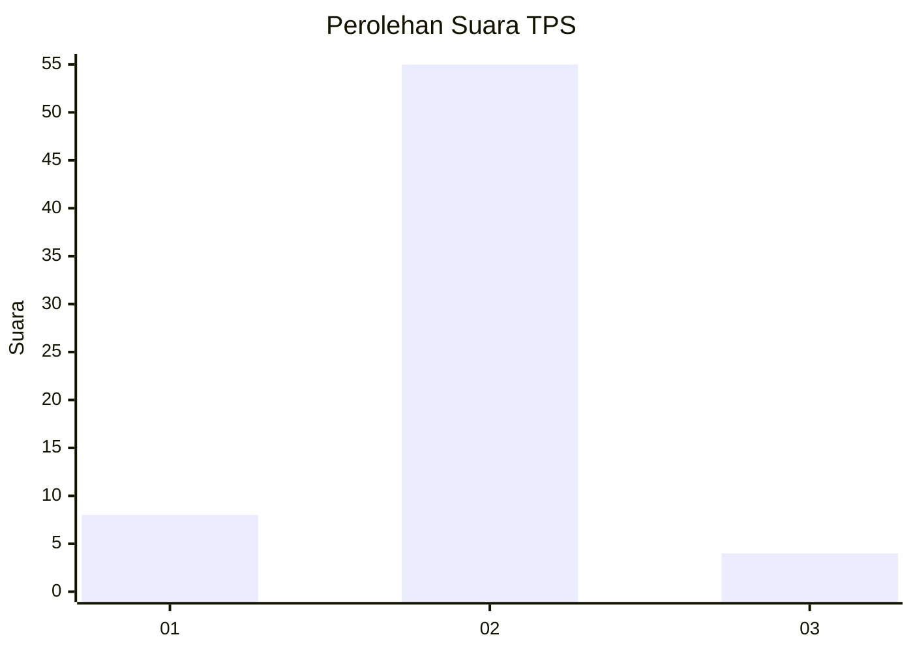
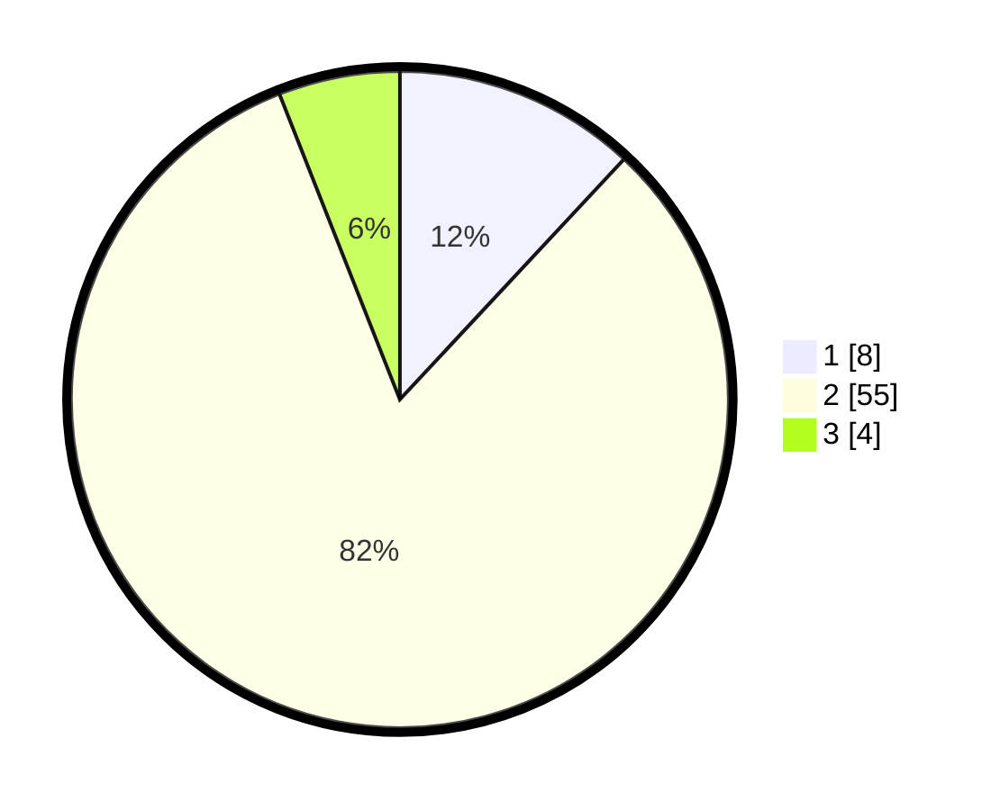

# Hasil

## Grafik

## Tabel

| No. | Nama Paslon    | Suara | Suara (raw) | Persentase |
|:--- |:-------------- | -----:| -----------:| ----------:|
| 1   | ANIES MUHAIMIN | 8     | [8][p-1]    | 11,94      |
| 2   | PRABOWO GIBRAN | 55    | [55][p-2]   | 82,09      |
| 3   | GANJAR MAHFUD  | 4     | [4][p-3]    | 5,97       |

[p-1]: https://github.com/gigit-pemilu/pemilu-2024-32-jawa-barat/blob/main/pilpres/hitung-suara/sub/32-jawa-barat/sub/04-bandung/sub/38-pasirjambu/sub/2009-sugihmukti/sub/034-tps/sub/paslon-1.txt
[p-2]: https://github.com/gigit-pemilu/pemilu-2024-32-jawa-barat/blob/main/pilpres/hitung-suara/sub/32-jawa-barat/sub/04-bandung/sub/38-pasirjambu/sub/2009-sugihmukti/sub/034-tps/sub/paslon-2.txt
[p-3]: https://github.com/gigit-pemilu/pemilu-2024-32-jawa-barat/blob/main/pilpres/hitung-suara/sub/32-jawa-barat/sub/04-bandung/sub/38-pasirjambu/sub/2009-sugihmukti/sub/034-tps/sub/paslon-3.txt

## Foto C Plano

https://sirekap-obj-formc.kpu.go.id/7e72/pemilu/ppwp/32/04/38/20/09/3204382009034-20240222-224244--b4c5d751-f7df-46ad-9c57-878677bbed1b.jpg

https://sirekap-obj-formc.kpu.go.id/7e72/pemilu/ppwp/32/04/38/20/09/3204382009034-20240222-224431--4080378e-bfd0-4d6b-818b-b76907dba190.jpg

https://sirekap-obj-formc.kpu.go.id/7e72/pemilu/ppwp/32/04/38/20/09/3204382009034-20240222-224520--359062c8-f163-428c-9708-bc2a841f33e7.jpg

## Metadata

| Key        | Value               |
| ---------- | ------------------- |
| Time Stamp | 2024-02-24 22:31:28 |

