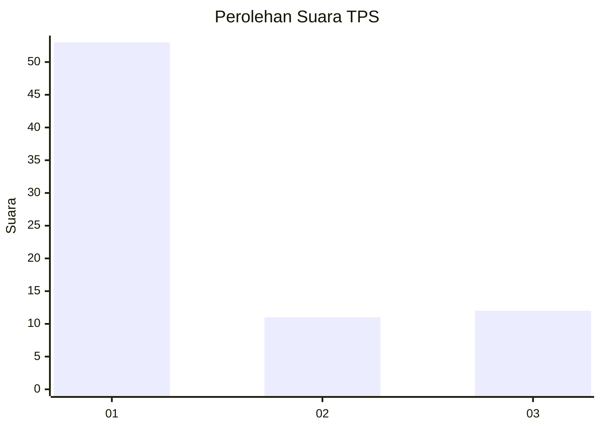
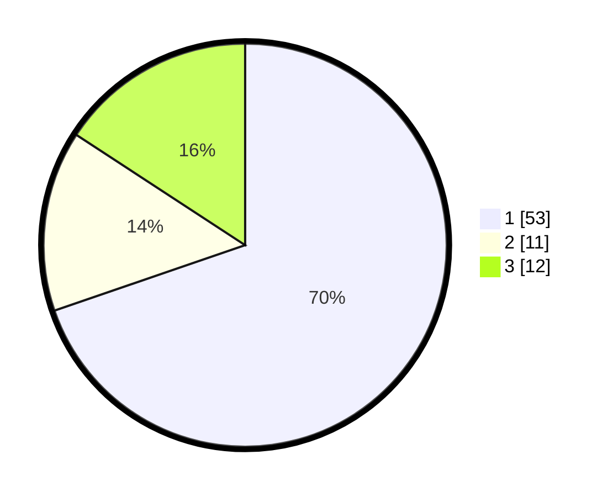

# Hasil

## Grafik

## Tabel

| No. | Nama Paslon    | Suara | Suara (raw) | Persentase |
|:--- |:-------------- | -----:| -----------:| ----------:|
| 1   | ANIES MUHAIMIN | 53    | [53][p-1]   | 69,74      |
| 2   | PRABOWO GIBRAN | 11    | [11][p-2]   | 14,47      |
| 3   | GANJAR MAHFUD  | 12    | [12][p-3]   | 15,79      |

[p-1]: https://github.com/gigit-pemilu/pemilu-2024-32-jawa-barat/blob/main/pilpres/hitung-suara/sub/32-jawa-barat/sub/04-bandung/sub/38-pasirjambu/sub/2010-tenjolaya/sub/004-tps/sub/paslon-1.txt
[p-2]: https://github.com/gigit-pemilu/pemilu-2024-32-jawa-barat/blob/main/pilpres/hitung-suara/sub/32-jawa-barat/sub/04-bandung/sub/38-pasirjambu/sub/2010-tenjolaya/sub/004-tps/sub/paslon-2.txt
[p-3]: https://github.com/gigit-pemilu/pemilu-2024-32-jawa-barat/blob/main/pilpres/hitung-suara/sub/32-jawa-barat/sub/04-bandung/sub/38-pasirjambu/sub/2010-tenjolaya/sub/004-tps/sub/paslon-3.txt

## Foto C Plano

https://sirekap-obj-formc.kpu.go.id/e2bb/pemilu/ppwp/32/04/38/20/10/3204382010004-20240223-103003--41d944e5-6c64-4a67-9b92-ece8ef37ba5d.jpg

https://sirekap-obj-formc.kpu.go.id/e2bb/pemilu/ppwp/32/04/38/20/10/3204382010004-20240223-103145--13a3e738-bfaa-4ce2-a688-b60fb3229845.jpg

https://sirekap-obj-formc.kpu.go.id/e2bb/pemilu/ppwp/32/04/38/20/10/3204382010004-20240223-103241--dfe96768-f988-4916-b46f-a2cfcba7e96c.jpg

## Metadata

| Key        | Value               |
| ---------- | ------------------- |
| Time Stamp | 2024-02-24 22:31:28 |

