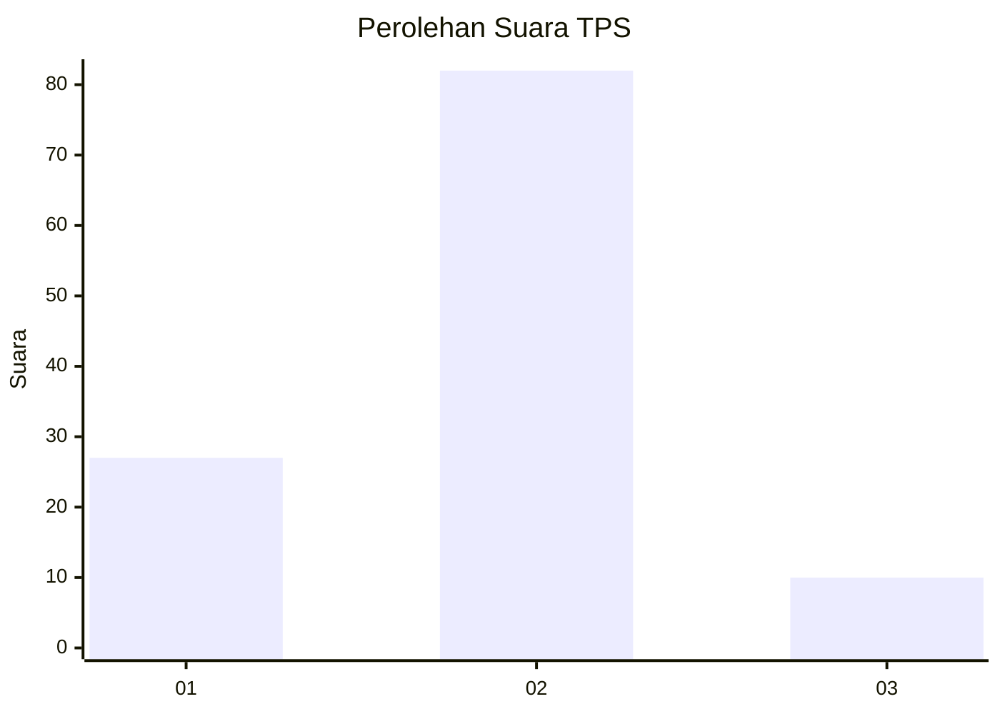
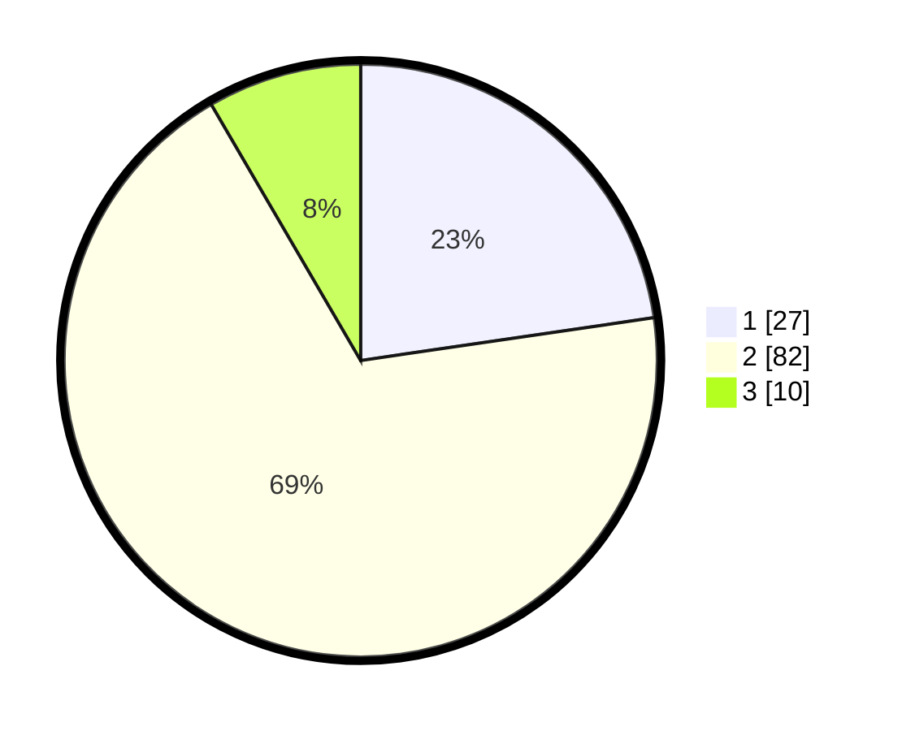

# Hasil

## Grafik

## Tabel

| No. | Nama Paslon    | Suara | Suara (raw) | Persentase |
|:--- |:-------------- | -----:| -----------:| ----------:|
| 1   | ANIES MUHAIMIN | 27    | [27][p-1]   | 22,69      |
| 2   | PRABOWO GIBRAN | 82    | [82][p-2]   | 68,91      |
| 3   | GANJAR MAHFUD  | 10    | [10][p-3]   | 8,40       |

[p-1]: https://github.com/gigit-pemilu/pemilu-2024-32-jawa-barat/blob/main/pilpres/hitung-suara/sub/32-jawa-barat/sub/04-bandung/sub/39-ciwidey/sub/2001-lebakmuncang/sub/004-tps/sub/paslon-1.txt
[p-2]: https://github.com/gigit-pemilu/pemilu-2024-32-jawa-barat/blob/main/pilpres/hitung-suara/sub/32-jawa-barat/sub/04-bandung/sub/39-ciwidey/sub/2001-lebakmuncang/sub/004-tps/sub/paslon-2.txt
[p-3]: https://github.com/gigit-pemilu/pemilu-2024-32-jawa-barat/blob/main/pilpres/hitung-suara/sub/32-jawa-barat/sub/04-bandung/sub/39-ciwidey/sub/2001-lebakmuncang/sub/004-tps/sub/paslon-3.txt

## Foto C Plano

https://sirekap-obj-formc.kpu.go.id/f2fb/pemilu/ppwp/32/04/39/20/01/3204392001004-20240215-042617--36522ff0-8192-4a5d-9147-cc66fbbc65db.jpg

https://sirekap-obj-formc.kpu.go.id/f2fb/pemilu/ppwp/32/04/39/20/01/3204392001004-20240214-210150--d00678e4-17b8-4377-a76c-d7234b23880c.jpg

https://sirekap-obj-formc.kpu.go.id/f2fb/pemilu/ppwp/32/04/39/20/01/3204392001004-20240214-210304--8ab642dd-67dc-4c3e-aac2-8efdd40bb1c6.jpg

## Metadata

| Key        | Value               |
| ---------- | ------------------- |
| Time Stamp | 2024-02-15 05:00:24 |

