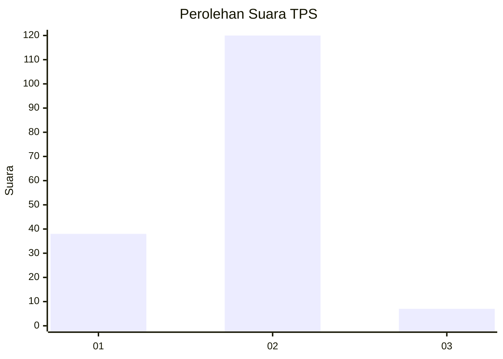
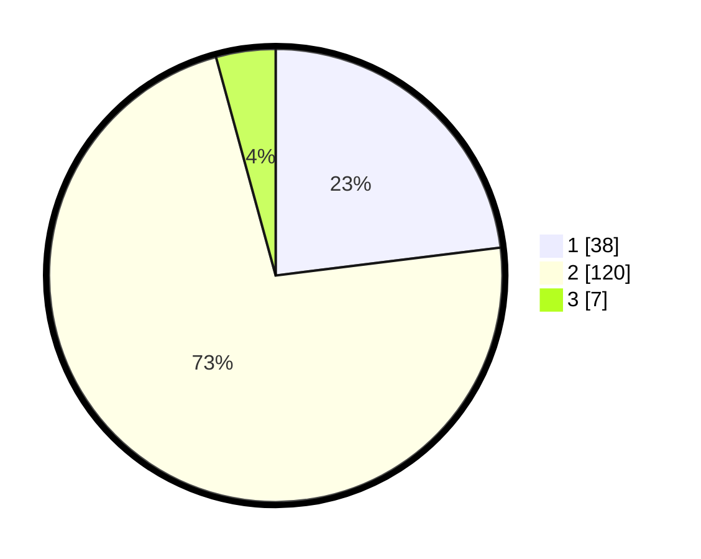

# Hasil

## Grafik

## Tabel

| No. | Nama Paslon    | Suara | Suara (raw) | Persentase |
|:--- |:-------------- | -----:| -----------:| ----------:|
| 1   | ANIES MUHAIMIN | 38    | [38][p-1]   | 23,03      |
| 2   | PRABOWO GIBRAN | 120   | [120][p-2]  | 72,73      |
| 3   | GANJAR MAHFUD  | 7     | [7][p-3]    | 4,24       |

[p-1]: https://github.com/gigit-pemilu/pemilu-2024/blob/main/pilpres/hitung-suara/sub/32-jawa-barat/sub/04-bandung/sub/39-ciwidey/sub/2004-panundaan/sub/006-tps/sub/paslon-1.txt
[p-2]: https://github.com/gigit-pemilu/pemilu-2024/blob/main/pilpres/hitung-suara/sub/32-jawa-barat/sub/04-bandung/sub/39-ciwidey/sub/2004-panundaan/sub/006-tps/sub/paslon-2.txt
[p-3]: https://github.com/gigit-pemilu/pemilu-2024/blob/main/pilpres/hitung-suara/sub/32-jawa-barat/sub/04-bandung/sub/39-ciwidey/sub/2004-panundaan/sub/006-tps/sub/paslon-3.txt

## Foto C Plano

https://sirekap-obj-formc.kpu.go.id/f9c5/pemilu/ppwp/32/04/39/20/04/3204392004006-20240214-141400--4b9d4b04-3b2d-4a0d-85aa-83644fc72acb.jpg

https://sirekap-obj-formc.kpu.go.id/f9c5/pemilu/ppwp/32/04/39/20/04/3204392004006-20240214-141609--4c237479-5b4e-42f1-9995-f2a41e75dec3.jpg

https://sirekap-obj-formc.kpu.go.id/f9c5/pemilu/ppwp/32/04/39/20/04/3204392004006-20240214-141801--fece07f4-dfaf-4a2f-87af-cbf3f73f0156.jpg

## Metadata

| Key        | Value               |
| ---------- | ------------------- |
| Time Stamp | 2024-02-15 20:30:46 |

