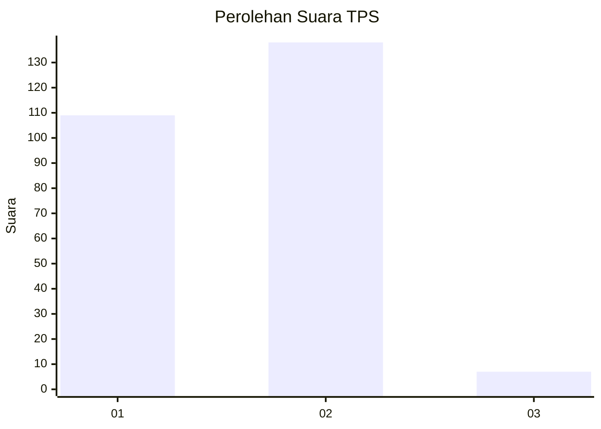
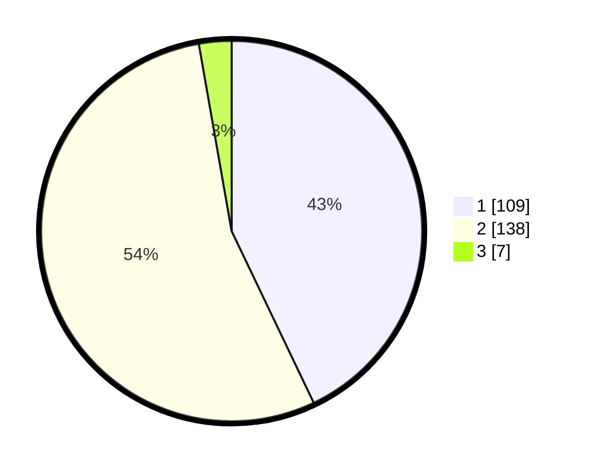

# Hasil

## Grafik

## Tabel

| No. | Nama Paslon    | Suara | Suara (raw) | Persentase |
|:--- |:-------------- | -----:| -----------:| ----------:|
| 1   | ANIES MUHAIMIN | 109   | [109][p-1]  | 42,91      |
| 2   | PRABOWO GIBRAN | 138   | [138][p-2]  | 54,33      |
| 3   | GANJAR MAHFUD  | 7     | [7][p-3]    | 2,76       |

[p-1]: https://github.com/gigit-pemilu/pemilu-2024-32-jawa-barat/blob/main/pilpres/hitung-suara/sub/32-jawa-barat/sub/04-bandung/sub/39-ciwidey/sub/2007-sukawening/sub/016-tps/sub/paslon-1.txt
[p-2]: https://github.com/gigit-pemilu/pemilu-2024-32-jawa-barat/blob/main/pilpres/hitung-suara/sub/32-jawa-barat/sub/04-bandung/sub/39-ciwidey/sub/2007-sukawening/sub/016-tps/sub/paslon-2.txt
[p-3]: https://github.com/gigit-pemilu/pemilu-2024-32-jawa-barat/blob/main/pilpres/hitung-suara/sub/32-jawa-barat/sub/04-bandung/sub/39-ciwidey/sub/2007-sukawening/sub/016-tps/sub/paslon-3.txt

## Foto C Plano

https://sirekap-obj-formc.kpu.go.id/c028/pemilu/ppwp/32/04/39/20/07/3204392007016-20240215-030519--f3194e96-67f8-4715-b8f8-1016e9bad894.jpg

https://sirekap-obj-formc.kpu.go.id/c028/pemilu/ppwp/32/04/39/20/07/3204392007016-20240215-030749--c500faf0-76a4-4812-b6ed-55d8c242abdf.jpg

https://sirekap-obj-formc.kpu.go.id/c028/pemilu/ppwp/32/04/39/20/07/3204392007016-20240215-030920--e35fd720-7ef1-428c-a3fd-b3093641a175.jpg

## Metadata

| Key        | Value               |
| ---------- | ------------------- |
| Time Stamp | 2024-02-15 22:30:27 |

