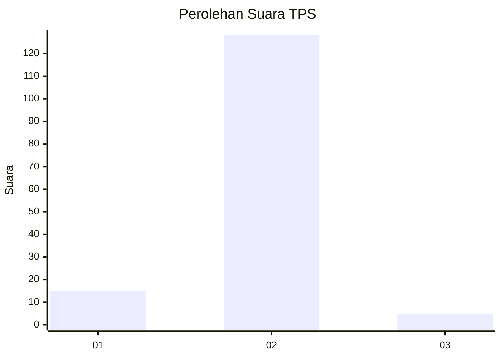
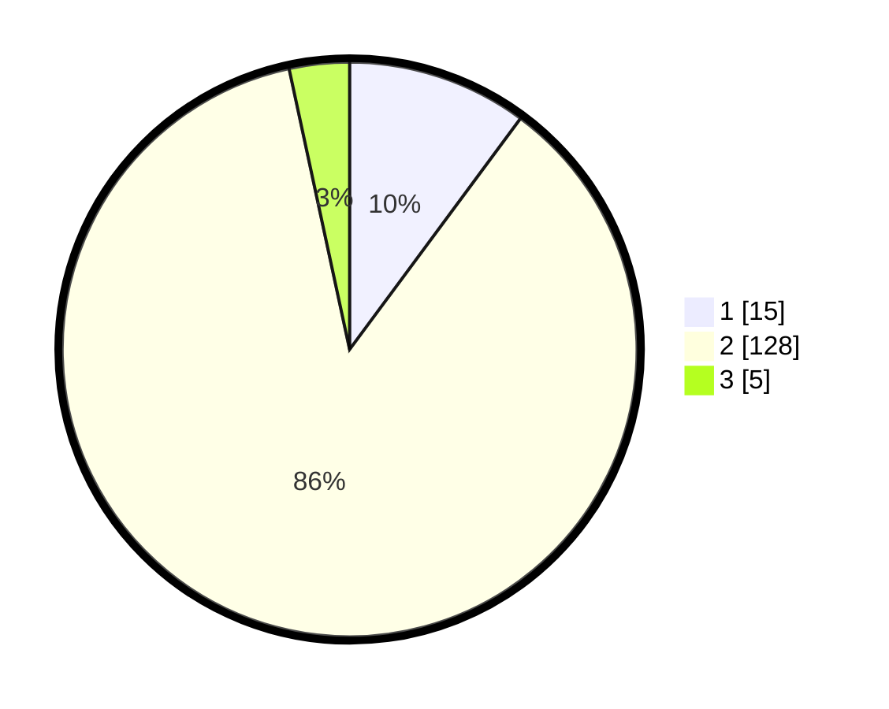

# Hasil

## Grafik

## Tabel

| No. | Nama Paslon    | Suara | Suara (raw) | Persentase |
|:--- |:-------------- | -----:| -----------:| ----------:|
| 1   | ANIES MUHAIMIN | 15    | [15][p-1]   | 10,14      |
| 2   | PRABOWO GIBRAN | 128   | [128][p-2]  | 86,49      |
| 3   | GANJAR MAHFUD  | 5     | [5][p-3]    | 3,38       |

[p-1]: https://github.com/gigit-pemilu/pemilu-2024/blob/main/pilpres/hitung-suara/sub/32-jawa-barat/sub/04-bandung/sub/40-rancabali/sub/2002-sukaresmi/sub/004-tps/sub/paslon-1.txt
[p-2]: https://github.com/gigit-pemilu/pemilu-2024/blob/main/pilpres/hitung-suara/sub/32-jawa-barat/sub/04-bandung/sub/40-rancabali/sub/2002-sukaresmi/sub/004-tps/sub/paslon-2.txt
[p-3]: https://github.com/gigit-pemilu/pemilu-2024/blob/main/pilpres/hitung-suara/sub/32-jawa-barat/sub/04-bandung/sub/40-rancabali/sub/2002-sukaresmi/sub/004-tps/sub/paslon-3.txt

## Foto C Plano

https://sirekap-obj-formc.kpu.go.id/fb84/pemilu/ppwp/32/04/40/20/02/3204402002004-20240215-001806--302fcd3d-88a8-490f-8f1b-b33b5b900e19.jpg

https://sirekap-obj-formc.kpu.go.id/fb84/pemilu/ppwp/32/04/40/20/02/3204402002004-20240215-001840--181d9a0b-038d-4aaf-a2d6-b3867961e726.jpg

https://sirekap-obj-formc.kpu.go.id/fb84/pemilu/ppwp/32/04/40/20/02/3204402002004-20240215-001925--fa6c1a58-0065-4e97-b612-f4d790fe07bc.jpg

## Metadata

| Key        | Value               |
| ---------- | ------------------- |
| Time Stamp | 2024-02-16 10:00:28 |

