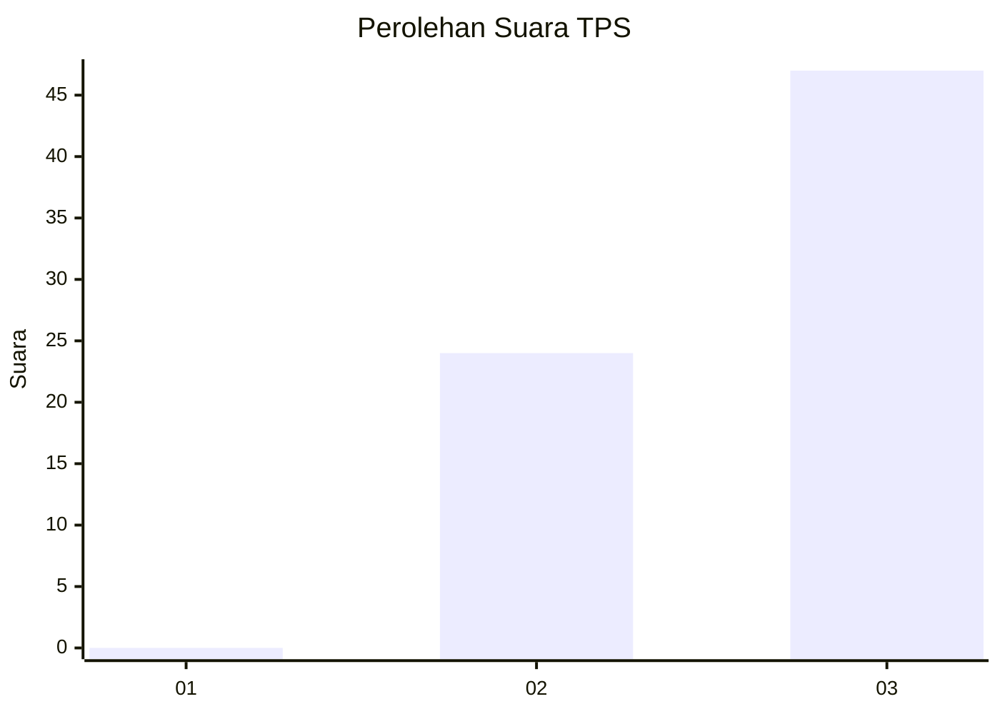
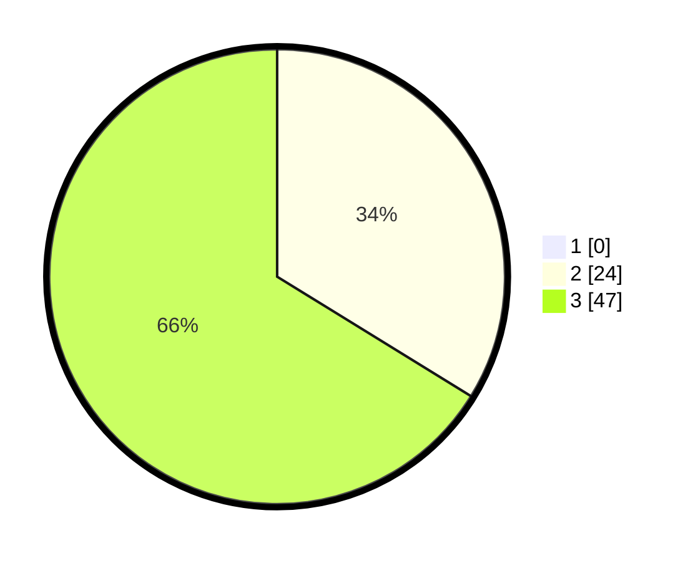

# Hasil

## Grafik

## Tabel

| No. | Nama Paslon    | Suara | Suara (raw) | Persentase |
|:--- |:-------------- | -----:| -----------:| ----------:|
| 1   | ANIES MUHAIMIN | 0     | [0][p-1]    | 0,00       |
| 2   | PRABOWO GIBRAN | 24    | [24][p-2]   | 33,80      |
| 3   | GANJAR MAHFUD  | 47    | [47][p-3]   | 66,20      |

[p-1]: https://github.com/gigit-pemilu/pemilu-2024-32-jawa-barat/blob/main/pilpres/hitung-suara/sub/32-jawa-barat/sub/04-bandung/sub/40-rancabali/sub/2002-sukaresmi/sub/026-tps/sub/paslon-1.txt
[p-2]: https://github.com/gigit-pemilu/pemilu-2024-32-jawa-barat/blob/main/pilpres/hitung-suara/sub/32-jawa-barat/sub/04-bandung/sub/40-rancabali/sub/2002-sukaresmi/sub/026-tps/sub/paslon-2.txt
[p-3]: https://github.com/gigit-pemilu/pemilu-2024-32-jawa-barat/blob/main/pilpres/hitung-suara/sub/32-jawa-barat/sub/04-bandung/sub/40-rancabali/sub/2002-sukaresmi/sub/026-tps/sub/paslon-3.txt

## Foto C Plano

https://sirekap-obj-formc.kpu.go.id/9d5b/pemilu/ppwp/32/04/40/20/02/3204402002026-20240221-165534--b435f7cb-7579-4eea-8c69-4204f5e302c1.jpg

https://sirekap-obj-formc.kpu.go.id/9d5b/pemilu/ppwp/32/04/40/20/02/3204402002026-20240221-170219--955f3f2a-c40b-4b0d-8f59-82aae5344da4.jpg

https://sirekap-obj-formc.kpu.go.id/9d5b/pemilu/ppwp/32/04/40/20/02/3204402002026-20240214-193224--9341cf38-bfe6-4593-9ed6-a454e9b4d25f.jpg

## Metadata

| Key        | Value               |
| ---------- | ------------------- |
| Time Stamp | 2024-02-21 18:00:00 |

