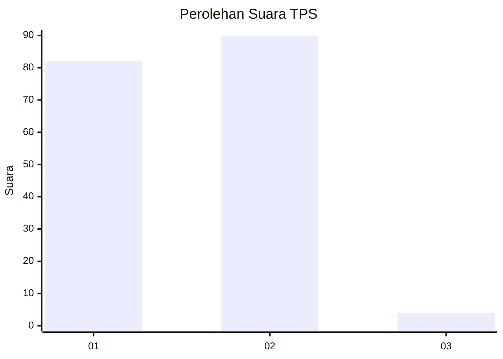
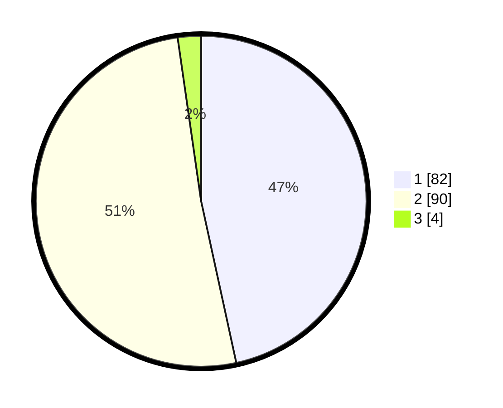

# Hasil

## Grafik

## Tabel

| No. | Nama Paslon    | Suara | Suara (raw) | Persentase |
|:--- |:-------------- | -----:| -----------:| ----------:|
| 1   | ANIES MUHAIMIN | 82    | [82][p-1]   | 46,59      |
| 2   | PRABOWO GIBRAN | 90    | [90][p-2]   | 51,14      |
| 3   | GANJAR MAHFUD  | 4     | [4][p-3]    | 2,27       |

[p-1]: https://github.com/gigit-pemilu/pemilu-2024/blob/main/pilpres/hitung-suara/sub/32-jawa-barat/sub/04-bandung/sub/44-cangkuang/sub/2001-cangkuang/sub/001-tps/sub/paslon-1.txt
[p-2]: https://github.com/gigit-pemilu/pemilu-2024/blob/main/pilpres/hitung-suara/sub/32-jawa-barat/sub/04-bandung/sub/44-cangkuang/sub/2001-cangkuang/sub/001-tps/sub/paslon-2.txt
[p-3]: https://github.com/gigit-pemilu/pemilu-2024/blob/main/pilpres/hitung-suara/sub/32-jawa-barat/sub/04-bandung/sub/44-cangkuang/sub/2001-cangkuang/sub/001-tps/sub/paslon-3.txt

## Foto C Plano

https://sirekap-obj-formc.kpu.go.id/c4ae/pemilu/ppwp/32/04/44/20/01/3204442001001-20240215-032315--4020797d-2c7e-4123-b6d3-f274cab7788d.jpg

https://sirekap-obj-formc.kpu.go.id/c4ae/pemilu/ppwp/32/04/44/20/01/3204442001001-20240215-032329--6c81abd0-121c-4db4-8442-44cee320cf22.jpg

https://sirekap-obj-formc.kpu.go.id/c4ae/pemilu/ppwp/32/04/44/20/01/3204442001001-20240215-032354--8b36c361-eef5-4ac5-ac23-2590f8da8e88.jpg

## Metadata

| Key        | Value               |
| ---------- | ------------------- |
| Time Stamp | 2024-02-16 12:51:22 |

