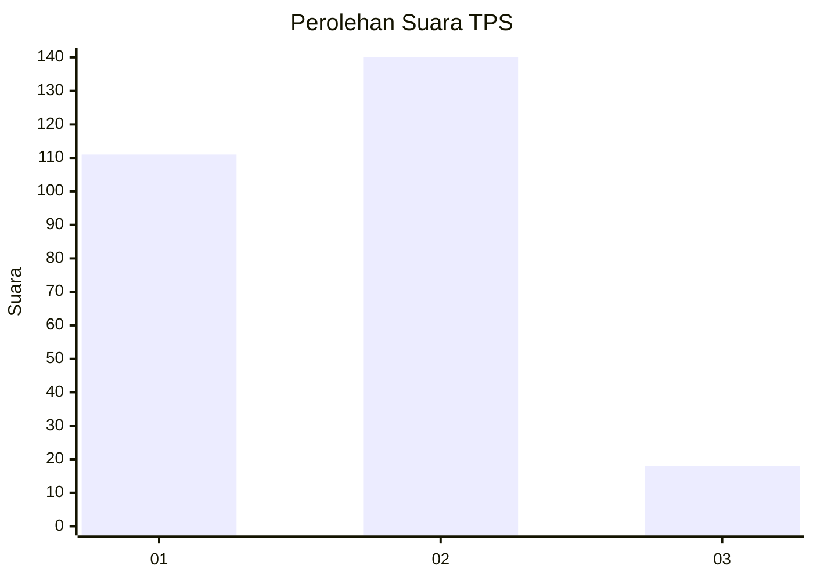

# Hasil

## Grafik

## Tabel

| No. | Nama Paslon    | Suara | Suara (raw) | Persentase |
|:--- |:-------------- | -----:| -----------:| ----------:|
| 1   | ANIES MUHAIMIN | 111   | [111][p-1]  | 41,26      |
| 2   | PRABOWO GIBRAN | 140   | [140][p-2]  | 52,04      |
| 3   | GANJAR MAHFUD  | 18    | [18][p-3]   | 6,69       |

[p-1]: https://github.com/gigit-pemilu/pemilu-2024-32-jawa-barat/blob/main/pilpres/hitung-suara/sub/32-jawa-barat/sub/04-bandung/sub/44-cangkuang/sub/2002-ciluncat/sub/029-tps/sub/paslon-1.txt
[p-2]: https://github.com/gigit-pemilu/pemilu-2024-32-jawa-barat/blob/main/pilpres/hitung-suara/sub/32-jawa-barat/sub/04-bandung/sub/44-cangkuang/sub/2002-ciluncat/sub/029-tps/sub/paslon-2.txt
[p-3]: https://github.com/gigit-pemilu/pemilu-2024-32-jawa-barat/blob/main/pilpres/hitung-suara/sub/32-jawa-barat/sub/04-bandung/sub/44-cangkuang/sub/2002-ciluncat/sub/029-tps/sub/paslon-3.txt

## Foto C Plano

https://sirekap-obj-formc.kpu.go.id/67ce/pemilu/ppwp/32/04/44/20/02/3204442002029-20240214-234613--63b4e150-584e-4f87-82ea-03bfc4e2f5c6.jpg

https://sirekap-obj-formc.kpu.go.id/67ce/pemilu/ppwp/32/04/44/20/02/3204442002029-20240214-234621--44409fe4-af48-425b-93e6-a2a7414c5f41.jpg

https://sirekap-obj-formc.kpu.go.id/67ce/pemilu/ppwp/32/04/44/20/02/3204442002029-20240214-234630--f4f6ac27-b02f-4da7-b20f-f3be1a0fb43a.jpg

## Metadata

| Key        | Value               |
| ---------- | ------------------- |
| Time Stamp | 2024-02-17 02:00:02 |

