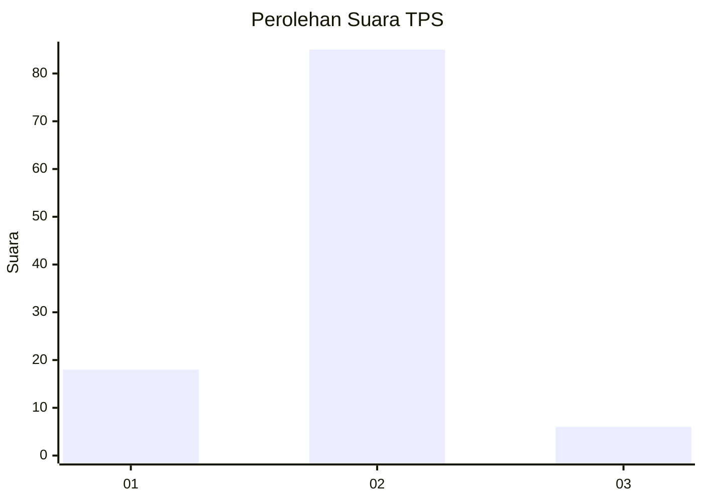
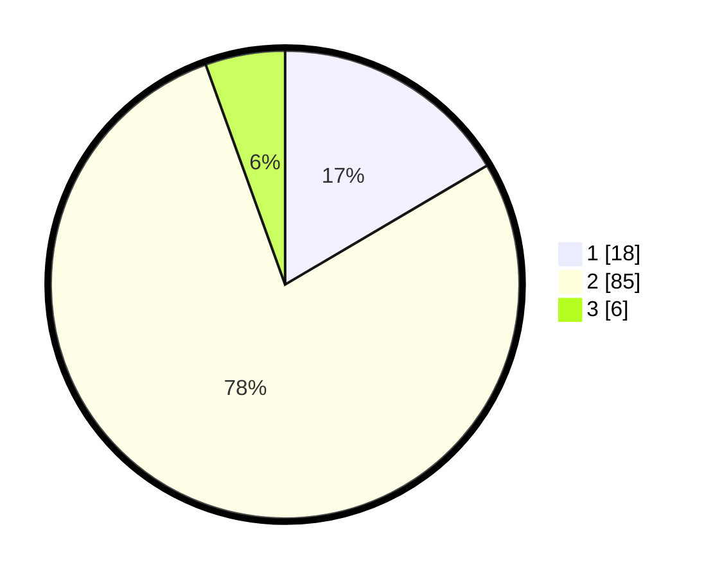

# Hasil

## Grafik

## Tabel

| No. | Nama Paslon    | Suara | Suara (raw) | Persentase |
|:--- |:-------------- | -----:| -----------:| ----------:|
| 1   | ANIES MUHAIMIN | 18    | [18][p-1]   | 16,51      |
| 2   | PRABOWO GIBRAN | 85    | [85][p-2]   | 77,98      |
| 3   | GANJAR MAHFUD  | 6     | [6][p-3]    | 5,50       |

[p-1]: https://github.com/gigit-pemilu/pemilu-2024-32-jawa-barat/blob/main/pilpres/hitung-suara/sub/32-jawa-barat/sub/04-bandung/sub/44-cangkuang/sub/2004-bandasari/sub/015-tps/sub/paslon-1.txt
[p-2]: https://github.com/gigit-pemilu/pemilu-2024-32-jawa-barat/blob/main/pilpres/hitung-suara/sub/32-jawa-barat/sub/04-bandung/sub/44-cangkuang/sub/2004-bandasari/sub/015-tps/sub/paslon-2.txt
[p-3]: https://github.com/gigit-pemilu/pemilu-2024-32-jawa-barat/blob/main/pilpres/hitung-suara/sub/32-jawa-barat/sub/04-bandung/sub/44-cangkuang/sub/2004-bandasari/sub/015-tps/sub/paslon-3.txt

## Foto C Plano

https://sirekap-obj-formc.kpu.go.id/81e8/pemilu/ppwp/32/04/44/20/04/3204442004015-20240217-215013--bf186e29-7209-4d51-b56a-ddc57f5d60e2.jpg

https://sirekap-obj-formc.kpu.go.id/81e8/pemilu/ppwp/32/04/44/20/04/3204442004015-20240214-214645--3b58284d-bf86-4f07-a863-f446a5df209d.jpg

https://sirekap-obj-formc.kpu.go.id/81e8/pemilu/ppwp/32/04/44/20/04/3204442004015-20240214-214759--1c313e4a-8173-4e55-ad48-a35f8cfd841c.jpg

## Metadata

| Key        | Value               |
| ---------- | ------------------- |
| Time Stamp | 2024-02-19 06:16:00 |

