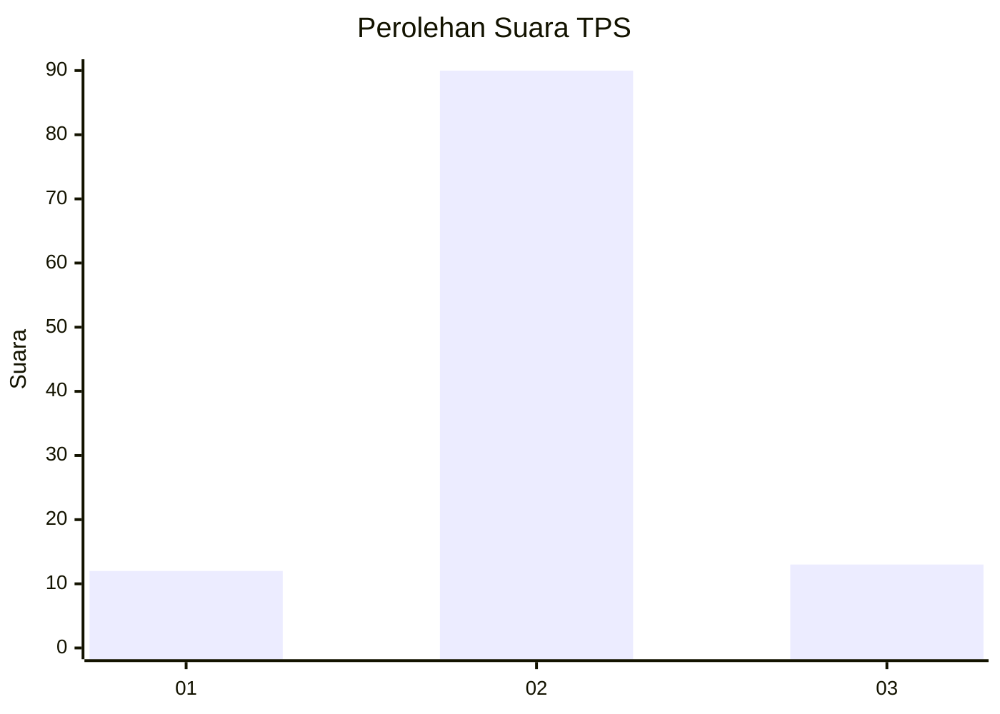
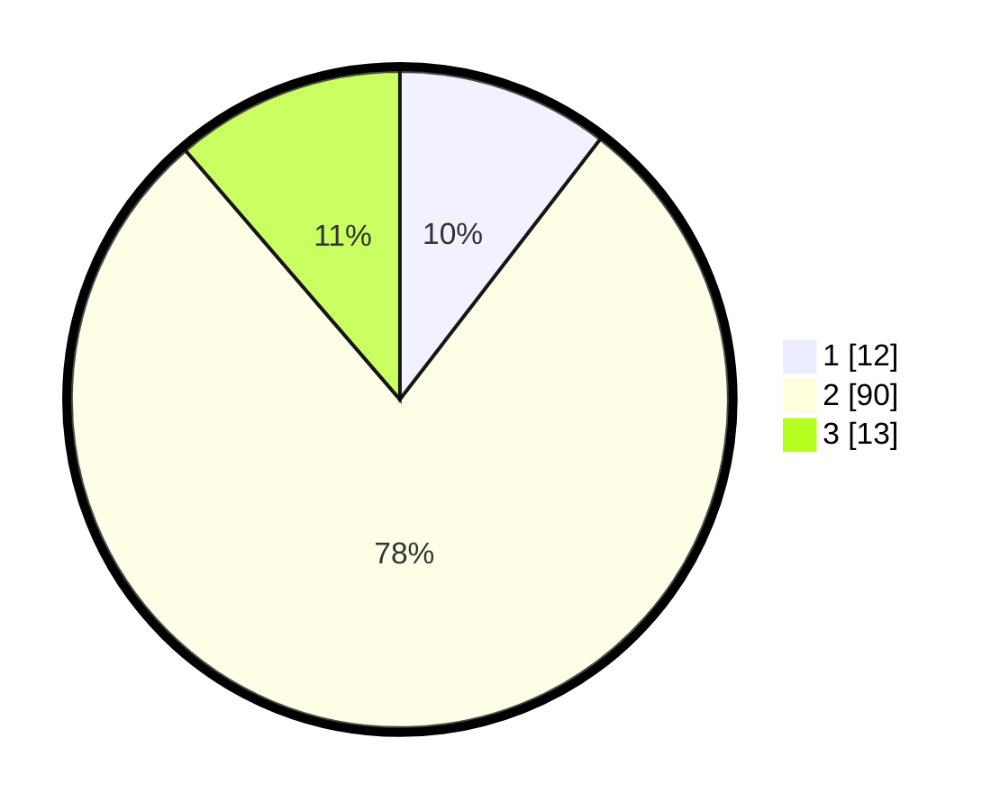

# Hasil

## Grafik

## Tabel

| No. | Nama Paslon    | Suara | Suara (raw) | Persentase |
|:--- |:-------------- | -----:| -----------:| ----------:|
| 1   | ANIES MUHAIMIN | 12    | [12][p-1]   | 10,43      |
| 2   | PRABOWO GIBRAN | 90    | [90][p-2]   | 78,26      |
| 3   | GANJAR MAHFUD  | 13    | [13][p-3]   | 11,30      |

[p-1]: https://github.com/gigit-pemilu/pemilu-2024/blob/main/pilpres/hitung-suara/sub/32-jawa-barat/sub/04-bandung/sub/44-cangkuang/sub/2004-bandasari/sub/022-tps/sub/paslon-1.txt
[p-2]: https://github.com/gigit-pemilu/pemilu-2024/blob/main/pilpres/hitung-suara/sub/32-jawa-barat/sub/04-bandung/sub/44-cangkuang/sub/2004-bandasari/sub/022-tps/sub/paslon-2.txt
[p-3]: https://github.com/gigit-pemilu/pemilu-2024/blob/main/pilpres/hitung-suara/sub/32-jawa-barat/sub/04-bandung/sub/44-cangkuang/sub/2004-bandasari/sub/022-tps/sub/paslon-3.txt

## Foto C Plano

https://sirekap-obj-formc.kpu.go.id/5d6f/pemilu/ppwp/32/04/44/20/04/3204442004022-20240217-202631--24f53578-1d5f-4f75-8a9d-04f6700c1d59.jpg

https://sirekap-obj-formc.kpu.go.id/5d6f/pemilu/ppwp/32/04/44/20/04/3204442004022-20240214-185129--e6c8df49-d6dc-4e33-a2a7-1ac7666d7732.jpg

https://sirekap-obj-formc.kpu.go.id/5d6f/pemilu/ppwp/32/04/44/20/04/3204442004022-20240214-185328--457b4258-773b-498f-a5de-e70fb7669731.jpg

## Metadata

| Key        | Value               |
| ---------- | ------------------- |
| Time Stamp | 2024-02-19 06:16:00 |

