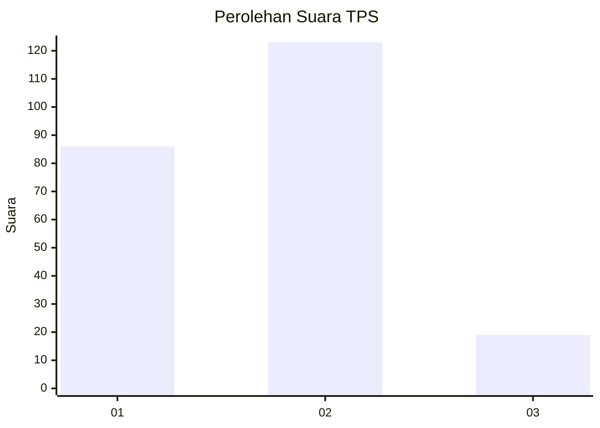

# Hasil

## Grafik

## Tabel

| No. | Nama Paslon    | Suara | Suara (raw) | Persentase |
|:--- |:-------------- | -----:| -----------:| ----------:|
| 1   | ANIES MUHAIMIN | 86    | [86][p-1]   | 37,72      |
| 2   | PRABOWO GIBRAN | 123   | [123][p-2]  | 53,95      |
| 3   | GANJAR MAHFUD  | 19    | [19][p-3]   | 8,33       |

[p-1]: https://github.com/gigit-pemilu/pemilu-2024-32-jawa-barat/blob/main/pilpres/hitung-suara/sub/32-jawa-barat/sub/04-bandung/sub/46-kutawaringin/sub/2001-jelegong/sub/002-tps/sub/paslon-1.txt
[p-2]: https://github.com/gigit-pemilu/pemilu-2024-32-jawa-barat/blob/main/pilpres/hitung-suara/sub/32-jawa-barat/sub/04-bandung/sub/46-kutawaringin/sub/2001-jelegong/sub/002-tps/sub/paslon-2.txt
[p-3]: https://github.com/gigit-pemilu/pemilu-2024-32-jawa-barat/blob/main/pilpres/hitung-suara/sub/32-jawa-barat/sub/04-bandung/sub/46-kutawaringin/sub/2001-jelegong/sub/002-tps/sub/paslon-3.txt

## Foto C Plano

https://sirekap-obj-formc.kpu.go.id/9e6a/pemilu/ppwp/32/04/46/20/01/3204462001002-20240225-113034--3f8620a8-c405-4645-9221-af78531481cd.jpg

https://sirekap-obj-formc.kpu.go.id/9e6a/pemilu/ppwp/32/04/46/20/01/3204462001002-20240225-113733--5679733c-5765-415b-bc40-13529fcc7440.jpg

https://sirekap-obj-formc.kpu.go.id/9e6a/pemilu/ppwp/32/04/46/20/01/3204462001002-20240225-114115--71befae8-c42b-411c-9458-8ea0dc3990e9.jpg

## Metadata

| Key        | Value               |
| ---------- | ------------------- |
| Time Stamp | 2024-02-26 12:00:00 |

