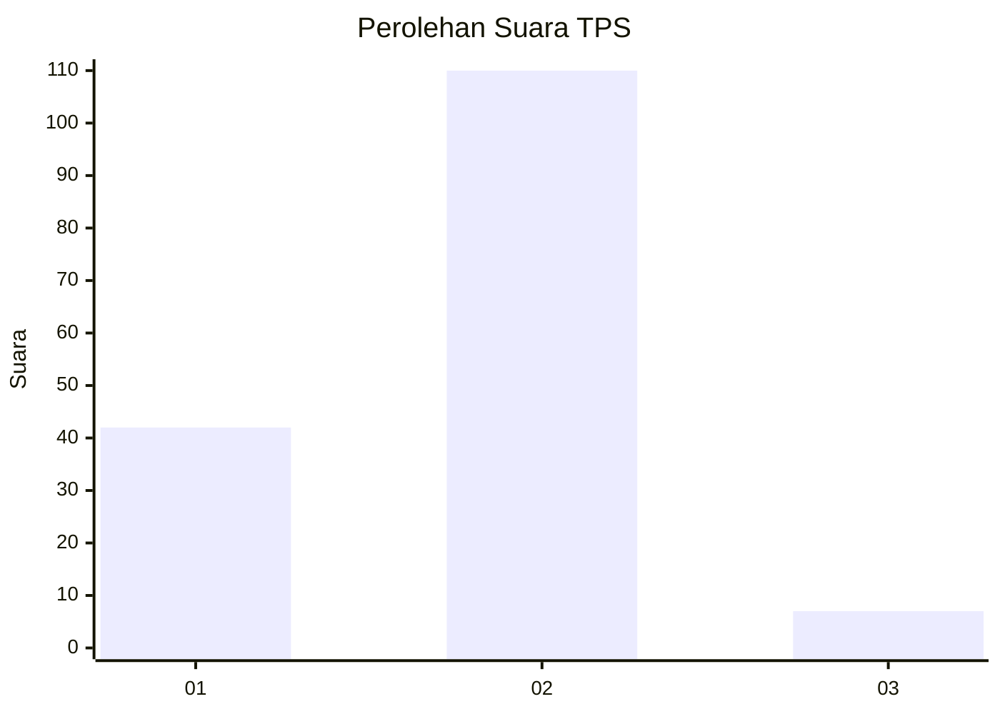
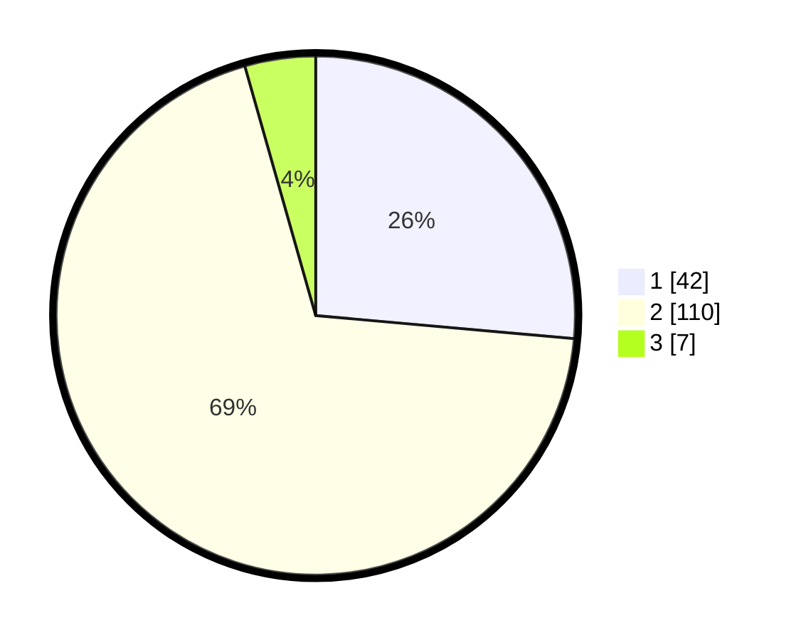

# Hasil

## Grafik

## Tabel

| No. | Nama Paslon    | Suara | Suara (raw) | Persentase |
|:--- |:-------------- | -----:| -----------:| ----------:|
| 1   | ANIES MUHAIMIN | 42    | [42][p-1]   | 26,42      |
| 2   | PRABOWO GIBRAN | 110   | [110][p-2]  | 69,18      |
| 3   | GANJAR MAHFUD  | 7     | [7][p-3]    | 4,40       |

[p-1]: https://github.com/gigit-pemilu/pemilu-2024/blob/main/pilpres/hitung-suara/sub/32-jawa-barat/sub/04-bandung/sub/46-kutawaringin/sub/2001-jelegong/sub/003-tps/sub/paslon-1.txt
[p-2]: https://github.com/gigit-pemilu/pemilu-2024/blob/main/pilpres/hitung-suara/sub/32-jawa-barat/sub/04-bandung/sub/46-kutawaringin/sub/2001-jelegong/sub/003-tps/sub/paslon-2.txt
[p-3]: https://github.com/gigit-pemilu/pemilu-2024/blob/main/pilpres/hitung-suara/sub/32-jawa-barat/sub/04-bandung/sub/46-kutawaringin/sub/2001-jelegong/sub/003-tps/sub/paslon-3.txt

## Foto C Plano

https://sirekap-obj-formc.kpu.go.id/9b23/pemilu/ppwp/32/04/46/20/01/3204462001003-20240225-123358--47526c94-92b3-4871-86e1-a973a4a890a9.jpg

https://sirekap-obj-formc.kpu.go.id/9b23/pemilu/ppwp/32/04/46/20/01/3204462001003-20240225-123429--79d6bc6a-3300-4fc3-9c67-5124e1c93f6a.jpg

https://sirekap-obj-formc.kpu.go.id/9b23/pemilu/ppwp/32/04/46/20/01/3204462001003-20240225-123459--a7ef3538-75fb-4b3b-b540-e0072db63980.jpg

## Metadata

| Key        | Value               |
| ---------- | ------------------- |
| Time Stamp | 2024-02-26 12:00:00 |

