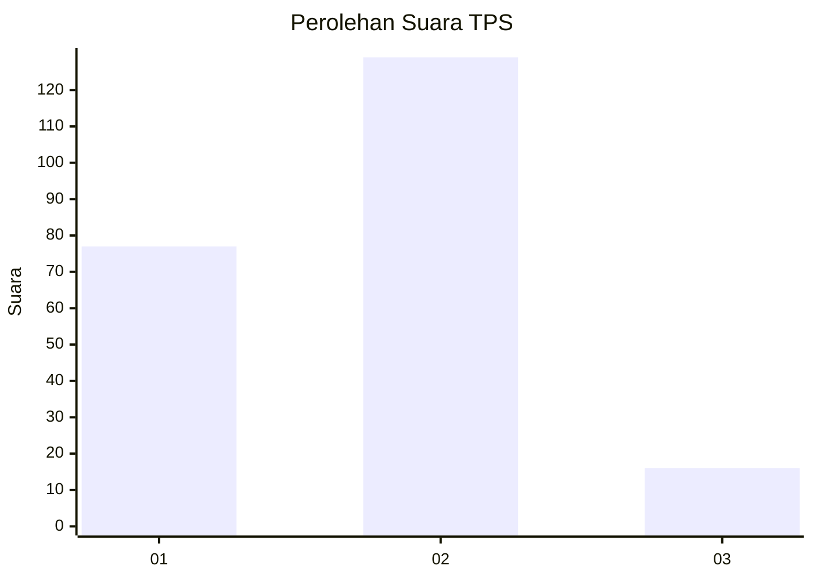
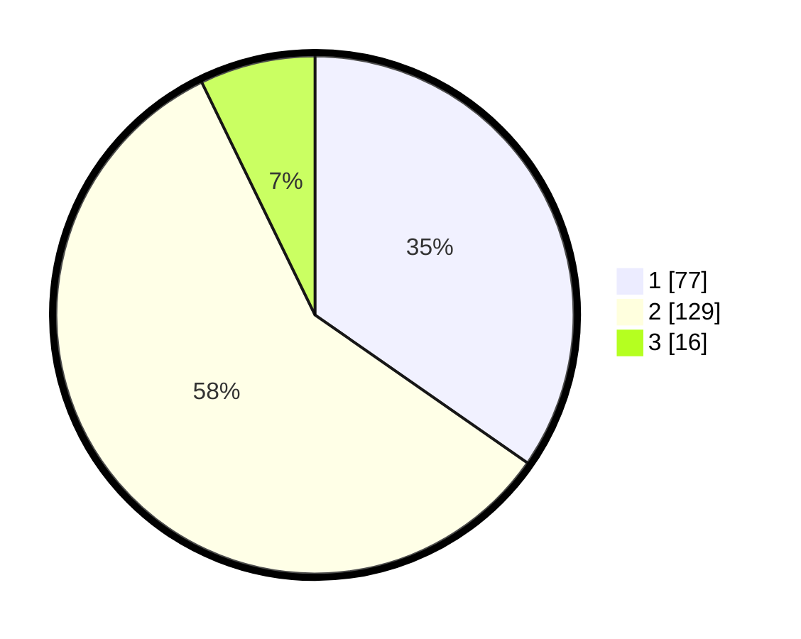

# Hasil

## Grafik

## Tabel

| No. | Nama Paslon    | Suara | Suara (raw) | Persentase |
|:--- |:-------------- | -----:| -----------:| ----------:|
| 1   | ANIES MUHAIMIN | 77    | [77][p-1]   | 34,68      |
| 2   | PRABOWO GIBRAN | 129   | [129][p-2]  | 58,11      |
| 3   | GANJAR MAHFUD  | 16    | [16][p-3]   | 7,21       |

[p-1]: https://github.com/gigit-pemilu/pemilu-2024/blob/main/pilpres/hitung-suara/sub/32-jawa-barat/sub/04-bandung/sub/46-kutawaringin/sub/2001-jelegong/sub/005-tps/sub/paslon-1.txt
[p-2]: https://github.com/gigit-pemilu/pemilu-2024/blob/main/pilpres/hitung-suara/sub/32-jawa-barat/sub/04-bandung/sub/46-kutawaringin/sub/2001-jelegong/sub/005-tps/sub/paslon-2.txt
[p-3]: https://github.com/gigit-pemilu/pemilu-2024/blob/main/pilpres/hitung-suara/sub/32-jawa-barat/sub/04-bandung/sub/46-kutawaringin/sub/2001-jelegong/sub/005-tps/sub/paslon-3.txt

## Foto C Plano

https://sirekap-obj-formc.kpu.go.id/730d/pemilu/ppwp/32/04/46/20/01/3204462001005-20240225-114340--8693eb18-c437-40ce-8db9-a5998ecf06b0.jpg

https://sirekap-obj-formc.kpu.go.id/730d/pemilu/ppwp/32/04/46/20/01/3204462001005-20240225-114515--b65daff5-d33c-4a61-b13d-12aa4027cd74.jpg

https://sirekap-obj-formc.kpu.go.id/730d/pemilu/ppwp/32/04/46/20/01/3204462001005-20240225-114643--6c582583-c50e-44be-85f5-92fba68b0cc3.jpg

## Metadata

| Key        | Value               |
| ---------- | ------------------- |
| Time Stamp | 2024-02-26 12:00:00 |

