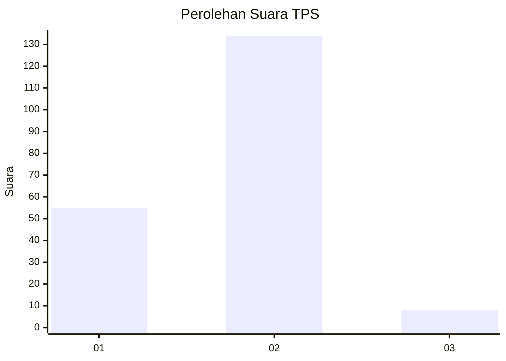
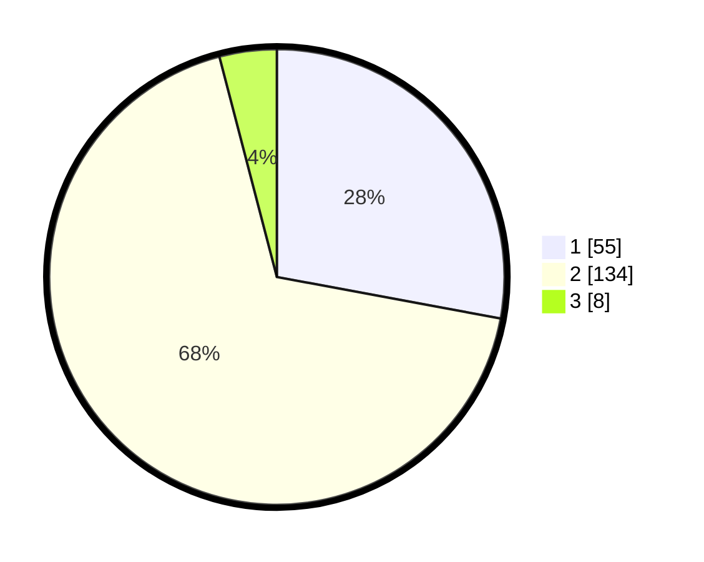

# Hasil

## Grafik

## Tabel

| No. | Nama Paslon    | Suara | Suara (raw) | Persentase |
|:--- |:-------------- | -----:| -----------:| ----------:|
| 1   | ANIES MUHAIMIN | 55    | [55][p-1]   | 27,92      |
| 2   | PRABOWO GIBRAN | 134   | [134][p-2]  | 68,02      |
| 3   | GANJAR MAHFUD  | 8     | [8][p-3]    | 4,06       |

[p-1]: https://github.com/gigit-pemilu/pemilu-2024-32-jawa-barat/blob/main/pilpres/hitung-suara/sub/32-jawa-barat/sub/04-bandung/sub/46-kutawaringin/sub/2001-jelegong/sub/006-tps/sub/paslon-1.txt
[p-2]: https://github.com/gigit-pemilu/pemilu-2024-32-jawa-barat/blob/main/pilpres/hitung-suara/sub/32-jawa-barat/sub/04-bandung/sub/46-kutawaringin/sub/2001-jelegong/sub/006-tps/sub/paslon-2.txt
[p-3]: https://github.com/gigit-pemilu/pemilu-2024-32-jawa-barat/blob/main/pilpres/hitung-suara/sub/32-jawa-barat/sub/04-bandung/sub/46-kutawaringin/sub/2001-jelegong/sub/006-tps/sub/paslon-3.txt

## Foto C Plano

https://sirekap-obj-formc.kpu.go.id/743e/pemilu/ppwp/32/04/46/20/01/3204462001006-20240225-122002--8aefc47f-a4bc-43b3-9eb1-53be3b0e8da4.jpg

https://sirekap-obj-formc.kpu.go.id/743e/pemilu/ppwp/32/04/46/20/01/3204462001006-20240225-122106--abe3587a-4894-42da-8bfb-24c03d12bb65.jpg

https://sirekap-obj-formc.kpu.go.id/743e/pemilu/ppwp/32/04/46/20/01/3204462001006-20240225-122132--3ad75131-25f1-45a6-965d-8c3e5685e1f8.jpg

## Metadata

| Key        | Value               |
| ---------- | ------------------- |
| Time Stamp | 2024-02-26 12:00:00 |

