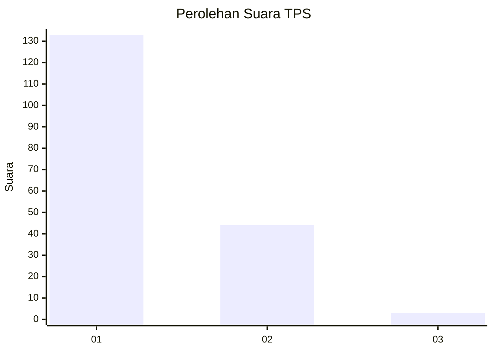
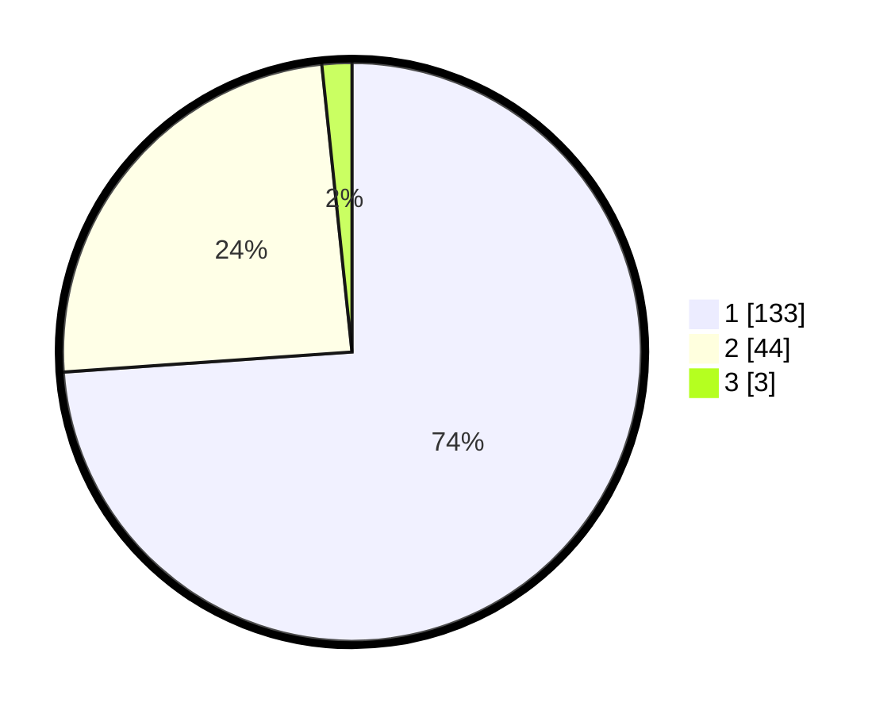

# Hasil

## Grafik

## Tabel

| No. | Nama Paslon    | Suara | Suara (raw) | Persentase |
|:--- |:-------------- | -----:| -----------:| ----------:|
| 1   | ANIES MUHAIMIN | 133   | [133][p-1]  | 73,89      |
| 2   | PRABOWO GIBRAN | 44    | [44][p-2]   | 24,44      |
| 3   | GANJAR MAHFUD  | 3     | [3][p-3]    | 1,67       |

[p-1]: https://github.com/gigit-pemilu/pemilu-2024/blob/main/pilpres/hitung-suara/sub/32-jawa-barat/sub/04-bandung/sub/46-kutawaringin/sub/2001-jelegong/sub/041-tps/sub/paslon-1.txt
[p-2]: https://github.com/gigit-pemilu/pemilu-2024/blob/main/pilpres/hitung-suara/sub/32-jawa-barat/sub/04-bandung/sub/46-kutawaringin/sub/2001-jelegong/sub/041-tps/sub/paslon-2.txt
[p-3]: https://github.com/gigit-pemilu/pemilu-2024/blob/main/pilpres/hitung-suara/sub/32-jawa-barat/sub/04-bandung/sub/46-kutawaringin/sub/2001-jelegong/sub/041-tps/sub/paslon-3.txt

## Foto C Plano

https://sirekap-obj-formc.kpu.go.id/ca5b/pemilu/ppwp/32/04/46/20/01/3204462001041-20240225-121359--fc28bc36-1bdc-4819-a652-773dd40a7716.jpg

https://sirekap-obj-formc.kpu.go.id/ca5b/pemilu/ppwp/32/04/46/20/01/3204462001041-20240225-121507--28cb1d9c-d7cc-4185-b31d-780555d89836.jpg

https://sirekap-obj-formc.kpu.go.id/ca5b/pemilu/ppwp/32/04/46/20/01/3204462001041-20240225-121545--4246b3ff-4120-46b0-b6b8-0dccb19a1e61.jpg

## Metadata

| Key        | Value               |
| ---------- | ------------------- |
| Time Stamp | 2024-02-26 12:00:00 |

