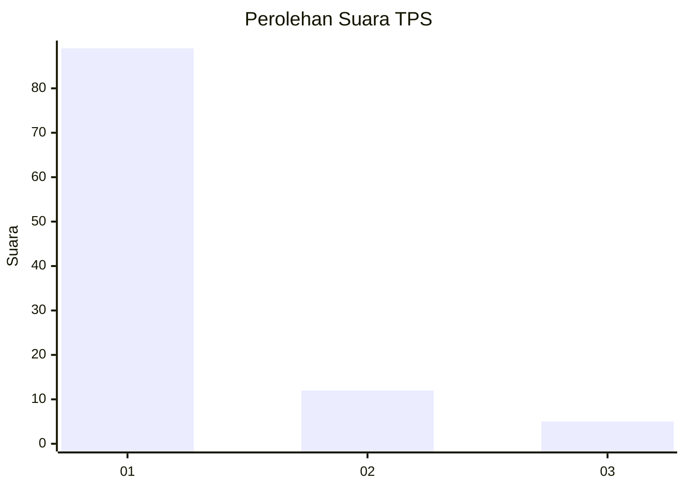
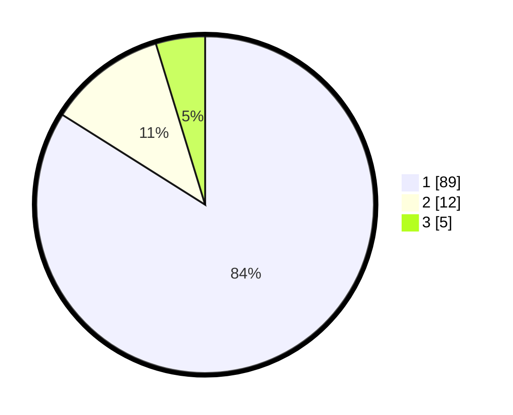

# Hasil

## Grafik

## Tabel

| No. | Nama Paslon    | Suara | Suara (raw) | Persentase |
|:--- |:-------------- | -----:| -----------:| ----------:|
| 1   | ANIES MUHAIMIN | 89    | [89][p-1]   | 83,96      |
| 2   | PRABOWO GIBRAN | 12    | [12][p-2]   | 11,32      |
| 3   | GANJAR MAHFUD  | 5     | [5][p-3]    | 4,72       |

[p-1]: https://github.com/gigit-pemilu/pemilu-2024-32-jawa-barat/blob/main/pilpres/hitung-suara/sub/32-jawa-barat/sub/04-bandung/sub/46-kutawaringin/sub/2002-jatisari/sub/028-tps/sub/paslon-1.txt
[p-2]: https://github.com/gigit-pemilu/pemilu-2024-32-jawa-barat/blob/main/pilpres/hitung-suara/sub/32-jawa-barat/sub/04-bandung/sub/46-kutawaringin/sub/2002-jatisari/sub/028-tps/sub/paslon-2.txt
[p-3]: https://github.com/gigit-pemilu/pemilu-2024-32-jawa-barat/blob/main/pilpres/hitung-suara/sub/32-jawa-barat/sub/04-bandung/sub/46-kutawaringin/sub/2002-jatisari/sub/028-tps/sub/paslon-3.txt

## Foto C Plano

https://sirekap-obj-formc.kpu.go.id/05a2/pemilu/ppwp/32/04/46/20/02/3204462002028-20240225-141706--4056a63d-6363-48d4-ba46-a03d06ec8f06.jpg

https://sirekap-obj-formc.kpu.go.id/05a2/pemilu/ppwp/32/04/46/20/02/3204462002028-20240225-141801--3c2eeb80-9b62-4385-954d-28ad096ac653.jpg

https://sirekap-obj-formc.kpu.go.id/05a2/pemilu/ppwp/32/04/46/20/02/3204462002028-20240225-141849--2d7c1f60-604f-454c-b28a-92e756dfa53d.jpg

## Metadata

| Key        | Value               |
| ---------- | ------------------- |
| Time Stamp | 2024-02-26 12:00:00 |

