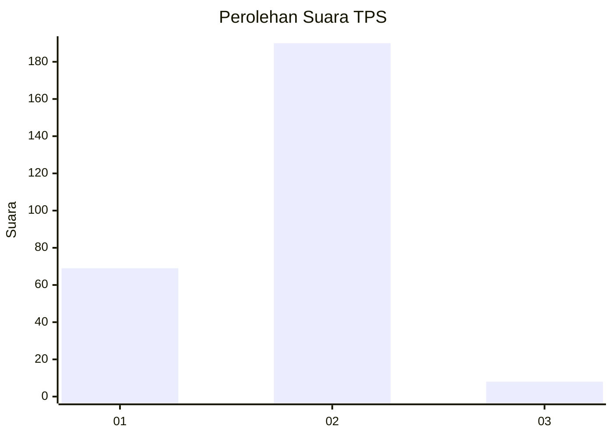
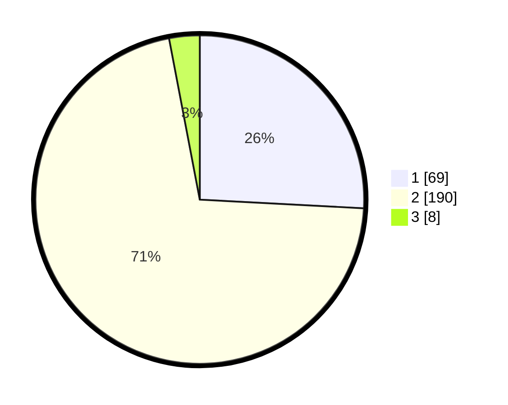

# Hasil

## Grafik

## Tabel

| No. | Nama Paslon    | Suara | Suara (raw) | Persentase |
|:--- |:-------------- | -----:| -----------:| ----------:|
| 1   | ANIES MUHAIMIN | 69    | [69][p-1]   | 25,84      |
| 2   | PRABOWO GIBRAN | 190   | [190][p-2]  | 71,16      |
| 3   | GANJAR MAHFUD  | 8     | [8][p-3]    | 3,00       |

[p-1]: https://github.com/gigit-pemilu/pemilu-2024/blob/main/pilpres/hitung-suara/sub/32-jawa-barat/sub/04-bandung/sub/46-kutawaringin/sub/2007-sukamulya/sub/002-tps/sub/paslon-1.txt
[p-2]: https://github.com/gigit-pemilu/pemilu-2024/blob/main/pilpres/hitung-suara/sub/32-jawa-barat/sub/04-bandung/sub/46-kutawaringin/sub/2007-sukamulya/sub/002-tps/sub/paslon-2.txt
[p-3]: https://github.com/gigit-pemilu/pemilu-2024/blob/main/pilpres/hitung-suara/sub/32-jawa-barat/sub/04-bandung/sub/46-kutawaringin/sub/2007-sukamulya/sub/002-tps/sub/paslon-3.txt

## Foto C Plano

https://sirekap-obj-formc.kpu.go.id/bee4/pemilu/ppwp/32/04/46/20/07/3204462007002-20240225-112910--08a8d958-3a01-4a55-83b3-acc2ba524f0d.jpg

https://sirekap-obj-formc.kpu.go.id/bee4/pemilu/ppwp/32/04/46/20/07/3204462007002-20240225-112939--5d57f4cb-78d9-41a0-b1be-e953f757bfa1.jpg

https://sirekap-obj-formc.kpu.go.id/bee4/pemilu/ppwp/32/04/46/20/07/3204462007002-20240225-113011--22e5adfb-d380-44c8-914d-42a1ec6d30bc.jpg

## Metadata

| Key        | Value               |
| ---------- | ------------------- |
| Time Stamp | 2024-02-26 15:00:00 |

