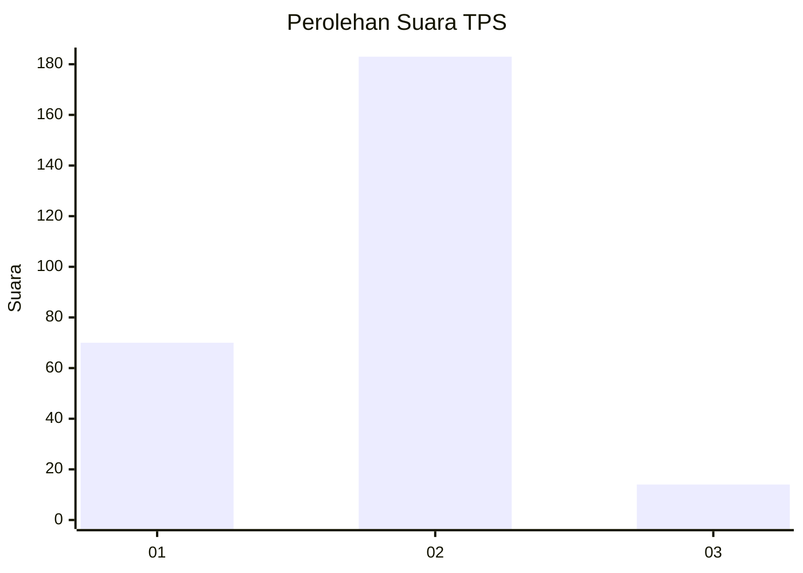
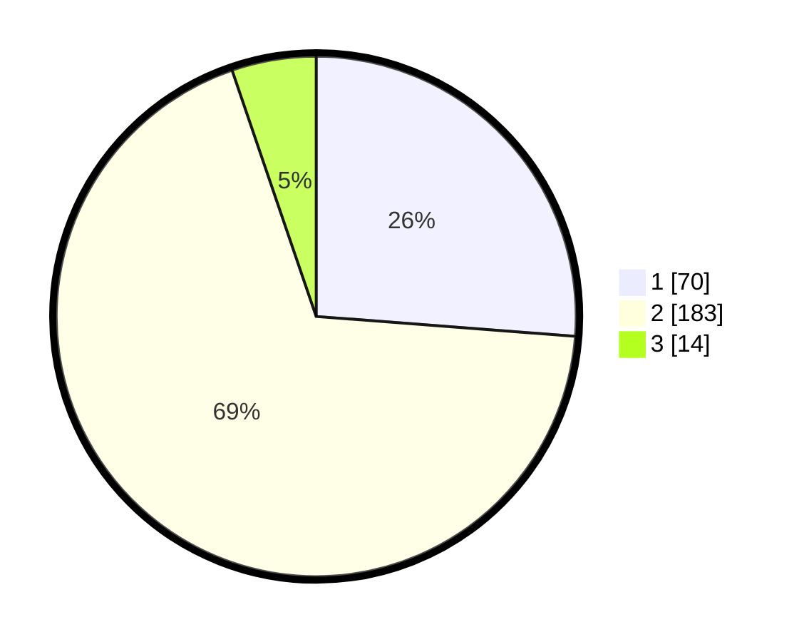

# Hasil

## Grafik

## Tabel

| No. | Nama Paslon    | Suara | Suara (raw) | Persentase |
|:--- |:-------------- | -----:| -----------:| ----------:|
| 1   | ANIES MUHAIMIN | 70    | [70][p-1]   | 26,22      |
| 2   | PRABOWO GIBRAN | 183   | [183][p-2]  | 68,54      |
| 3   | GANJAR MAHFUD  | 14    | [14][p-3]   | 5,24       |

[p-1]: https://github.com/gigit-pemilu/pemilu-2024/blob/main/pilpres/hitung-suara/sub/32-jawa-barat/sub/04-bandung/sub/46-kutawaringin/sub/2009-buninagara/sub/019-tps/sub/paslon-1.txt
[p-2]: https://github.com/gigit-pemilu/pemilu-2024/blob/main/pilpres/hitung-suara/sub/32-jawa-barat/sub/04-bandung/sub/46-kutawaringin/sub/2009-buninagara/sub/019-tps/sub/paslon-2.txt
[p-3]: https://github.com/gigit-pemilu/pemilu-2024/blob/main/pilpres/hitung-suara/sub/32-jawa-barat/sub/04-bandung/sub/46-kutawaringin/sub/2009-buninagara/sub/019-tps/sub/paslon-3.txt

## Foto C Plano

https://sirekap-obj-formc.kpu.go.id/03de/pemilu/ppwp/32/04/46/20/09/3204462009019-20240225-142109--94c8892e-5a5f-423f-be8b-284d869e10b5.jpg

https://sirekap-obj-formc.kpu.go.id/03de/pemilu/ppwp/32/04/46/20/09/3204462009019-20240225-142202--eea7089e-d38c-4225-9a9c-59c9f640a52f.jpg

https://sirekap-obj-formc.kpu.go.id/03de/pemilu/ppwp/32/04/46/20/09/3204462009019-20240225-142243--03532409-a5cf-4ae3-9ed6-b30d54ad80ad.jpg

## Metadata

| Key        | Value               |
| ---------- | ------------------- |
| Time Stamp | 2024-02-26 16:00:00 |

