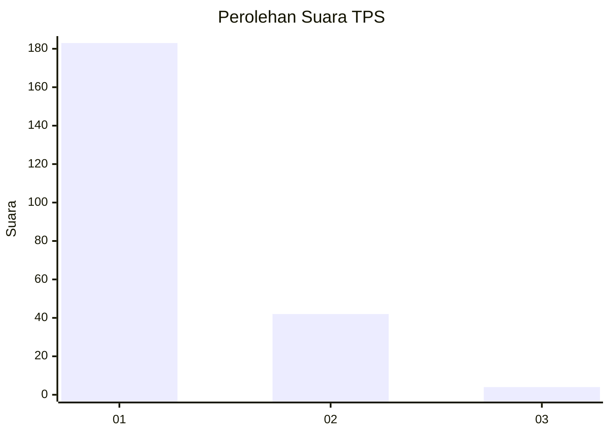
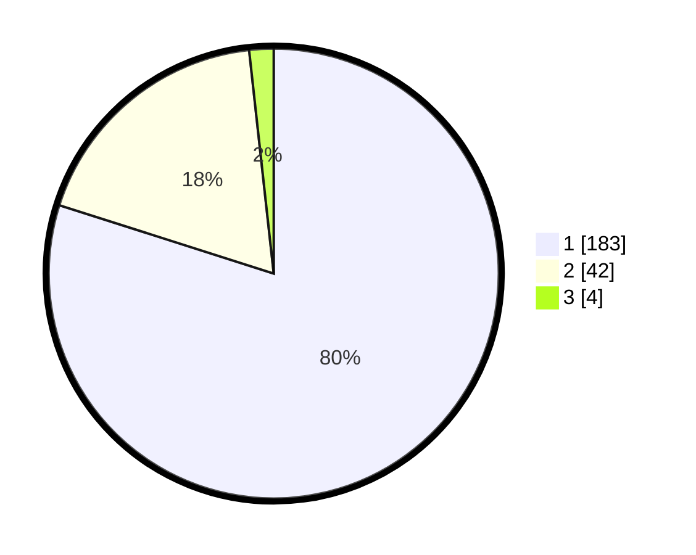

# Hasil

## Grafik

## Tabel

| No. | Nama Paslon    | Suara | Suara (raw) | Persentase |
|:--- |:-------------- | -----:| -----------:| ----------:|
| 1   | ANIES MUHAIMIN | 183   | [183][p-1]  | 79,91      |
| 2   | PRABOWO GIBRAN | 42    | [42][p-2]   | 18,34      |
| 3   | GANJAR MAHFUD  | 4     | [4][p-3]    | 1,75       |

[p-1]: https://github.com/gigit-pemilu/pemilu-2024-32-jawa-barat/blob/main/pilpres/hitung-suara/sub/32-jawa-barat/sub/04-bandung/sub/46-kutawaringin/sub/2010-gajah-mekar/sub/029-tps/sub/paslon-1.txt
[p-2]: https://github.com/gigit-pemilu/pemilu-2024-32-jawa-barat/blob/main/pilpres/hitung-suara/sub/32-jawa-barat/sub/04-bandung/sub/46-kutawaringin/sub/2010-gajah-mekar/sub/029-tps/sub/paslon-2.txt
[p-3]: https://github.com/gigit-pemilu/pemilu-2024-32-jawa-barat/blob/main/pilpres/hitung-suara/sub/32-jawa-barat/sub/04-bandung/sub/46-kutawaringin/sub/2010-gajah-mekar/sub/029-tps/sub/paslon-3.txt

## Foto C Plano

https://sirekap-obj-formc.kpu.go.id/23a6/pemilu/ppwp/32/04/46/20/10/3204462010029-20240225-133527--3c929698-1d03-4fc3-b2b7-fd6b91ded2e0.jpg

https://sirekap-obj-formc.kpu.go.id/23a6/pemilu/ppwp/32/04/46/20/10/3204462010029-20240225-133637--a6c6844e-3ef3-43da-bb93-976d2dcdbca1.jpg

https://sirekap-obj-formc.kpu.go.id/23a6/pemilu/ppwp/32/04/46/20/10/3204462010029-20240225-133733--575d1fb2-096f-45a1-ac19-72db29126a17.jpg

## Metadata

| Key        | Value               |
| ---------- | ------------------- |
| Time Stamp | 2024-02-26 16:00:00 |

