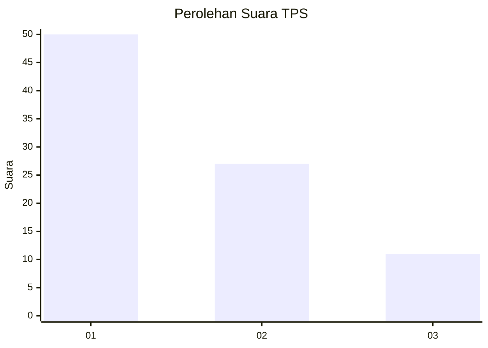
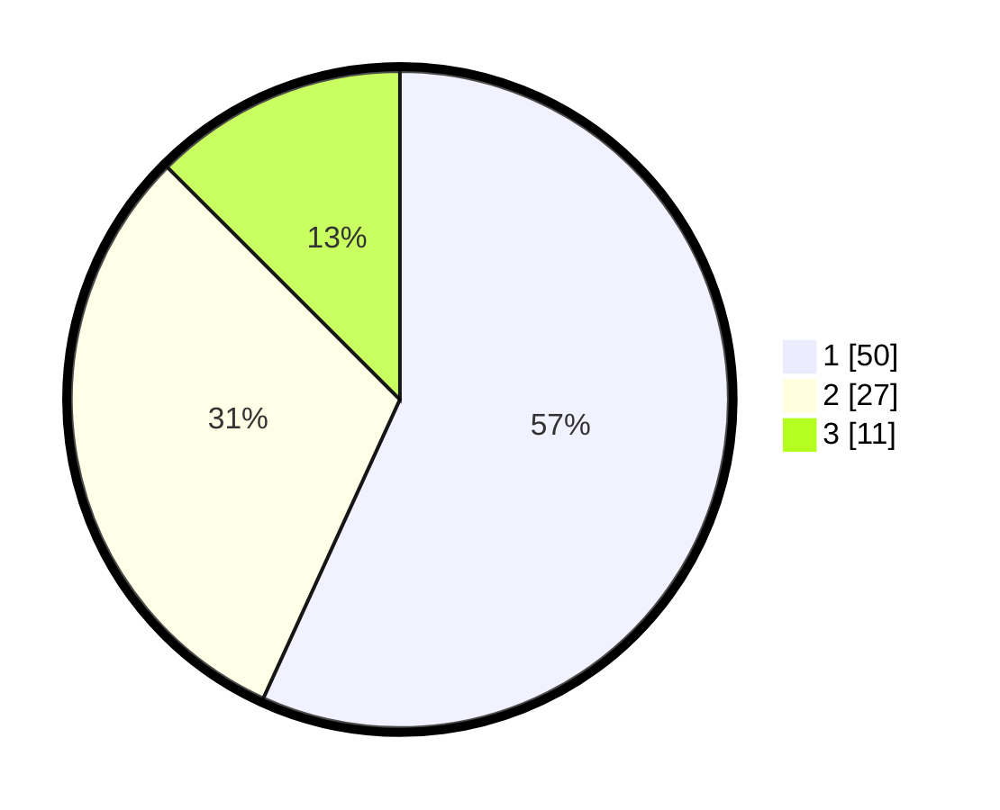

# Hasil

## Grafik

## Tabel

| No. | Nama Paslon    | Suara | Suara (raw) | Persentase |
|:--- |:-------------- | -----:| -----------:| ----------:|
| 1   | ANIES MUHAIMIN | 50    | [50][p-1]   | 56,82      |
| 2   | PRABOWO GIBRAN | 27    | [27][p-2]   | 30,68      |
| 3   | GANJAR MAHFUD  | 11    | [11][p-3]   | 12,50      |

[p-1]: https://github.com/gigit-pemilu/pemilu-2024/blob/main/pilpres/hitung-suara/sub/32-jawa-barat/sub/05-garut/sub/01-garut-kota/sub/1001-kota-kulon/sub/040-tps/sub/paslon-1.txt
[p-2]: https://github.com/gigit-pemilu/pemilu-2024/blob/main/pilpres/hitung-suara/sub/32-jawa-barat/sub/05-garut/sub/01-garut-kota/sub/1001-kota-kulon/sub/040-tps/sub/paslon-2.txt
[p-3]: https://github.com/gigit-pemilu/pemilu-2024/blob/main/pilpres/hitung-suara/sub/32-jawa-barat/sub/05-garut/sub/01-garut-kota/sub/1001-kota-kulon/sub/040-tps/sub/paslon-3.txt

## Foto C Plano

https://sirekap-obj-formc.kpu.go.id/1411/pemilu/ppwp/32/05/01/10/01/3205011001040-20240214-213314--9e9319e3-3fe2-4c31-90d8-787dc88e8b48.jpg

https://sirekap-obj-formc.kpu.go.id/1411/pemilu/ppwp/32/05/01/10/01/3205011001040-20240214-213318--18c3dbe8-6d20-4801-8a62-0e83769c32f7.jpg

https://sirekap-obj-formc.kpu.go.id/1411/pemilu/ppwp/32/05/01/10/01/3205011001040-20240214-213320--53bebb5f-a677-4494-86e2-2d9a749d16f6.jpg

## Metadata

| Key        | Value               |
| ---------- | ------------------- |
| Time Stamp | 2024-02-15 22:00:27 |

