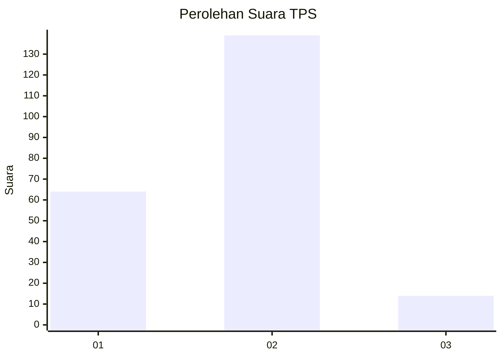
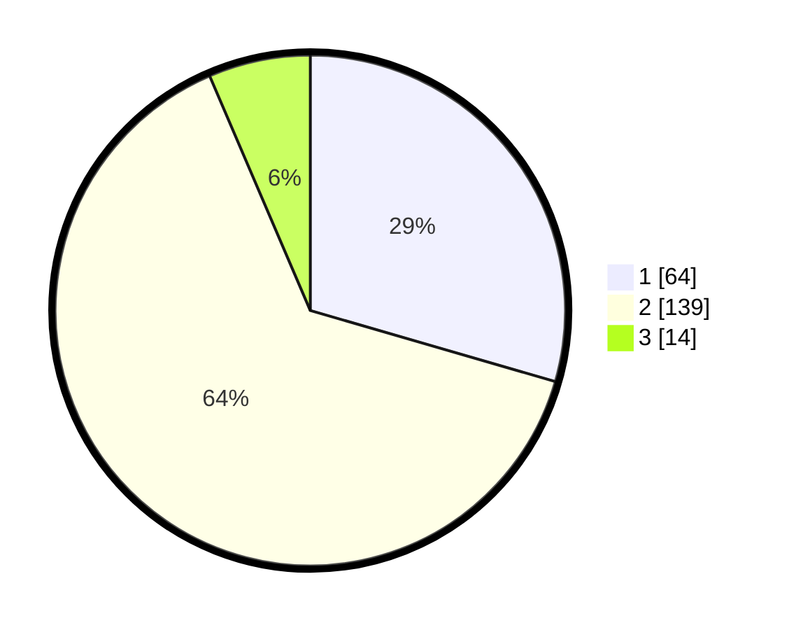

# Hasil

## Grafik

## Tabel

| No. | Nama Paslon    | Suara | Suara (raw) | Persentase |
|:--- |:-------------- | -----:| -----------:| ----------:|
| 1   | ANIES MUHAIMIN | 64    | [64][p-1]   | 29,49      |
| 2   | PRABOWO GIBRAN | 139   | [139][p-2]  | 64,06      |
| 3   | GANJAR MAHFUD  | 14    | [14][p-3]   | 6,45       |

[p-1]: https://github.com/gigit-pemilu/pemilu-2024/blob/main/pilpres/hitung-suara/sub/32-jawa-barat/sub/05-garut/sub/01-garut-kota/sub/1005-muara-sanding/sub/005-tps/sub/paslon-1.txt
[p-2]: https://github.com/gigit-pemilu/pemilu-2024/blob/main/pilpres/hitung-suara/sub/32-jawa-barat/sub/05-garut/sub/01-garut-kota/sub/1005-muara-sanding/sub/005-tps/sub/paslon-2.txt
[p-3]: https://github.com/gigit-pemilu/pemilu-2024/blob/main/pilpres/hitung-suara/sub/32-jawa-barat/sub/05-garut/sub/01-garut-kota/sub/1005-muara-sanding/sub/005-tps/sub/paslon-3.txt

## Foto C Plano

https://sirekap-obj-formc.kpu.go.id/691b/pemilu/ppwp/32/05/01/10/05/3205011005005-20240215-091944--4e04c22c-cfc8-4890-b8cb-caa9a2a00b27.jpg

https://sirekap-obj-formc.kpu.go.id/691b/pemilu/ppwp/32/05/01/10/05/3205011005005-20240215-091109--cd7eb6eb-d8f1-41f5-b189-da4edc53c1d8.jpg

https://sirekap-obj-formc.kpu.go.id/691b/pemilu/ppwp/32/05/01/10/05/3205011005005-20240215-092423--53503534-c7ea-422e-a30c-d3d1d798f717.jpg

## Metadata

| Key        | Value               |
| ---------- | ------------------- |
| Time Stamp | 2024-02-15 23:29:50 |

