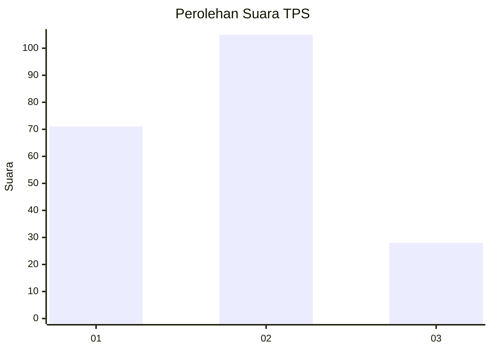
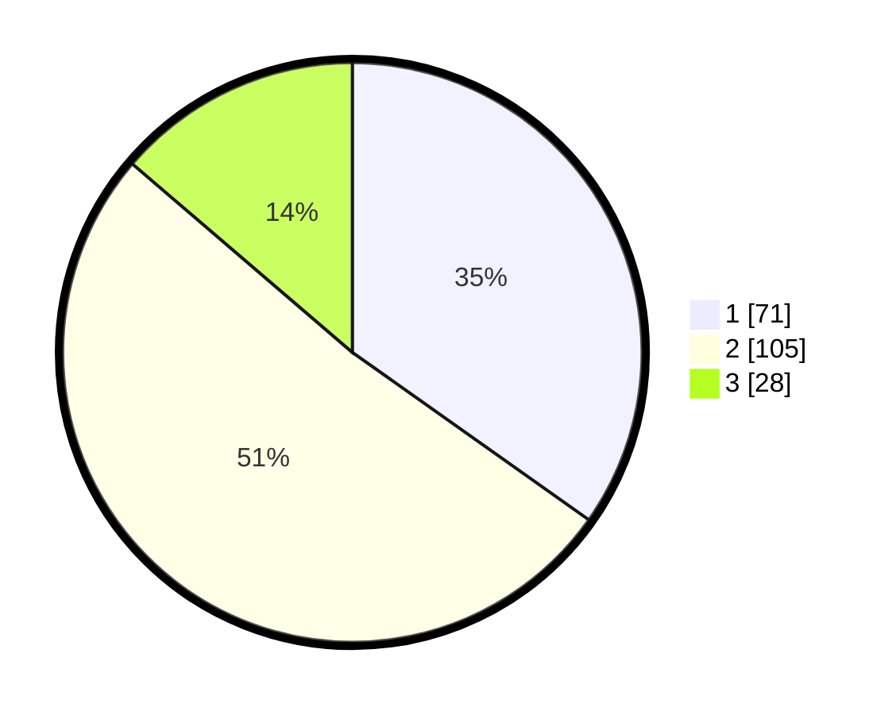

# Hasil

## Grafik

## Tabel

| No. | Nama Paslon    | Suara | Suara (raw) | Persentase |
|:--- |:-------------- | -----:| -----------:| ----------:|
| 1   | ANIES MUHAIMIN | 71    | [71][p-1]   | 34,80      |
| 2   | PRABOWO GIBRAN | 105   | [105][p-2]  | 51,47      |
| 3   | GANJAR MAHFUD  | 28    | [28][p-3]   | 13,73      |

[p-1]: https://github.com/gigit-pemilu/pemilu-2024/blob/main/pilpres/hitung-suara/sub/32-jawa-barat/sub/05-garut/sub/02-karangpawitan/sub/1001-suci-kaler/sub/003-tps/sub/paslon-1.txt
[p-2]: https://github.com/gigit-pemilu/pemilu-2024/blob/main/pilpres/hitung-suara/sub/32-jawa-barat/sub/05-garut/sub/02-karangpawitan/sub/1001-suci-kaler/sub/003-tps/sub/paslon-2.txt
[p-3]: https://github.com/gigit-pemilu/pemilu-2024/blob/main/pilpres/hitung-suara/sub/32-jawa-barat/sub/05-garut/sub/02-karangpawitan/sub/1001-suci-kaler/sub/003-tps/sub/paslon-3.txt

## Foto C Plano

https://sirekap-obj-formc.kpu.go.id/1941/pemilu/ppwp/32/05/02/10/01/3205021001003-20240215-024023--bc65e40c-892f-4e5a-899c-cae1969b1b3b.jpg

https://sirekap-obj-formc.kpu.go.id/1941/pemilu/ppwp/32/05/02/10/01/3205021001003-20240215-024000--9155b04f-890e-4964-b32f-b13b15a623f9.jpg

https://sirekap-obj-formc.kpu.go.id/1941/pemilu/ppwp/32/05/02/10/01/3205021001003-20240215-024028--f57f8597-9cf1-4aba-9361-0b5f931bd5da.jpg

## Metadata

| Key        | Value               |
| ---------- | ------------------- |
| Time Stamp | 2024-02-15 21:01:18 |

