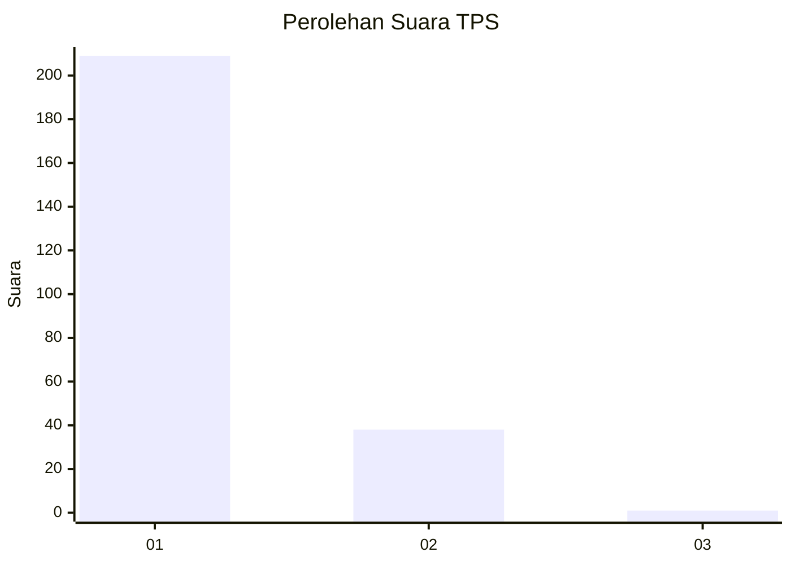
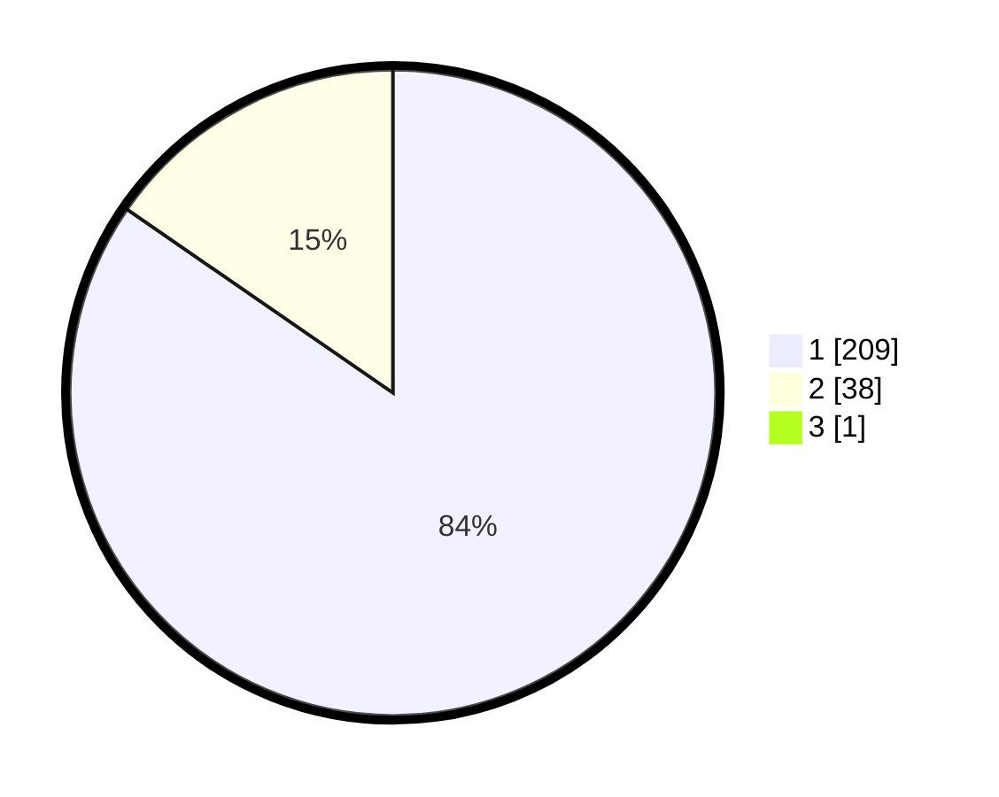

# Hasil

## Grafik

## Tabel

| No. | Nama Paslon    | Suara | Suara (raw) | Persentase |
|:--- |:-------------- | -----:| -----------:| ----------:|
| 1   | ANIES MUHAIMIN | 209   | [209][p-1]  | 84,27      |
| 2   | PRABOWO GIBRAN | 38    | [38][p-2]   | 15,32      |
| 3   | GANJAR MAHFUD  | 1     | [1][p-3]    | 0,40       |

[p-1]: https://github.com/gigit-pemilu/pemilu-2024/blob/main/pilpres/hitung-suara/sub/32-jawa-barat/sub/05-garut/sub/02-karangpawitan/sub/2005-situgede/sub/001-tps/sub/paslon-1.txt
[p-2]: https://github.com/gigit-pemilu/pemilu-2024/blob/main/pilpres/hitung-suara/sub/32-jawa-barat/sub/05-garut/sub/02-karangpawitan/sub/2005-situgede/sub/001-tps/sub/paslon-2.txt
[p-3]: https://github.com/gigit-pemilu/pemilu-2024/blob/main/pilpres/hitung-suara/sub/32-jawa-barat/sub/05-garut/sub/02-karangpawitan/sub/2005-situgede/sub/001-tps/sub/paslon-3.txt

## Foto C Plano

https://sirekap-obj-formc.kpu.go.id/8837/pemilu/ppwp/32/05/02/20/05/3205022005001-20240215-224513--a6d04828-7b73-4dc6-ad41-49cc0d3ecd87.jpg

https://sirekap-obj-formc.kpu.go.id/8837/pemilu/ppwp/32/05/02/20/05/3205022005001-20240215-202843--ef8115f4-8d82-4f49-9175-cef492d0e116.jpg

https://sirekap-obj-formc.kpu.go.id/8837/pemilu/ppwp/32/05/02/20/05/3205022005001-20240215-203200--a91a5685-f748-45c5-99b9-60597dc5bdf2.jpg

## Metadata

| Key        | Value               |
| ---------- | ------------------- |
| Time Stamp | 2024-02-15 23:29:50 |

