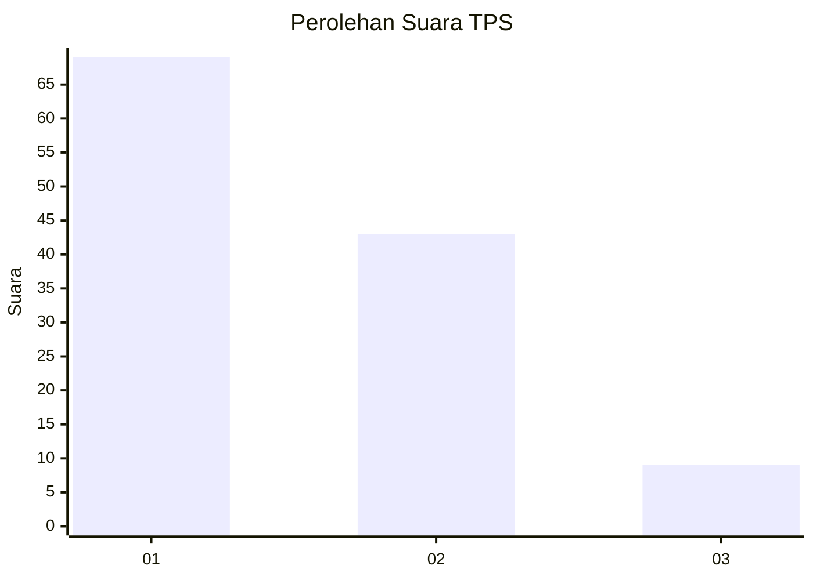
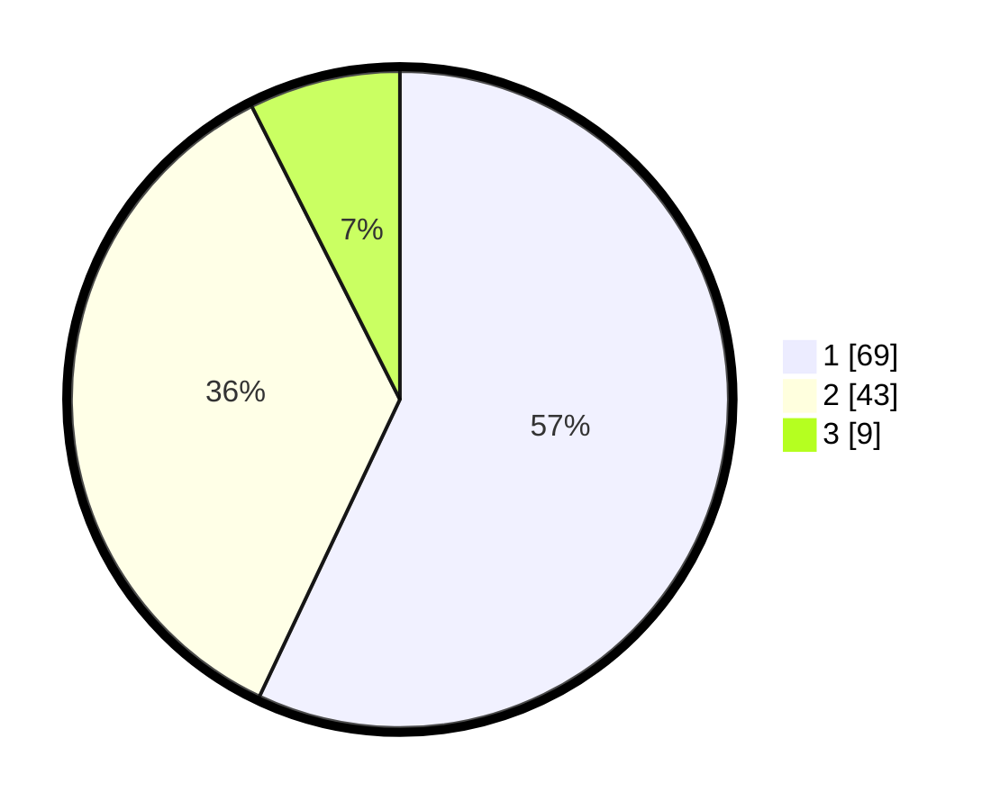

# Hasil

## Grafik

## Tabel

| No. | Nama Paslon    | Suara | Suara (raw) | Persentase |
|:--- |:-------------- | -----:| -----------:| ----------:|
| 1   | ANIES MUHAIMIN | 69    | [69][p-1]   | 57,02      |
| 2   | PRABOWO GIBRAN | 43    | [43][p-2]   | 35,54      |
| 3   | GANJAR MAHFUD  | 9     | [9][p-3]    | 7,44       |

[p-1]: https://github.com/gigit-pemilu/pemilu-2024/blob/main/pilpres/hitung-suara/sub/32-jawa-barat/sub/05-garut/sub/02-karangpawitan/sub/2009-godog/sub/026-tps/sub/paslon-1.txt
[p-2]: https://github.com/gigit-pemilu/pemilu-2024/blob/main/pilpres/hitung-suara/sub/32-jawa-barat/sub/05-garut/sub/02-karangpawitan/sub/2009-godog/sub/026-tps/sub/paslon-2.txt
[p-3]: https://github.com/gigit-pemilu/pemilu-2024/blob/main/pilpres/hitung-suara/sub/32-jawa-barat/sub/05-garut/sub/02-karangpawitan/sub/2009-godog/sub/026-tps/sub/paslon-3.txt

## Foto C Plano

https://sirekap-obj-formc.kpu.go.id/6da2/pemilu/ppwp/32/05/02/20/09/3205022009026-20240214-155127--62891854-3a08-42cf-ba4d-922d6510c355.jpg

https://sirekap-obj-formc.kpu.go.id/6da2/pemilu/ppwp/32/05/02/20/09/3205022009026-20240214-155911--774b1485-176f-46c3-8b54-be9e6369266d.jpg

https://sirekap-obj-formc.kpu.go.id/6da2/pemilu/ppwp/32/05/02/20/09/3205022009026-20240214-160125--a40745b9-a0c0-4cb6-9554-f0cf14ed2ba7.jpg

## Metadata

| Key        | Value               |
| ---------- | ------------------- |
| Time Stamp | 2024-02-16 13:30:32 |

