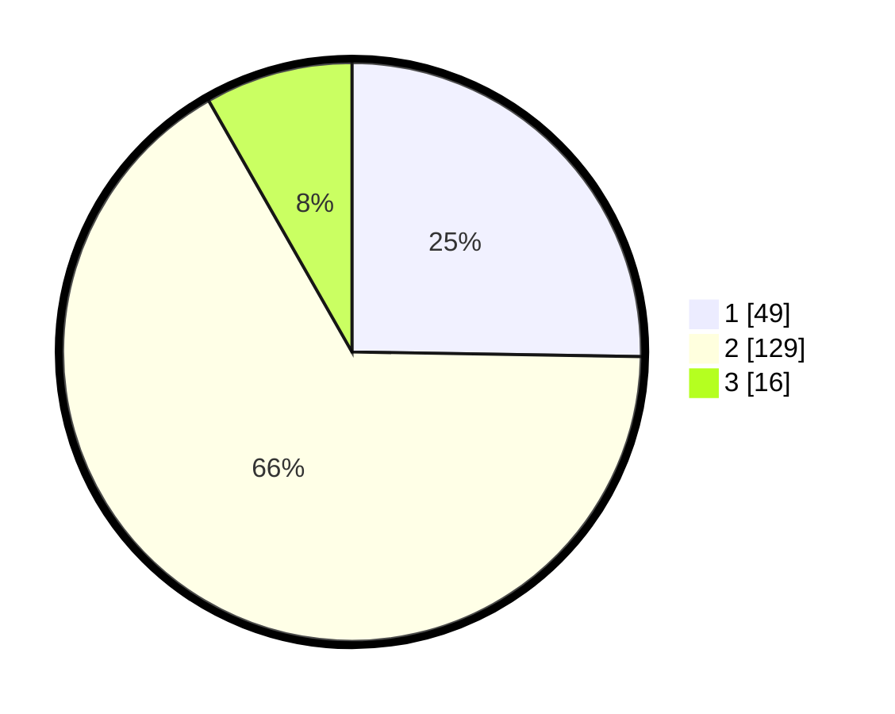

# Hasil

## Grafik

## Tabel

| No. | Nama Paslon    | Suara | Suara (raw) | Persentase |
|:--- |:-------------- | -----:| -----------:| ----------:|
| 1   | ANIES MUHAIMIN | 49    | [49][p-1]   | 25,26      |
| 2   | PRABOWO GIBRAN | 129   | [129][p-2]  | 66,49      |
| 3   | GANJAR MAHFUD  | 16    | [16][p-3]   | 8,25       |

[p-1]: https://github.com/gigit-pemilu/pemilu-2024/blob/main/pilpres/hitung-suara/sub/32-jawa-barat/sub/05-garut/sub/02-karangpawitan/sub/2012-sindangpalay/sub/005-tps/sub/paslon-1.txt
[p-2]: https://github.com/gigit-pemilu/pemilu-2024/blob/main/pilpres/hitung-suara/sub/32-jawa-barat/sub/05-garut/sub/02-karangpawitan/sub/2012-sindangpalay/sub/005-tps/sub/paslon-2.txt
[p-3]: https://github.com/gigit-pemilu/pemilu-2024/blob/main/pilpres/hitung-suara/sub/32-jawa-barat/sub/05-garut/sub/02-karangpawitan/sub/2012-sindangpalay/sub/005-tps/sub/paslon-3.txt

## Foto C Plano

https://sirekap-obj-formc.kpu.go.id/52b4/pemilu/ppwp/32/05/02/20/12/3205022012005-20240214-160119--1e2b5a31-2364-4188-a46f-f7b1c4fb44ab.jpg

https://sirekap-obj-formc.kpu.go.id/52b4/pemilu/ppwp/32/05/02/20/12/3205022012005-20240215-231821--50196943-9ad1-402f-86f2-3f380b832374.jpg

https://sirekap-obj-formc.kpu.go.id/52b4/pemilu/ppwp/32/05/02/20/12/3205022012005-20240215-231819--f21a15db-479b-40d0-98e8-3da465cfe71b.jpg

## Metadata

| Key        | Value               |
| ---------- | ------------------- |
| Time Stamp | 2024-02-16 00:00:26 |

