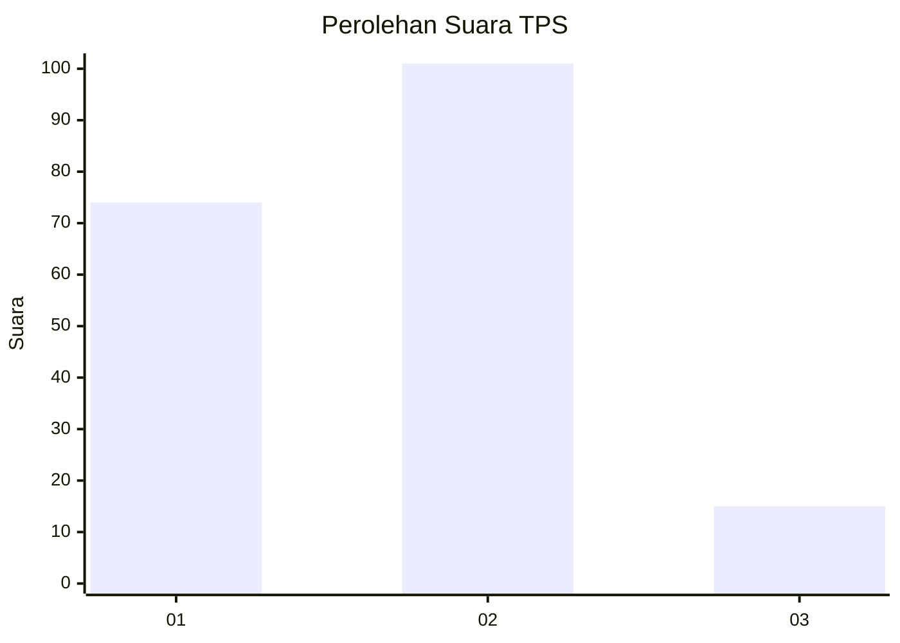

# Hasil

## Grafik

## Tabel

| No. | Nama Paslon    | Suara | Suara (raw) | Persentase |
|:--- |:-------------- | -----:| -----------:| ----------:|
| 1   | ANIES MUHAIMIN | 74    | [74][p-1]   | 38,95      |
| 2   | PRABOWO GIBRAN | 101   | [101][p-2]  | 53,16      |
| 3   | GANJAR MAHFUD  | 15    | [15][p-3]   | 7,89       |

[p-1]: https://github.com/gigit-pemilu/pemilu-2024/blob/main/pilpres/hitung-suara/sub/32-jawa-barat/sub/05-garut/sub/03-wanaraja/sub/2001-wanaraja/sub/002-tps/sub/paslon-1.txt
[p-2]: https://github.com/gigit-pemilu/pemilu-2024/blob/main/pilpres/hitung-suara/sub/32-jawa-barat/sub/05-garut/sub/03-wanaraja/sub/2001-wanaraja/sub/002-tps/sub/paslon-2.txt
[p-3]: https://github.com/gigit-pemilu/pemilu-2024/blob/main/pilpres/hitung-suara/sub/32-jawa-barat/sub/05-garut/sub/03-wanaraja/sub/2001-wanaraja/sub/002-tps/sub/paslon-3.txt

## Foto C Plano

https://sirekap-obj-formc.kpu.go.id/1e4d/pemilu/ppwp/32/05/03/20/01/3205032001002-20240215-035348--7e486d57-c355-4bb9-84ab-ab0a06382d0d.jpg

https://sirekap-obj-formc.kpu.go.id/1e4d/pemilu/ppwp/32/05/03/20/01/3205032001002-20240215-035501--590cecf3-73f7-4700-96f4-c7bedacb685d.jpg

https://sirekap-obj-formc.kpu.go.id/1e4d/pemilu/ppwp/32/05/03/20/01/3205032001002-20240215-035621--83629210-6935-4b18-9df9-d5ae711b4da9.jpg

## Metadata

| Key        | Value               |
| ---------- | ------------------- |
| Time Stamp | 2024-02-15 20:30:46 |

